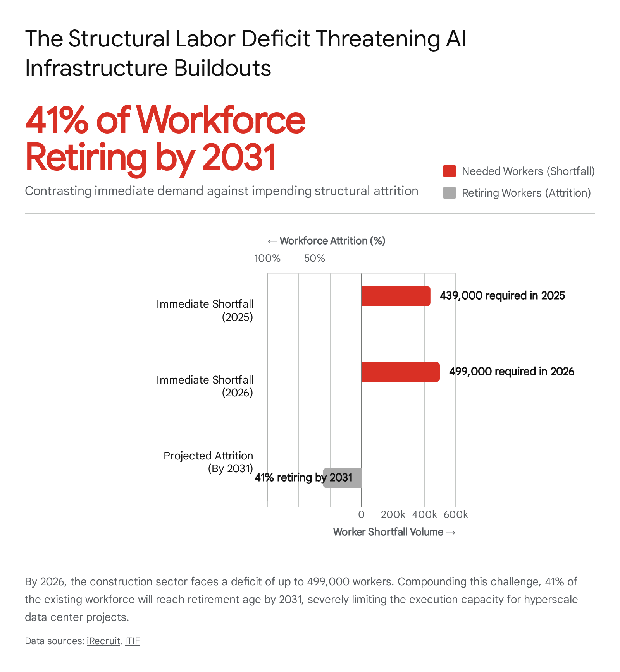
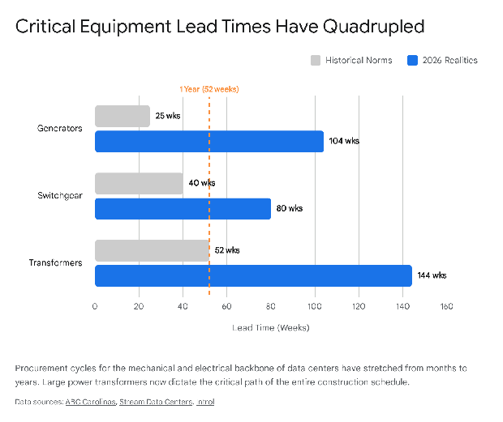
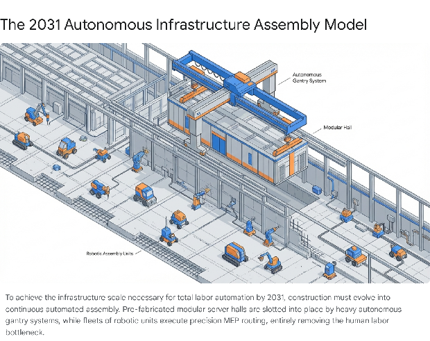

# **The Physical Limits of Artificial Intelligence: Data Center Construction Constraints and the Path to the 2031 Autonomous Economy**

## **Introduction**

The global proliferation of artificial intelligence (AI), particularly the training and inferencing of massive foundational models, has triggered an infrastructure investment supercycle projected to require up to $3 trillion in capital expenditure by the end of the decade.1 While the digital output of these AI models appears boundless, the physical foundation enabling this intelligence is tethered strictly to the constraints of the material world. The narrative surrounding AI scalability frequently centers on algorithmic efficiency, silicon architecture, and energy generation. However, a purely physical, logistical bottleneck is rapidly emerging as the ultimate limiting factor in the AI rollout: the construction and deployment of the physical data center facilities themselves.

The global data center market is attempting to execute an unprecedented expansion, aiming to add nearly 100 gigawatts (GW) of new capacity between 2026 and 2030, effectively doubling the existing global infrastructure footprint.1 Executing this degree of physical expansion requires navigating severe, compounding constraints. These encompass a dwindling supply of permitted, build-ready land, a structurally depleted and aging construction workforce, severely constrained supply chains for highly specialized mechanical and electrical equipment, and a finite supply of the raw materials required for networking infrastructure.4

Looking ahead to the next five years, the trajectory of AI capability suggests a critical threshold where artificial systems will begin assuming the bulk of human cognitive and physical labor by 2031\.7 Replacing the aggregate mental capacity of the global knowledge workforce requires a physical compute footprint of a scale never before attempted. To achieve this reality within the narrow timeframe of five years, the methodologies of data center construction must undergo a radical paradigm shift, transitioning from traditional, bespoke real estate development to hyper-scaled, modular, and fully autonomous robotic manufacturing. This comprehensive report exhaustively examines the specific constraints limiting data center construction—land, labor, equipment, and networking—and projects the necessary physical and methodological scaling required to accommodate the 2031 autonomous economy.

## **Land Availability and the Regulatory Friction of Siting**

The foundational prerequisite for any physical infrastructure is land. However, within the context of hyperscale AI data centers, the definition of "build-ready" land has fundamentally changed. Historically, data center developers sought small-to-medium acreage near major metropolitan hubs to minimize latency for standard cloud computing tasks. Today, the sheer physical footprint required to house hundreds of thousands of interconnected Graphics Processing Units (GPUs)—often spanning hundreds of acres for a single campus—has pushed development out of established Tier 1 markets and into secondary, tertiary, and emerging markets, creating profound new regulatory and zoning friction.9

### **The Shift in Zoning and Escalating Community Opposition**

As hyperscale data centers increasingly encroach upon rural and suburban landscapes, local municipalities are increasingly utilizing zoning laws to halt, delay, or heavily condition development. AI-focused data centers require massive structural footprints and support buildings, leading to intense community pushback driven by concerns over visual blight, the industrialization of rural character, and localized noise pollution generated by massive banks of cooling systems and backup generators.11

In historically dominant markets such as Northern Virginia—which currently hosts a massive concentration of global data center capacity—localities have begun to actively eliminate "by-right" zoning for data center construction. This regulatory shift forces developers into protracted, highly politicized rezoning and special exception processes.11 If a data center project is delayed, heavily modified, or entirely withdrawn, it almost universally occurs during this local rezoning phase, as public hearings offer a highly effective and legally binding avenue for organized community opposition to express grievances.12 Consequently, developers are now forced to function as long-term land bankers, acquiring massive plots of land years in advance of expected construction simply to absorb the timeline shocks and bureaucratic delays inherent to the local permitting process.10

### **The United Kingdom's Strategic Response: The NSIP Regime**

The United Kingdom serves as a prime, forward-looking case study of high-level governmental intervention designed to bypass these local zoning constraints and accelerate physical infrastructure deployment. Recognizing that local planning authorities, operating under the legacy Town and Country Planning Act 1990, were administratively ill-equipped to handle the scale, complexity, and speed required for hyperscale AI developments, the UK government has fundamentally overhauled its national planning policy.9

As of January 2026, new regulatory frameworks have formally brought major data centers within the scope of the Nationally Significant Infrastructure Projects (NSIP) regime in England.9 This represents a monumental shift in land-use authority. The NSIP operates as an opt-in regime that allows developers of large-scale, strategically vital AI data centers to entirely bypass local district councils. Instead, developers apply directly to the Secretary of State for a Development Consent Order (DCO).9

This framework provides immense advantages for physical deployment. A DCO consolidates planning permission, necessary highway alterations, environmental compliance, and even compulsory land acquisition into a single, legally binding, and predictable statutory timeline.13

Furthermore, to support this physical expansion, the UK has established designated "AI Growth Zones" (AIGZs) and formally designated data centers as Critical National Infrastructure (CNI). This places data centers on an equal strategic footing with defense, water, and emergency services, effectively forcing the overarching planning system to weigh national economic and technological imperatives above localized community opposition.9 The government is concurrently drafting a specialized National Policy Statement (NPS) specifically tailored for data centers, aiming to compress overall consent and permitting times to an aggressive 12 months for major projects.15

| Traditional Local Planning (e.g., Town and Country Planning Act 1990\) | Nationally Significant Infrastructure Projects (NSIP) Regime |
| :---- | :---- |
| Decisions made by local planning authorities/councils. | Decisions made by the Secretary of State at the national level. |
| Highly susceptible to local political pressure and NIMBYism. | Assessed against national economic and technological imperatives. |
| Fragmented consent (separate applications for land, highways, etc.). | Consolidated Development Consent Order (DCO) covering all required permissions. |
| Unpredictable timelines, often resulting in multi-year delays. | Strict, fixed statutory timetables for examination and decision-making (target 12 months). |

This federalization of land use and the stripping of local veto power represents the necessary regulatory evolution that must be replicated globally to lift the land availability constraint. Without such top-down zoning interventions, the physical space required to build the 2031 autonomous economy will remain locked behind localized bureaucratic friction.

## **The Critical Shortage of Specialized Construction Labor**

Even in scenarios where land is successfully secured and fully permitted, the physical assembly of a massive data center is strictly bound by human execution capacity. The construction industry is currently grappling with a severe, structural, and long-term labor deficit that is fundamentally incompatible with the projected doubling of global data center capacity by 2030\.1

### **Demographics and the Execution Capacity Deficit**

As of late 2025, the U.S. construction industry was already operating with a staggering shortfall of approximately 439,000 workers.17 By 2026, workforce projections indicate the necessity of recruiting an additional 349,000 to 499,000 net new workers simply to meet the existing baseline demand for construction services, before even accounting for the exponential surge in AI infrastructure.4

This gap is severely exacerbated by demographic realities that cannot be solved by short-term recruitment drives. Approximately 41% of the current construction workforce is expected to reach retirement age by 2031, and nearly 20% of active tradespeople are already over the age of 55\.4 Simultaneously, the influx of younger generations into vocational and technical trades has dwindled, creating a scenario where the industry is losing experienced master tradespeople at a significantly faster rate than it is acquiring apprentices.

The scale of modern AI data center campuses has multiplied the required on-site workforce beyond recognition. A decade ago, a large, state-of-the-art data center project might have required a peak crew of roughly 750 workers. Today, sprawling hyperscale campuses routinely require active armies of 4,000 to 5,000 workers operating simultaneously.18 Managing a workforce the size of a small municipality on a single, highly secure site introduces profound logistical inefficiencies. Workers can easily lose up to two hours of their daily shift simply commuting from parking areas, passing through multi-stage security checkpoints, and navigating the sprawling campus to reach their specific work zones. This loss of productive time severely degrades the overall execution capacity of the labor pool.4

### **The Bottleneck of Specialized Trades**

The construction of an AI-ready facility is exceptionally complex. It is not merely the erection of structural steel and concrete walls; it is the assembly of a massive, highly sensitive, mission-critical machine. Consequently, labor demand is heavily skewed toward highly specialized, certified trades. The most critical bottlenecks exist within three distinct professions:

1. **High-Voltage Electricians:** Electrical infrastructure installation accounts for a massive 45% to 70% of total data center construction costs.4 The industry requires over 300,000 new electricians over the next decade to sustain AI-driven demand. This shortage is frequently cited as a leading barrier to construction. The complex, high-amperage power routing required for high-density AI clusters cannot be executed by general laborers; it requires precision wiring skills that take years of rigorous apprenticeship to acquire.19 The shortage is so acute that in major development hubs like Northern Virginia, journeyman electricians command salaries ranging between $120,000 and $200,000 annually.4 Furthermore, nearly 30% of active union electricians are currently between the ages of 50 and 70, signaling an imminent wave of skill loss.4  
2. **HVAC and Liquid Cooling Technicians:** As AI workloads advance, they push server rack heat densities from a traditional 5-10 kilowatts (kW) up to extreme levels of 50-100 kW.1 At these densities, traditional forced-air cooling is physically incapable of preventing catastrophic thermal runaway. The required transition to direct-to-chip liquid cooling and full-immersion tanks necessitates an entirely different skill set. Construction requires advanced pipefitters and specialized mechanical technicians who understand complex fluid dynamics, pressure testing, and zero-tolerance leak standards near highly sensitive silicon.4  
3. **Diesel Mechanics:** To ensure continuous, 24/7 reliability, data centers must deploy massive arrays of backup diesel generators. Maintaining the mechanical integrity of multi-megawatt backup power systems across a gigawatt-scale campus demands a specialized workforce. The broader heavy equipment and transportation industries are already suffering from a severe deficit of diesel technicians, with 65.5% of current technicians aged over 45\.21 Data centers must compete directly with these other sectors for a shrinking pool of talent capable of commissioning and maintaining these massive industrial engines.23

| Specialized Trade Role | 2026 Estimated Salary Range | Key Driver of Demand in AI Data Centers |
| :---- | :---- | :---- |
| Journeyman Electrician | $120,000 – $200,000 | High-voltage distribution, complex busway installations, massive scale. |
| HVAC / Liquid Cooling Tech | $40,000 – $90,000 | Shift from air to liquid cooling; managing 50-100 kW rack densities. |
| Controls / MEP Supervisor | $68,000 – $141,000 | Coordination of hyper-complex power and fluid dynamics systems. |

The financial penalty for this specialized labor shortage is severe and immediate. Surging demand has pushed project backlogs to between 8.5 and 12 months.4 A delay in commissioning a standard 60 MW data center can cost an operator an estimated $14.2 million per month in lost revenue.4 Consequently, billion-dollar physical structures risk becoming "stranded assets"—physically erected, but operationally inert because the specialized commissioning engineers required to rigorously test and activate the interdependent systems simply do not exist in sufficient numbers.4

## **Supply Chain Paralysis: The Equipment Chokepoint**

Simultaneous with the physical labor crisis is a fundamental breakdown in the global supply chain for the core mechanical, electrical, and plumbing (MEP) equipment that forms the internal organs of a data center. The global manufacturing base for heavy industrial infrastructure is currently unable to absorb the sudden, vertical spike in demand generated by AI scaling.25

### **Unprecedented Lead Times**

The bespoke nature of heavy infrastructure, combined with deep, multi-tier supply chain dependencies (ranging from raw metal procurement to microchip integration for control panels), has resulted in delivery timelines stretching years into the future. By 2026, equipment lead times have reached historic highs, shifting the industry from a "just-in-time" model to a "years-in-advance" reality:

* **Large Power Transformers:** Delivery schedules for the massive transformers required to step down grid voltage for campus use have stretched to between 128 and 144 weeks (nearly three years).26  
* **Medium-Voltage Switchgear:** The essential panels that route and protect electrical circuits face backlogs running between 45 and 100 weeks.26  
* **Standby Generators:** Historically available within a manageable 20 to 30 weeks, lead times for industrial backup generators have expanded drastically to 72 to over 104 weeks.5  
* **Cooling Systems (Major Chillers):** The massive industrial chillers required to reject heat from liquid cooling loops sit at lead times between 10 and 16 months.28

### **The Standardization Deficit**

A primary, underlying cause of these manufacturing bottlenecks is the data center industry's historical lack of architectural standardization. Traditionally, data center operators varied their physical designs based on geographical climates and specific tenant requests. For example, a developer might deploy one specific type of chiller for a facility on the humid East Coast, a completely different evaporative system in the arid climate of California, and yet another localized variant in the Pacific Northwest.5

This bespoke engineering completely eliminates the fungibility of equipment. If a project in one region is stalled due to local permitting issues, operators cannot simply reallocate that facility's delayed cooling units or switchgear to a different, ready-to-build site to maintain momentum.5 Consequently, project schedules are no longer dictated by the efficiency of field construction productivity. Instead, the critical path of construction is entirely captive to the manufacturing progress of distant original equipment manufacturers (OEMs).29 If a single critical component—such as an automated transfer switch—is delayed in a factory across the world, an otherwise completely constructed shell cannot be energized or commissioned, further exacerbating the risk of stranded capital.

## **Networking Infrastructure: The Optical Fiber and Interconnect Constraint**

While concrete, steel, and copper form the physical shell and circulatory system of the data center, the neural pathways of AI are constructed entirely from glass. The transition from traditional cloud computing to the training of massive Large Language Models (LLMs) has fundamentally altered the physical architecture of data networks. It has shifted the primary data flow from "North-South" (a server communicating out to the internet) to an overwhelming volume of "East-West" traffic (servers communicating directly with other servers within the same physical facility).30

### **The Glass Shortage and Fiber Density**

Training a frontier AI model requires tens of thousands of GPUs to act as a single, perfectly synchronized compute engine. To prevent latency from destroying computational efficiency and leaving expensive processors idle, these GPUs must communicate with one another at the speed of light. Consequently, an AI-optimized hyperscale data center requires up to 36 times more internal optical fiber than a traditional CPU-based facility.6 The cables required have shifted from containing a few hundred strands to massive multi-conduit deployments packing thousands of individual glass fibers into a single physical run.32

This exponential, localized surge in demand has essentially maxed out global optical fiber manufacturing capacity.30 By late 2025, the supply crunch intensified to the point where major industry leaders, such as Corning, reportedly ceased selling raw glass preforms to other manufacturers to prioritize their own internal cabling supply.6 Global inventories of high-performance specialty fibers have been drained, and the lead time for critical ribbon fiber—the dense, flat cables essential for rapidly linking massive data halls—has stretched beyond 60 weeks.33 Furthermore, because the industrial expansion cycle for manufacturing optical fiber preform (the highly purified raw glass cylinder from which fiber is drawn) takes 18 to 24 months to bring online, new manufacturing capacity initiated today will not practically alleviate the physical bottleneck until late 2027\.34

### **The Interconnect Transition: 1.6T and Co-Packaged Optics**

As raw bandwidth requirements scale exponentially, the physical networking hardware connecting the fiber to the silicon is undergoing a forced, rapid evolution. The industry is currently transitioning from standard 400G and 800G optical architectures to 1.6 Terabit per second (1.6T) and eventually 3.2T data rates by the end of the decade.35

Traditional copper interconnects reach strict physical limitations regarding signal degradation and heat generation when pushed to these speeds within dense AI clusters. To solve this "data movement bottleneck," hyperscalers and hardware designers (collaborating via the Optical Compute Interconnect (OCI) Multi-Source Agreement) are moving to replace internal copper scale-up links with optical cables.37

This transition involves deploying Co-Packaged Optics (CPO). CPO is a highly advanced manufacturing architecture that integrates photonic engines directly onto the same physical package substrate as the silicon ASIC or GPU.36 This structural change reduces the distance electrical signals must travel from traditional centimeters (across a printed circuit board to a pluggable transceiver) to mere millimeters, drastically reducing latency and power consumption.38 However, the precision manufacturing required for CPO and silicon photonics relies on highly complex, microscopic fabrication processes. These advanced manufacturing techniques create further supply chain fragility, limiting the physical speed at which AI network clusters can be manufactured and stitched together on the data center floor.39

## **Engineering a Solution: Timelines for Constraint Resolution**

The immediate convergence of land scarcity, chronic labor deficits, and supply chain paralysis ensures that traditional "stick-built" construction methods will perpetually lag behind the exponential curve of AI compute demand. To lift these physical constraints and accelerate deployment timelines over the 2026-2030 period, the construction industry is being forced into a state of extreme industrialization.

### **Industrialized and Modular Construction**

To bypass the unpredictable nature of local site conditions and circumvent the severe shortage of specialized field labor, developers are transitioning away from site-centric construction toward manufacturing-led, "fab-to-site" logistics.40 Prefabricated Modular Data Centers (PMDCs) are now being assembled in highly controlled factory environments.41 Entire data halls, complex integrated cooling skids, and massive modular electrical rooms are mass-produced, shipped to the final site via heavy transport, and rapidly interconnected.40

This methodology fundamentally alters project economics and physical timelines. Factory assembly relies on optimized production lines requiring crews of only 20 to 50 stationary workers, a paradigm that is vastly more productive than managing thousands of transient tradespeople on a sprawling, chaotic campus.4 Most importantly, modular construction compresses overall delivery schedules by 30% to 50%, reducing a traditional 24-to-36-month timeline down to an accelerated 12-to-20 months.4 Crucially, factory-level integration allows highly complex electrical and liquid cooling systems to be rigorously pre-tested before shipping, drastically cutting on-site commissioning times from months to weeks and neutralizing the risk of late-stage failures.20

### **Autonomous and Robotic Site Execution**

Where on-site physical labor cannot be entirely eliminated through prefabrication, it is aggressively being automated. The industry is actively deploying construction robotics to handle high-repetition, low-variance tasks that traditionally consume massive amounts of human hours.

For example, anchoring heavy AI server racks requires drilling tens of thousands of precise holes into thick concrete floors—a grueling, ergonomic nightmare that delays subsequent electrical and mechanical installation phases. In 2026, autonomous downward-drilling robots (developed by firms like DeWalt and August Robotics) are actively operating on hyperscale sites. These robotic units navigate autonomously, drilling up to ten times faster than human crews.43 Operating 24 hours a day with 99.97% accuracy, these fleets independently cut up to 80 weeks of cumulative timeline across multiple project phases, entirely removing humans from the critical path of this task.43 Moving forward, autonomous multi-robot coordination for intricate MEP installation, guided perfectly by AI-analyzed Building Information Models (BIM), will become standard practice to keep pace with the necessary structural expansion.45

## **The 2031 Horizon: Scaling Physical Infrastructure to Replace Human Mental Capacity**

Looking to the future, if we operate under the assumption that AI development maintains its current trajectory, reaching a capability threshold sufficient to replace the vast majority of human mental and knowledge-based labor by 2031, the physical infrastructure required will mandate a scaling effort unprecedented in human history.7

### **Calculating the Compute Equivalent of the Global Workforce**

To understand the sheer physical construction required by 2031, we must conceptually estimate the computational equivalent of human cognitive capacity. Current scientific and technological estimates suggest the human brain processes information at roughly 1 ExaFLOP, or  floating-point operations per second.46 To replicate and subsequently replace the active cognitive labor of a global knowledge workforce—conservatively estimated at 1 billion individuals—the AI infrastructure system would require an aggregate compute capacity in the realm of  FLOPs, operating continuously and reliably.

Currently, state-of-the-art supercomputers achieving a mere 1 ExaFLOP require substantial physical footprints, massive structural support, and highly complex cooling infrastructure.46 Even factoring in aggressive, exponential gains in algorithmic efficiency and silicon hardware performance—where AI processing power per square foot doubles at rapid intervals—housing the sheer volumetric mass of silicon required to sustain a continuous, global, autonomous intelligence network pushes the physical limits of civil engineering to the extreme.48

If global data center capacity is already projected to require 200 GW by 2030 strictly based on the current, nascent phase of generative AI 3, the physical facility capacity required to entirely displace global human labor would require a massive multiplier of that figure, translating into thousands of new mega-structures worldwide.

### **The Gigafactory Era of Data Centers**

To physically achieve this level of capacity by 2031, the constraints detailed in this report must not merely be mitigated; they must be entirely eradicated through a transition to extreme, automated industrialization.

1. **The End of Bespoke Construction:** Data centers will cease to be treated as unique real estate development projects. Instead, they will be manufactured like automobiles or commercial aircraft. Specialized mega-factories will mass-produce standardized, densely packed modular compute blocks designed for universal deployment regardless of the geographic location.40  
2. **Hyper-Density Consolidation:** Because the physical availability of land and the manufacturing output of networking fiber cannot scale infinitely, the physical density of the hardware within the building envelope must drastically increase. Rack densities will shift entirely away from 100 kW air-cooled systems toward multi-megawatt-scale, fully liquid-immersed pods. This will pack exascale computational capabilities into vastly smaller physical footprints, fundamentally altering the structural engineering requirements of the building.1  
3. **Machine Building Machine:** By 2031, the construction labor deficit that crippled the industry in 2026 will be rendered largely irrelevant. The advanced AI models themselves will direct their own physical fabrication. The complex structural engineering, global supply chain logistics, and physical site assembly will be continuously orchestrated by AI agents and executed almost entirely by advanced autonomous robotics.45

In this ultimate scenario, the physical fabrication of compute infrastructure becomes a closed, self-replicating loop. As AI systematically assumes human mental capacity across all economic sectors, it will concurrently and continuously optimize the physical processes required to manufacture its own expansion. This creates a continuous, automated pipeline of prefabricated silicon, glass, and steel that effectively transforms the severe physical constraints of 2026 into the automated abundance required for 2031\.

## **Conclusion**

The artificial intelligence revolution is currently bottlenecked not by the limits of software code or silicon design, but by the physical realities of concrete, steel, and human labor. The industry's aspiration to double global data center capacity to 200 GW by 2030 is colliding violently with the structural limitations of the traditional construction and manufacturing sectors.

Land procurement has devolved from a standard commercial transaction into a multi-year regulatory and political battle, forcing proactive governments to federalize planning permissions through mechanisms like the UK's NSIP regime simply to maintain development momentum. The construction workforce is facing a demographic cliff, missing nearly half a million workers and severely lacking the highly specialized high-voltage and mechanical talent required to execute complex, liquid-cooled AI designs. Simultaneously, the global manufacturing base for critical infrastructure—ranging from massive power transformers to optical fiber preforms—is buckling under the unprecedented pressure, resulting in equipment lead times stretching up to three years.

To successfully bridge the gap between the severe physical limitations of today and the theoretical requirement of replacing the entirety of human cognitive capacity by 2031, the data center industry must completely abandon traditional construction methodologies. The viable path forward relies entirely on radical architectural standardization, the complete shift to factory-based modular assembly, and the widespread, aggressive deployment of autonomous construction robotics. Only by treating data centers as mass-produced, modular hardware rather than bespoke, site-built real estate can the physical infrastructure scale fast enough to house the autonomous intelligence of the next decade.

#### **Works cited**

1. 2026 Global Data Center Outlook \- JLL, accessed March 13, 2026, [https://www.jll.com/en-us/insights/market-outlook/data-center-outlook](https://www.jll.com/en-us/insights/market-outlook/data-center-outlook)  
2. The data center balance: How US states can navigate the opportunities and challenges \- McKinsey, accessed March 13, 2026, [https://www.mckinsey.com/industries/public-sector/our-insights/the-data-center-balance-how-us-states-can-navigate-the-opportunities-and-challenges](https://www.mckinsey.com/industries/public-sector/our-insights/the-data-center-balance-how-us-states-can-navigate-the-opportunities-and-challenges)  
3. Global data center sector to nearly double to 200GW amid AI infrastructure boom \- JLL, accessed March 13, 2026, [https://www.jll.com/en-uk/newsroom/global-data-center-sector-to-nearly-double-to-200gw-amid-ai-infrastructure-boom](https://www.jll.com/en-uk/newsroom/global-data-center-sector-to-nearly-double-to-200gw-amid-ai-infrastructure-boom)  
4. Data Center Construction Labor Market Report \- iRecruit.co, accessed March 13, 2026, [https://www.irecruit.co/insights/data-center-construction-labor-market-report](https://www.irecruit.co/insights/data-center-construction-labor-market-report)  
5. Smooth Sailing in the 'Perfect Storm': Navigating Supply Chain Challenges \- Stream Data Centers, accessed March 13, 2026, [https://www.streamdatacenters.com/wp-content/uploads/2025/05/SDC-Brief-Supply-Chain-250429.pdf](https://www.streamdatacenters.com/wp-content/uploads/2025/05/SDC-Brief-Supply-Chain-250429.pdf)  
6. 'Perfect storm' in fiber supply threatens US broadband targets \- Light Reading, accessed March 13, 2026, [https://www.lightreading.com/fttx/-perfect-storm-in-fiber-supply-threatens-us-broadband-targets](https://www.lightreading.com/fttx/-perfect-storm-in-fiber-supply-threatens-us-broadband-targets)  
7. Scaling AI Requires New Processes, Not Just New Tools | BCG, accessed March 13, 2026, [https://www.bcg.com/publications/2026/scaling-ai-requires-new-processes-not-just-new-tools](https://www.bcg.com/publications/2026/scaling-ai-requires-new-processes-not-just-new-tools)  
8. Invest in the workforce for the AI age: A blueprint for scale, skills and responsible growth, accessed March 13, 2026, [https://www.weforum.org/stories/2026/01/ai-roadmap-transforming/](https://www.weforum.org/stories/2026/01/ai-roadmap-transforming/)  
9. Data centres and the NSIP regime: a significant shift in the consenting landscape, accessed March 13, 2026, [https://www.womblebonddickinson.com/uk/insights/articles-and-briefings/data-centres-and-nsip-regime-significant-shift-consenting-landscape](https://www.womblebonddickinson.com/uk/insights/articles-and-briefings/data-centres-and-nsip-regime-significant-shift-consenting-landscape)  
10. Land, Zoning, and the Data Center Boom | by Ahmed Ismail \- Medium, accessed March 13, 2026, [https://medium.com/ahmeds-tech-brief/land-zoning-and-the-data-center-boom-002e06a994d5](https://medium.com/ahmeds-tech-brief/land-zoning-and-the-data-center-boom-002e06a994d5)  
11. Data Center Investors Face Growing Risk From Local Opposition \- Capstone DC, accessed March 13, 2026, [https://capstonedc.com/insights/data-center-investors-face-growing-risk-from-local-opposition/](https://capstonedc.com/insights/data-center-investors-face-growing-risk-from-local-opposition/)  
12. Data Centers 2026 Look Ahead \- ALL4, accessed March 13, 2026, [https://www.all4inc.com/4-the-record-articles/data-centers-2026-look-ahead/](https://www.all4inc.com/4-the-record-articles/data-centers-2026-look-ahead/)  
13. Data centres now Nationally Significant Infrastructure Projects \- Connections, accessed March 13, 2026, [https://connections.nortonrosefulbright.com/post/102mii8/data-centres-now-nationally-significant-infrastructure-projects](https://connections.nortonrosefulbright.com/post/102mii8/data-centres-now-nationally-significant-infrastructure-projects)  
14. Data centres: planning policy, sustainability, and resilience \- UK Parliament, accessed March 13, 2026, [https://researchbriefings.files.parliament.uk/documents/CBP-10315/CBP-10315.pdf](https://researchbriefings.files.parliament.uk/documents/CBP-10315/CBP-10315.pdf)  
15. Data Centres & AI Growth Zones in planning: Change on the horizon in 2026, accessed March 13, 2026, [https://www.burges-salmon.com/articles/102lxwu/data-centres-ai-growth-zones-in-planning-change-on-the-horizon-in-2026/](https://www.burges-salmon.com/articles/102lxwu/data-centres-ai-growth-zones-in-planning-change-on-the-horizon-in-2026/)  
16. accessed March 13, 2026, [https://www.irecruit.co/insights/data-center-construction-labor-market-report\#:\~:text=The%20construction%20industry%20is%20grappling,just%20to%20meet%20existing%20demand.](https://www.irecruit.co/insights/data-center-construction-labor-market-report#:~:text=The%20construction%20industry%20is%20grappling,just%20to%20meet%20existing%20demand.)  
17. Fact of the Week: Construction Industry Facing a 439,000-Worker Shortage Driven by the Growth of Data Centers | ITIF, accessed March 13, 2026, [https://itif.org/publications/2026/01/12/construction-industry-facing-worker-shortage-driven-by-growth-of-data-centers/](https://itif.org/publications/2026/01/12/construction-industry-facing-worker-shortage-driven-by-growth-of-data-centers/)  
18. Data Center Construction Predictions for 2026 \- DataBank, accessed March 13, 2026, [https://www.databank.com/resources/blogs/data-center-construction-predictions-for-2026/](https://www.databank.com/resources/blogs/data-center-construction-predictions-for-2026/)  
19. Construction Industry Must Add 349,000 Workers in 2026 | Distribution Strategy Group, accessed March 13, 2026, [https://distributionstrategy.com/construction-industry-must-add-349000-workers-in-2026/](https://distributionstrategy.com/construction-industry-must-add-349000-workers-in-2026/)  
20. Data Center Commissioning Updates 2026 \- iRecruit.co, accessed March 13, 2026, [https://www.irecruit.co/insights/data-center-commissioning-updates-2026](https://www.irecruit.co/insights/data-center-commissioning-updates-2026)  
21. New ATRI Research Addresses Shortage of Qualified Diesel Techs in Trucking, accessed March 13, 2026, [https://truckingresearch.org/2025/08/new-atri-research-addresses-shortage-of-qualified-diesel-techs-in-trucking/](https://truckingresearch.org/2025/08/new-atri-research-addresses-shortage-of-qualified-diesel-techs-in-trucking/)  
22. What 2026's Skilled Labor Shortage Means for Maintenance Teams \- Coast, accessed March 13, 2026, [https://coastapp.com/blog/skilled-labor-shortage-maintenance/](https://coastapp.com/blog/skilled-labor-shortage-maintenance/)  
23. How Penske is Managing the Diesel Technician Shortage, accessed March 13, 2026, [https://www.pensketruckleasing.com/resources/resource-library/diesel-technician-shortage/](https://www.pensketruckleasing.com/resources/resource-library/diesel-technician-shortage/)  
24. Diesel Equipment Technology \- Lanier Technical College, accessed March 13, 2026, [https://www.laniertech.edu/programs/automotive-transportation-technologies/diesel-equipment-technology/](https://www.laniertech.edu/programs/automotive-transportation-technologies/diesel-equipment-technology/)  
25. Global energy transition hits a hardware bottleneck \- pv magazine USA, accessed March 13, 2026, [https://pv-magazine-usa.com/2026/02/27/global-energy-transition-hits-a-hardware-bottleneck/](https://pv-magazine-usa.com/2026/02/27/global-energy-transition-hits-a-hardware-bottleneck/)  
26. US Data Center Construction Drops for First Time Since 2020 | Introl Blog, accessed March 13, 2026, [https://introl.com/blog/us-data-center-construction-drop-first-since-2020](https://introl.com/blog/us-data-center-construction-drop-first-since-2020)  
27. Sizing the Surge: US Data Center Construction Outlook to 2030 \- MOCA Systems, accessed March 13, 2026, [https://mocasystems.com/wp-content/uploads/2025/10/MSIDataCenterReport\_Final.pdf](https://mocasystems.com/wp-content/uploads/2025/10/MSIDataCenterReport_Final.pdf)  
28. North Carolina Data Centers: Construction, Workforce, and Infrastructure Impact, accessed March 13, 2026, [https://abccarolinas.org/north-carolina-data-centers-construction-workforce-and-infrastructure-impact/](https://abccarolinas.org/north-carolina-data-centers-construction-workforce-and-infrastructure-impact/)  
29. How Construction Firms Deliver Complex Data Centers in 2026 \- CMiC, accessed March 13, 2026, [https://cmicglobal.com/resources/article/data-center-construction-trends](https://cmicglobal.com/resources/article/data-center-construction-trends)  
30. AI's physical bottleneck: optical fiber supply is tightening | \- PlanHub.ca, accessed March 13, 2026, [https://www.planhub.ca/blog/en/ai-optical-fiber-bottleneck-supply/](https://www.planhub.ca/blog/en/ai-optical-fiber-bottleneck-supply/)  
31. Fiber vendors strategize for huge demand from AI in 2026 \- Fierce Network, accessed March 13, 2026, [https://www.fierce-network.com/broadband/major-fiber-vendors-strategize-huge-demand-ai-2026](https://www.fierce-network.com/broadband/major-fiber-vendors-strategize-huge-demand-ai-2026)  
32. 2026 Data Center Trends and Industry Predictions | Density and Demand \- Corning, accessed March 13, 2026, [https://www.corning.com/optical-communications/worldwide/en/home/the-signal-network-blog/2026-data-center-predictions.html](https://www.corning.com/optical-communications/worldwide/en/home/the-signal-network-blog/2026-data-center-predictions.html)  
33. Here's how big the fiber shortage really is \- Fierce Network, accessed March 13, 2026, [https://www.fierce-network.com/broadband/heres-how-big-fiber-shortage-really](https://www.fierce-network.com/broadband/heres-how-big-fiber-shortage-really)  
34. Structural Price Rally in Fiber Optic Cables: AI-Powered Demand, Supply Constraints & 2026 Forecast, accessed March 13, 2026, [https://www.oyii.net/news/structural-price-rally-in-fiber-optic-cables-ai-powered-demand-supply-constraints-2026-forecast/](https://www.oyii.net/news/structural-price-rally-in-fiber-optic-cables-ai-powered-demand-supply-constraints-2026-forecast/)  
35. The Trends Shaping the Data Center in 2026 and Beyond \- Siemon, accessed March 13, 2026, [https://www.siemon.com/en/the-trends-shaping-the-data-center-in-2026-and-beyond/](https://www.siemon.com/en/the-trends-shaping-the-data-center-in-2026-and-beyond/)  
36. Silicon Photonics In The Data Center: What A CMOS Exec Needs To ..., accessed March 13, 2026, [https://semiengineering.com/silicon-photonics-in-the-data-center-what-a-cmos-exec-needs-to-know/](https://semiengineering.com/silicon-photonics-in-the-data-center-what-a-cmos-exec-needs-to-know/)  
37. AMD, Broadcom, and Nvidia join hyperscalers to define optical scale-up interconnect of the future for AI clusters — Meta, Microsoft, and OpenAI to benefit as speeds eventually scale to 3.2 Tb/s, accessed March 13, 2026, [https://www.tomshardware.com/tech-industry/artificial-intelligence/amd-broadcom-and-nvidia-join-hyperscalers-to-define-optical-scale-up-interconnect-of-the-future-for-ai-clusters-meta-microsoft-and-openai-to-benefit-as-speeds-eventually-scale-to-3-2-tb-s](https://www.tomshardware.com/tech-industry/artificial-intelligence/amd-broadcom-and-nvidia-join-hyperscalers-to-define-optical-scale-up-interconnect-of-the-future-for-ai-clusters-meta-microsoft-and-openai-to-benefit-as-speeds-eventually-scale-to-3-2-tb-s)  
38. CPO Is Extending The Limits Of What’s Possible In AI Data Centers, accessed March 13, 2026, [https://semiengineering.com/cpo-is-extending-the-limits-of-whats-possible-in-ai-data-centers/](https://semiengineering.com/cpo-is-extending-the-limits-of-whats-possible-in-ai-data-centers/)  
39. Optical Interconnect in AI Data Centers Market | Outlook 2033 \- DataM Intelligence, accessed March 13, 2026, [https://www.datamintelligence.com/research-report/optical-interconnect-in-ai-data-centers-market](https://www.datamintelligence.com/research-report/optical-interconnect-in-ai-data-centers-market)  
40. How Manufacturing is Reshaping Construction and What It Means ..., accessed March 13, 2026, [https://www.mckinstry.com/insights/how-manufacturing-is-reshaping-construction-and-what-it-means-for-the-data-center-industry/](https://www.mckinstry.com/insights/how-manufacturing-is-reshaping-construction-and-what-it-means-for-the-data-center-industry/)  
41. Modular data center design: A construction choice that cuts embodied carbon \- Vertiv, accessed March 13, 2026, [https://www.vertiv.com/en-us/about/news-and-insights/articles/blog-posts/2026/modular-data-center-design-a-construction-choice-that-cuts-embodied-carbon/](https://www.vertiv.com/en-us/about/news-and-insights/articles/blog-posts/2026/modular-data-center-design-a-construction-choice-that-cuts-embodied-carbon/)  
42. Data Centre Trends 2026 \- Soben Part of Accenture, accessed March 13, 2026, [https://www.accenture.com/content/dam/accenture/final/accenture-com/document-4/Data-Centre-Trends-2026-Soben-Part-of-Accenture.pdf](https://www.accenture.com/content/dam/accenture/final/accenture-com/document-4/Data-Centre-Trends-2026-Soben-Part-of-Accenture.pdf)  
43. This simple robot could drastically speed up data center construction, accessed March 13, 2026, [https://fastcompanyme.com/co-design/this-simple-robot-could-drastically-speed-up-data-center-construction/](https://fastcompanyme.com/co-design/this-simple-robot-could-drastically-speed-up-data-center-construction/)  
44. DEWALT Robotics: Accelerating Data Centre Construction, accessed March 13, 2026, [https://constructiondigital.com/news/dewalt-robotics-accelerating-data-centre-construction](https://constructiondigital.com/news/dewalt-robotics-accelerating-data-centre-construction)  
45. Autonomous Construction: Why 2026 Is Make-or-Break \- BuildCheck AI, accessed March 13, 2026, [https://buildcheck.ai/insights-case-studies/autonomous-construction-why-2026-is-make-or-break](https://buildcheck.ai/insights-case-studies/autonomous-construction-why-2026-is-make-or-break)  
46. Brain-Inspired Computing Can Help Us Create Faster, More Energy-Efficient Devices — If We Win the Race, accessed March 13, 2026, [https://www.nist.gov/blogs/taking-measure/brain-inspired-computing-can-help-us-create-faster-more-energy-efficient](https://www.nist.gov/blogs/taking-measure/brain-inspired-computing-can-help-us-create-faster-more-energy-efficient)  
47. The Human Brain might follow same Scaling Law as AI: It aligns surprisingly well with a Performance vs. Compute Graph made for AI \- Reddit, accessed March 13, 2026, [https://www.reddit.com/r/artificial/comments/1g07ig9/the\_human\_brain\_might\_follow\_same\_scaling\_law\_as/](https://www.reddit.com/r/artificial/comments/1g07ig9/the_human_brain_might_follow_same_scaling_law_as/)  
48. The Rise of AI: A Reality Check on Energy and Economic Impacts, accessed March 13, 2026, [https://energyanalytics.org/the-rise-of-ai-a-reality-check-on-energy-and-economic-impacts/](https://energyanalytics.org/the-rise-of-ai-a-reality-check-on-energy-and-economic-impacts/)  
49. How Scaling Laws Drive Smarter, More Powerful AI \- NVIDIA Blog, accessed March 13, 2026, [https://blogs.nvidia.com/blog/ai-scaling-laws/](https://blogs.nvidia.com/blog/ai-scaling-laws/)  
50. Data Center Construction Insights 2026 \- DCNT Global, accessed March 13, 2026, [https://www.dcntglobal.com/top-10-data-center-construction-trends-in-2026/](https://www.dcntglobal.com/top-10-data-center-construction-trends-in-2026/)  
51. Data Center Trends 2026: Shifting Up a Gear | Accenture, accessed March 13, 2026, [https://www.accenture.com/us-en/insights/infrastructure-capital-projects/data-centre-trends-2026-shifting-up-gear](https://www.accenture.com/us-en/insights/infrastructure-capital-projects/data-centre-trends-2026-shifting-up-gear)  
52. Construction Robotics Report 2026 \- ZACUA VENTURES, accessed March 13, 2026, [https://zacuaventures.com/construction-robotics-report-2026/](https://zacuaventures.com/construction-robotics-report-2026/)
