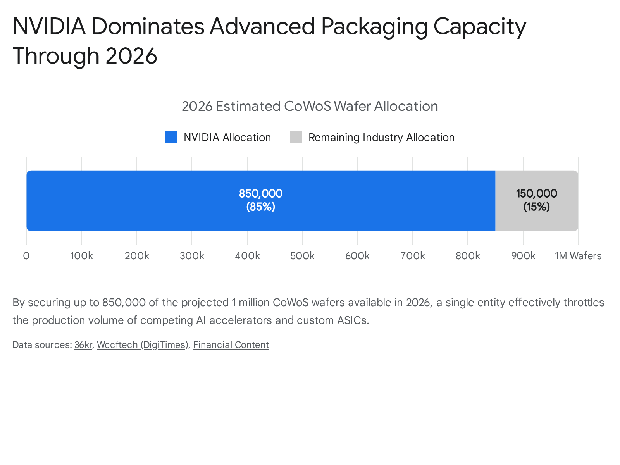
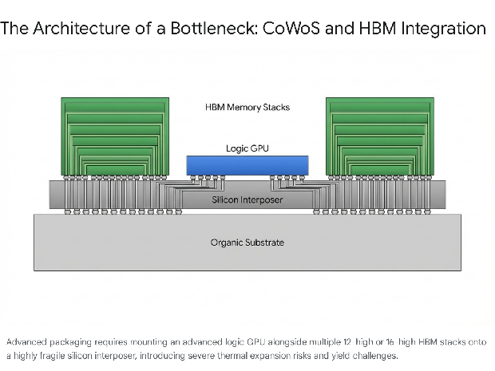

# **The Silicon Ceiling: Semiconductor Fabrication Constraints, AI Scaling, and the Hardware Path to Human-Equivalent Compute**

The global semiconductor industry has entered a period of extreme structural divergence, characterized by a high-stakes paradox. Surging demand for artificial intelligence (AI) infrastructure is projected to drive global semiconductor revenues to a historic peak of $975 billion by 2026, with a trajectory targeting $1 trillion to $2 trillion by the early 2030s.1 However, this explosive revenue growth masks severe physical and logistical constraints within the manufacturing supply chain. While AI accelerators generate roughly half of the industry's total revenue, they represent less than 0.2% of total unit volume.1 This concentration underscores a fragile ecosystem where the most critical components of the modern digital economy are constrained by a handful of highly complex, low-yield manufacturing processes.

As the industry races toward the realization of Artificial General Intelligence (AGI) and the hypothetical substitution of human cognitive labor within the next five years, the fundamental bottleneck is no longer software ingenuity, but the physical architecture of silicon.4 The ability to deploy large-scale models is strictly limited by the availability of advanced packaging, high-bandwidth memory (HBM), and extreme ultraviolet (EUV) lithography equipment.4 Projecting into a five-year horizon where AI must scale to replace the aggregate mental capacity of the global human workforce, the fabrication industry faces a mathematical and industrial challenge of unprecedented proportions. Scaling wafer production to yield the billions of advanced logic chips required for this transition demands an industrial mobilization that current supply chains—constrained by equipment lead times, raw material geopolitics, and a severe deficit of manufacturing capacity—are currently ill-equipped to handle.

This report comprehensively examines the specific constraints within the chip and memory fabrication supply chains. It ignores downstream deployment issues, such as data center construction and power generation, to focus exclusively on the physical limits of silicon production. By analyzing packaging chokepoints, memory architectures, lithography lead times, and raw material dependencies, this research provides a definitive timeline for when these manufacturing constraints might be lifted and assesses the feasibility of scaling hardware output to match human-equivalent compute within half a decade.

## **The Epicenter of the Bottleneck: Advanced Packaging and CoWoS**

If a single technology defines the constraints of the current AI rollout, it is advanced packaging, specifically Taiwan Semiconductor Manufacturing Company's (TSMC) Chip-on-Wafer-on-Substrate (CoWoS).5 As transistor miniaturization approaches its physical limits—with Moore's Law slowing down and advanced node costs climbing exponentially—the industry has shifted from monolithic chip designs to heterogeneous integration.7 This approach involves assembling multiple discrete components (chiplets) into a single, high-performance system-level package.8 CoWoS is the critical enabling process that allows advanced logic graphics processing units (GPUs) built on 5nm, 3nm, or 2nm nodes to be integrated alongside stacks of high-bandwidth memory (HBM) via a high-density interposer.6 Without this highly specialized packaging step, even the most advanced logic wafers cannot become functional AI accelerators.6

The supply-demand imbalance in the advanced packaging sector is acute. TSMC executives have confirmed that CoWoS capacity is structurally oversubscribed and entirely sold out through 2025 and into 2026\.5 The total global demand for CoWoS packaging is projected to surge from 370,000 wafers in 2024 to 670,000 wafers in 2025, reaching 1 million wafers by 2026\.8 Despite aggressive capacity expansions—including the development of eight new packaging facilities at the Chiayi Science Park in Taiwan and the strategic acquisition of an Innolux facility (AP8) to convert into packaging lines—demand from hyperscalers continues to outpace supply.12

A critical dynamic within this bottleneck is capacity monopolization. NVIDIA has reportedly secured between 70% and 80% of TSMC's advanced CoWoS-L capacity for 2025 and 2026 to support its Blackwell and forthcoming Rubin architectures, locking down an estimated 800,000 to 850,000 wafers.9 This leaves alternative application-specific integrated circuit (ASIC) developers and second-tier AI chip designers fighting for residual capacity.8

The engineering complexity of advanced packaging further exacerbates the bottleneck, primarily due to the physical limitations of the materials involved. The industry is currently transitioning from the traditional CoWoS-S, which utilizes a single-piece silicon interposer, to the more advanced CoWoS-L.4 Silicon interposers become exceedingly fragile and prone to deformation when scaled beyond approximately 3.3 times the maximum photomask reticle limit (around 2700 square millimeters).4 CoWoS-L circumvents this limitation by utilizing an organic substrate embedded with Local Silicon Interconnect (LSI) bridges to link multiple active dies, enabling the construction of the massive chip sizes required for next-generation models like NVIDIA's Blackwell.4

However, bonding multiple silicon dies (GPU and LSI bridges) and organic materials (polymer interposers and laminate substrates) that operate at power draws exceeding 1400 watts introduces a severe nightmare regarding the coefficient of thermal expansion (CTE) mismatch.15 Because silicon, polymers, and laminates expand and contract at different rates under intense thermal loads, the mismatched CTE can cause the package to warp, crack, or suffer catastrophic connection failures during the fabrication process.15 Yield calculation at these tolerances is phenomenally demanding; if there is a single failed microbump connection among thousands, the entire high-value package must be scrapped.15 These physics-based limitations dictate that packaging capacity cannot be rapidly scaled merely by deploying financial capital; it requires meticulous, time-consuming process refinement and highly specialized equipment.

### **Alternatives and Future Packaging Horizons**

As TSMC's CoWoS capacity remains constrained, fabless designers are exploring alternatives. Intel's Embedded Multi-die Interconnect Bridge (EMIB) is emerging as a viable fallback, particularly for North American cloud service providers (CSPs) like Google and Meta.17 EMIB removes the necessity for a large, expensive silicon interposer by integrating small silicon bridges directly into the substrate for die-to-die connections.17 This design not only simplifies the overall structure and enhances manufacturing yield but also minimizes the thermal-expansion mismatches caused by materials with different CTEs, as only a small portion of the package utilizes silicon bridges.17 Consequently, Intel has reported advanced packaging engagements translating into billions of dollars in potential revenue.18

Similarly, Powertech Technology, Taiwan's second-largest outsourced semiconductor assembly and test (OSAT) provider, has introduced its PiFO (Chip Middle) technology to rival CoWoS-L.19 PiFO adopts a square panel-level packaging design utilizing a glass substrate rather than a round silicon wafer.19 The glass substrate provides superior heat dissipation, and the panel-level format allows for greater production efficiency, capturing large orders from U.S. AI chip firms struggling to secure TSMC allocation.19

Looking slightly further ahead, the transition from traditional bump interconnection to hybrid bonding represents the next major hurdle. Companies like BE Semiconductor Industries (BESI) and Applied Materials are developing tools for direct copper-to-copper dielectric bonding.20 Hybrid bonding allows for unprecedented interconnect density and thermal efficiency, but it introduces extreme manufacturing challenges.20 The process is hyper-sensitive to particulate contamination generated during wafer dicing, and controlling die warpage during the bonding process remains a critical unresolved issue that slows mass adoption.20 Hybrid bonding pilot production is slated for late 2025 to 2026, but the stringent cleanliness and alignment requirements mean high-volume, defect-free scaling will likely stretch toward 2028 to 2030\.20

## **The Memory Wall: HBM Scarcity and the Zero-Sum Wafer Game**

Parallel to the packaging bottleneck is an unprecedented crisis in memory fabrication. As frontier AI models approach the 100-trillion parameter threshold, the primary constraint on processing speed is no longer compute logic, but data transfer rates—the infamous "memory wall".23 To bridge this gap, AI accelerators rely entirely on High-Bandwidth Memory (HBM) architectures. Like CoWoS, the supply of HBM3E and the forthcoming HBM4 is heavily constrained, with executives from SK Hynix and Micron confirming that their entire HBM capacity is fully booked through 2025 and 2026\.5

The HBM supply crisis is rooted in the structural realities of wafer processing. HBM manufacturing is vastly more complex and resource-intensive than conventional dynamic random-access memory (DRAM). The production of a single gigabyte of HBM consumes roughly three times the wafer capacity of standard DDR5 memory.25 This ratio is expected to worsen with the arrival of HBM4, as the process involves thinning individual DRAM wafers to extreme tolerances—down to 30 micrometers—and stacking them vertically using thousands of through-silicon vias (TSVs).16 The TSV process, coupled with advanced mass reflow molded underfill (MR-MUF) techniques or thermal compression bonding (TCB), adds numerous manufacturing steps and significantly reduces overall die yields compared to standard planar memory.16

| Memory Generation | Stacking Layers | Max Capacity per Stack | Interface Width | Target Bandwidth | Mass Production Timeline |
| :---- | :---- | :---- | :---- | :---- | :---- |
| **HBM3** | 8-Hi | 80 GB | 1024-bit | \~3.35 TB/s | 2023 |
| **HBM3E** | 12-Hi | 141 \- 192 GB | 1024-bit | 4.8 \- 8.0 TB/s | 2024 \- 2025 |
| **HBM4** | 12-Hi / 16-Hi | 288 GB | 2048-bit | 11.7 \- 13.0 TB/s | H2 2026 |
| **HBM4E** | 16-Hi | 512 GB+ | 2048-bit | 15.0+ TB/s | 2027 \- 2028 |

Table 1: Evolution of High-Bandwidth Memory specifications and timelines.16

The transition to HBM4 represents the most significant architectural shift in memory technology in a decade. Scheduled for mass production starting in mid-to-late 2026, HBM4 doubles the interface width from 1024-bit to 2048-bit, expanding from 16 to 32 independent channels.16 This wider interface allows for massive data throughput—up to 11.7 Gbps to 13 Gbps per pin, yielding system-level bandwidths exceeding 22 TB/s for 8-stack systems like NVIDIA's Rubin—without requiring the extreme clock speeds that caused thermal issues in previous generations.16

Crucially, HBM4 transitions the base die (the logic controller at the bottom of the memory stack) from legacy memory processes to advanced logic nodes.23 This represents a fusion of the memory and logic supply chains. Samsung is leveraging its internal foundry to produce the HBM4 logic base die on a 4nm logic process beneath its 10nm-class (1c) DRAM, positioning itself as a vertically integrated supplier.16 Conversely, SK Hynix has formed an alliance with TSMC, outsourcing its logic base die production to TSMC's 5nm and 12nm nodes to ensure tight synchronization with NVIDIA GPU architectures.23

Because HBM requires significantly more cleanroom space per gigabyte produced, manufacturers are forced to divert an ever-increasing percentage of their total fabrication capacity to HBM production.4 This reallocation creates a zero-sum environment for global silicon.31 Every wafer dedicated to an HBM stack for a data center GPU is inherently a wafer denied to consumer electronics, such as LPDDR5X modules for smartphones or standard DDR5 and DDR4 for personal computers.1 As a direct consequence, prices for legacy DDR4 and DDR5 memory modules surged dramatically between late 2025 and early 2026, leading to warnings from major PC manufacturers about impending 15% to 20% price hikes for consumer devices.1 Market intelligence firms project that smartphone shipments could decline by up to 5% in 2026 solely due to this memory supply crunch.1

To alleviate this bottleneck, the big three memory manufacturers—SK Hynix, Samsung, and Micron—are executing aggressive capital expansions. Samsung is fast-tracking the construction of its P4 and triple-story P5 cleanrooms at its Pyeongtaek campus, moving operational targets up from 2028 to late 2027\.34 SK Hynix has advanced the timeline for its M15X fab in Cheongju, pulling cleanroom completions forward to early 2026, while drastically scaling its investment in the Yongin semiconductor cluster to 600 trillion won ($410 billion).30 However, the sheer scale of AI demand is difficult to overstate. Hyperscaler projects, such as OpenAI's Stargate initiative, have reportedly secured commitments for up to 900,000 DRAM wafers monthly from South Korean suppliers through 2029\.30 This volume represents approximately 40% of the total global DRAM output—more than double the baseline global HBM production capacity.30 The absorption of such massive wafer volumes guarantees that structural tightness in the memory supply chain will persist deep into 2027 and 2028\.

## **Lithography Lead Times and Front-End Equipment Constraints**

While back-end packaging and memory stacking govern the immediate supply of AI accelerators, the front-end fabrication of the logic dies themselves is strictly constrained by the capital equipment supply chain. The transition to "Angstrom-era" logic nodes—such as Intel's 14A (1.4nm), TSMC's A14, and Samsung's SF2 processes—relies entirely on the availability and throughput of Extreme Ultraviolet (EUV) lithography systems.3

ASML Holding maintains an absolute global monopoly on EUV technology, which utilizes 13.5nm wavelength light to print microscopic circuit patterns.38 The industry is currently reliant on 0.33 NA (Low-NA) EUV systems, but the physical limits of single-exposure patterning at this aperture are forcing a transition.35 To avoid the prohibitively expensive and defect-prone practice of multi-patterning, chipmakers must shift to High-NA (0.55 NA) EUV.35 These next-generation tools offer an 8nm imprint resolution (compared to the 13nm resolution of Low-NA), enabling a threefold increase in transistor density.35 However, the machines are monumental in scale; each unit weighs 150,000 kilograms, requires 250 engineers up to six months to install, and costs approximately $400 million.35

ASML's production capacity acts as the ultimate speedometer for global semiconductor advancement. The company is currently executing a delivery schedule that estimates producing roughly 56 Low-NA and 10 High-NA EUV tools by 2027\.42 While ASML's latest TWINSCAN EXE:5200B High-NA systems aim to increase wafer throughput by 50%—from 220 wafers per hour today to an estimated 330 wafers per hour by 2030 through the integration of a 1000W light source—this capacity ramp is highly gradual.43 Consequently, foundries must meticulously plan equipment procurement years in advance, and their strategies are diverging. Intel has aggressively committed to High-NA EUV for its 14A node, expected to begin risk production in 2027\.46 Conversely, TSMC has adopted a highly conservative capital strategy; the company is reportedly satisfied with the yields of its N2 (2nm) nodes utilizing existing Low-NA infrastructure and does not plan to integrate High-NA EUV until the deployment of its 1nm or A10 nodes closer to 2030\.35

Beyond lithography, the fabrication equipment required for deposition (Chemical Vapor Deposition, Atomic Layer Deposition) and high-aspect-ratio etching is equally constrained. Market leaders such as Applied Materials, Lam Research, and Tokyo Electron are facing unprecedented demand visibility.47 The architectural shift from FinFET to Gate-All-Around (GAA) nanosheet transistors and the introduction of backside power delivery networks at the 2nm node multiplies the required process steps by a factor of 1.4x to 1.6x.37 This process complexity means that producing the same volume of wafers requires exponentially more equipment. Factory lead times for critical vacuum chambers, advanced etching systems, and precision metrology tools currently extend between 12 to 24 months, with some specialty analog equipment lead times stretching to 42 weeks.47 These hardware constraints directly dictate the timeline of fab construction; even with the influx of subsidies from the U.S. CHIPS Act and the European Chips Act, the physical installation and calibration of this machinery mean that fabs breaking ground in 2024 or 2025 will not reach meaningful high-volume manufacturing (HVM) until 2027 or 2028\.51

## **Upstream Constraints: Specialized Chemicals, Materials, and Rare Earths**

The semiconductor fabrication process requires a continuous, ultra-pure supply of over 100 highly specialized chemicals and materials.54 As node sizes shrink to 3nm and 2nm, the supply chain for these upstream components has become a critical vulnerability, exacerbated by geopolitical friction and limited raw material processing capabilities.

Photolithography at the Angstrom level requires advanced photoresists. Traditional organic photoresists fail to provide the necessary resolution, sensitivity, and defect control required for EUV light.55 To improve photon absorption at the 13.5nm wavelength, the industry is rapidly shifting toward metal-oxide and chemically amplified photoresists that incorporate elements like tin, zirconium, and hafnium.55 The production of these advanced resists, alongside the ultra-precise photomasks manufactured by specialized firms like Dai Nippon Printing (DNP) and Toppan, is highly consolidated in Japan.58 DNP, for instance, is heavily investing in multi-beam mask writing tools to complete its 2nm photomask development by 2025, targeting mass production by 2027\.58 Furthermore, the introduction of carbon nanotube pellicles—protective films necessary to shield the photomask from particulate contamination during EUV exposure—adds another layer of highly specialized material dependency to the process.58

Furthermore, semiconductor supply chains are increasingly weaponized through geopolitical export controls. In late 2024 and 2025, China introduced and subsequently manipulated export restrictions on critical rare earth elements, most notably yttrium and scandium.61 Scandium is essential for producing the specialized aluminum alloys used in semiconductor manufacturing equipment.61 Yttrium is indispensable for high-temperature, plasma-resistant coatings applied to the interior of vacuum chambers in etching and deposition tools; without these coatings, the extreme heat of the manufacturing process would compromise the equipment.61 Following the implementation of export controls, yttrium prices surged by roughly 60%, climbing to nearly 70 times their previous year's value.61 The inability to source these niche materials forced some Western equipment manufacturers to ration supplies and temporarily pause production lines, highlighting the systemic fragility of a highly globalized supply chain.61 Currently, the United States relies on imports for approximately 60% of the materials required for front-end fabrication, creating a strategic vulnerability that cannot be resolved quickly despite domestic reshoring efforts.54

Compounding the material shortages is a severe deficit in human capital. The proliferation of AI infrastructure and the simultaneous construction of new global fabs has vastly outpaced the availability of skilled labor.65 The global semiconductor industry is projected to face a shortfall of over 1 million skilled workers by 2030, including a deficit of approximately 67,000 workers in the United States alone.1 This bottleneck is acute not only among electrical engineers and photolithography specialists but also within the specialized construction trades. Constructing cleanrooms capable of supporting High-NA EUV and complex fluid delivery systems requires specialized pipefitters, welders, and electricians versed in ultra-high-voltage power distribution and harmonic distortion management.67 With nearly one-fifth of the current U.S. construction workforce nearing retirement, delays in fab commissioning due to labor shortages—as already witnessed at TSMC's Arizona facilities—are expected to serve as a persistent drag on capacity expansion through the end of the decade.67

## **The Five-Year Horizon: Scaling Compute to Replace Human Cognitive Labor**

To evaluate the feasibility of AI scaling to replace the majority of human cognitive labor within the next five years, we must translate theoretical AI capabilities into strict hardware requirements. This analysis assumes that software and algorithmic advancements will progress to a point where AGI is capable of substituting for human output, leaving physical semiconductor fabrication as the sole limiting variable.

Replacing the aggregate mental capacity of the global knowledge workforce necessitates a staggering escalation in computational throughput. To quantify this, a theoretical computational equivalence must be established between biological brains and silicon accelerators. Mechanistic modeling of human brain synapses generally estimates the processing capacity of a single human brain to be between  and  floating-point operations per second (FLOPS).70 Taking  FLOPS (one PetaFLOP) as the widely accepted median consensus for matching human cognitive task-performance, we can project the total compute required to run a digitized workforce.70

Assuming the global knowledge workforce consists of approximately 3.5 billion individuals, replacing their continuous cognitive output requires an aggregate sustained computational capacity of  FLOPS ( YottaFLOPS).70

Current frontier AI accelerators, such as the NVIDIA H100, generate approximately  FLOPS of relevant compute throughput.70 Therefore, matching the raw computational power of a single human brain requires approximately 10 state-of-the-art H100-equivalent accelerators running continuously.70

| Metric | Estimated Value | Unit |
| :---- | :---- | :---- |
| Single Human Brain Compute |  | FLOPS |
| Global Knowledge Workforce | 3.5 Billion | Humans |
| Aggregate Global Human Compute |  | FLOPS |
| Frontier AI Accelerator (H100) Compute |  | FLOPS |
| Accelerators Needed per Human Brain | 10 | Units |
| **Total Accelerators Required** | **35 Billion** | **H100-Equivalent Units** |

Table 2: Mathematical translation of human cognitive capacity to physical hardware requirements based on median FLOP/s estimates.70

To replace 3.5 billion human workers entirely via hardware brute-force, the global infrastructure would require an installed base of 35 billion advanced AI accelerators.

When mapped against the realities of semiconductor fabrication, the sheer scale of this requirement reveals a profound disconnect between software aspirations and hardware physics. TSMC currently maintains a 90% market share in state-of-the-art GPU fabrication.75 Epoch AI projects that TSMC's total silicon wafer production capacity across all advanced nodes by the year 2030 will yield a maximum of 300 million to 900 million H100-equivalent units.75 Therefore, even at the absolute maximum projected utilization of the world's leading foundry over the next five years, the physical output of the global semiconductor supply chain will yield fewer than 1 billion chips. This leaves a deficit of roughly 34 billion chips, meaning physical hardware production is constrained by nearly two orders of magnitude below the theoretical threshold required for complete workforce replacement.75

Generating 35 billion advanced logic chips within a five-year window is mathematically and industrially impossible under current manufacturing paradigms. A single bleeding-edge semiconductor fab—costing upwards of $20 billion to $40 billion and taking three to five years to construct and equip—can output roughly one to two million advanced wafers annually.66 Bridging the 34-billion-chip gap would require the immediate, concurrent construction of thousands of advanced fabs worldwide.77 This undertaking would vastly outstrip the total available global supply of ASML EUV lithography tools (capped at roughly 60 to 90 units per year), the processing capacity of chemical precursors, the availability of specialized rare earth metals, and the limited pool of skilled labor required to operate the facilities.39

## **Conclusion**

The global semiconductor industry is executing an unprecedented mobilization of capital to meet the demands of the AI supercycle, but it is currently colliding with the rigid realities of atoms, optics, and logistics. The timeline for lifting the immediate, acute fabrication constraints points toward late 2027 or 2028\. This horizon is contingent upon the successful delivery and integration of ASML's High-NA EUV machinery, TSMC's refinement of CoWoS-L and panel-level packaging yields, and the stabilization of 12-high and 16-high HBM4 memory architectures by Samsung and SK Hynix.30

However, looking strictly at the five-year forecast, the physical constraints of chip and memory fabrication impose an immovable ceiling on AI rollout. If the hypothetical substitution of human labor by AGI is to occur within the next half-decade, it absolutely cannot be achieved through the linear scaling of current silicon manufacturing. A deficit of over 34 billion advanced processors cannot be solved by simply building more fabs, as the upstream supply chains for lithography tools, organic interposers, specialized photoresists, and human expertise cannot scale rapidly enough to meet the demand.39

Therefore, the realization of a fully automated, AGI-driven economy within five years relies entirely on exponential improvements in algorithmic efficiency. Historically, the compute required to train models to a specific performance benchmark has decreased by a factor of 10 every two years.2 Unless the software layer fundamentally alters the ratio of FLOPS required to achieve human-level reasoning, allowing a single AI accelerator to perform the work of hundreds of human brains rather than requiring ten accelerators to replicate one, the physical output limits of the semiconductor supply chain will act as the ultimate governor on the pace of artificial intelligence deployment. The transition to human-equivalent compute will be dictated not merely by code, but by the physical limits of global semiconductor foundries.

#### **Works cited**

1. 2026 Global Semiconductor Industry Outlook \- Deloitte, accessed March 13, 2026, [https://www.deloitte.com/us/en/insights/industry/technology/technology-media-telecom-outlooks/semiconductor-industry-outlook.html](https://www.deloitte.com/us/en/insights/industry/technology/technology-media-telecom-outlooks/semiconductor-industry-outlook.html)  
2. Will we have AGI by 2030? | 80,000 Hours, accessed March 13, 2026, [https://80000hours.org/ai/guide/when-will-agi-arrive/](https://80000hours.org/ai/guide/when-will-agi-arrive/)  
3. The Future of Semiconductor Scaling: Beyond 2nm Chips (Market Trends & Growth Data), accessed March 13, 2026, [https://patentpc.com/blog/the-future-of-semiconductor-scaling-beyond-2nm-chips-market-trends-growth-data](https://patentpc.com/blog/the-future-of-semiconductor-scaling-beyond-2nm-chips-market-trends-growth-data)  
4. The CoWoS Crunch: Why TSMC's Specialized Packaging Remains the AI Industry's Ultimate Bottleneck \- FinancialContent \- Stock Market, accessed March 13, 2026, [https://markets.financialcontent.com/wral/article/tokenring-2026-2-2-the-cowos-crunch-why-tsmcs-specialized-packaging-remains-the-ai-industrys-ultimate-bottleneck](https://markets.financialcontent.com/wral/article/tokenring-2026-2-2-the-cowos-crunch-why-tsmcs-specialized-packaging-remains-the-ai-industrys-ultimate-bottleneck)  
5. Inside the AI Bottleneck: CoWoS, HBM, and 2–3nm Capacity Constraints Through 2027, accessed March 13, 2026, [https://www.fusionww.com/insights/blog/inside-the-ai-bottleneck-cowos-hbm-and-2-3nm-capacity-constraints-through-2027](https://www.fusionww.com/insights/blog/inside-the-ai-bottleneck-cowos-hbm-and-2-3nm-capacity-constraints-through-2027)  
6. Inside the AI Bottleneck: CoWoS, HBM, and 2–3nm Capacity Constraints Through 2027, accessed March 13, 2026, [https://info.fusionww.com/blog/inside-the-ai-bottleneck-cowos-hbm-and-2-3nm-capacity-constraints-through-2027](https://info.fusionww.com/blog/inside-the-ai-bottleneck-cowos-hbm-and-2-3nm-capacity-constraints-through-2027)  
7. Too Important to Ignore: Unpacking Advanced Packaging for AI Semiconductor – Report Summary \- Futurum, accessed March 13, 2026, [https://futurumgroup.com/press-release/too-important-to-ignore-unpacking-advanced-packaging-for-ai-semiconductor/](https://futurumgroup.com/press-release/too-important-to-ignore-unpacking-advanced-packaging-for-ai-semiconductor/)  
8. Who Will Divide Up the CoWoS Production Capacity in 2026? \- 36氪, accessed March 13, 2026, [https://eu.36kr.com/en/p/3580962946874242](https://eu.36kr.com/en/p/3580962946874242)  
9. TSMC Boosts CoWoS Capacity as NVIDIA Dominates Advanced Packaging Orders through 2027 \- FinancialContent \- Stock Market, accessed March 13, 2026, [https://markets.financialcontent.com/stocks/article/tokenring-2025-12-26-tsmc-boosts-cowos-capacity-as-nvidia-dominates-advanced-packaging-orders-through-2027](https://markets.financialcontent.com/stocks/article/tokenring-2025-12-26-tsmc-boosts-cowos-capacity-as-nvidia-dominates-advanced-packaging-orders-through-2027)  
10. The CoWoS Conundrum: Why Advanced Packaging is the 'Sovereign Utility' of the 2026 AI Economy \- FinancialContent \- Stock Market, accessed March 13, 2026, [https://markets.financialcontent.com/stocks/article/tokenring-2026-1-28-the-cowos-conundrum-why-advanced-packaging-is-the-sovereign-utility-of-the-2026-ai-economy](https://markets.financialcontent.com/stocks/article/tokenring-2026-1-28-the-cowos-conundrum-why-advanced-packaging-is-the-sovereign-utility-of-the-2026-ai-economy)  
11. Advanced Packaging Demand Soars: Nvidia Secures 60% of CoWoS Capacity, accessed March 13, 2026, [https://www.astutegroup.com/news/industrial/advanced-packaging-demand-soars-nvidia-secures-60-of-cowos-capacity/](https://www.astutegroup.com/news/industrial/advanced-packaging-demand-soars-nvidia-secures-60-of-cowos-capacity/)  
12. TSMC Reserves 70% of 2025 CoWoS-L Capacity for NVIDIA | TechPowerUp, accessed March 13, 2026, [https://www.techpowerup.com/333030/tsmc-reserves-70-of-2025-cowos-l-capacity-for-nvidia](https://www.techpowerup.com/333030/tsmc-reserves-70-of-2025-cowos-l-capacity-for-nvidia)  
13. CoWoS and Advanced Packaging: How Chip Architecture Shapes Data Center Design, accessed March 13, 2026, [https://introl.com/blog/cowos-advanced-packaging-chip-architecture-data-center-2025](https://introl.com/blog/cowos-advanced-packaging-chip-architecture-data-center-2025)  
14. NVIDIA Alone Has TSMC's Advanced Packaging Lines Booked for Several Years Ahead, Leaving Little Room for Competitors \- Wccftech, accessed March 13, 2026, [https://wccftech.com/nvidia-alone-has-tsmc-advanced-packaging-lines-booked-for-several-years-ahead/](https://wccftech.com/nvidia-alone-has-tsmc-advanced-packaging-lines-booked-for-several-years-ahead/)  
15. Unveiling the Real Bottlenecks of TSMC \- 36氪, accessed March 13, 2026, [https://eu.36kr.com/en/p/3627284731446275](https://eu.36kr.com/en/p/3627284731446275)  
16. The HBM4 Memory War: SK Hynix, Samsung, and Micron Clash at CES 2026 to Power NVIDIA's Rubin Revolution \- Markets \- Times Record, accessed March 13, 2026, [https://business.times-online.com/times-online/article/tokenring-2026-1-8-the-hbm4-memory-war-sk-hynix-samsung-and-micron-clash-at-ces-2026-to-power-nvidias-rubin-revolution](https://business.times-online.com/times-online/article/tokenring-2026-1-8-the-hbm4-memory-war-sk-hynix-samsung-and-micron-clash-at-ces-2026-to-power-nvidias-rubin-revolution)  
17. AI Boom Drives Demand for Ultra-Large Packaging as ASICs Expected to Shift from CoWoS to EMIB, Says TrendForce, accessed March 13, 2026, [https://www.trendforce.com/presscenter/news/20251125-12796.html](https://www.trendforce.com/presscenter/news/20251125-12796.html)  
18. Intel's EMIB Challenges TSMC's CoWoS as America's Answer to the AI Packaging Bottleneck | SemiWiki, accessed March 13, 2026, [https://semiwiki.com/forum/threads/intel%E2%80%99s-emib-challenges-tsmc%E2%80%99s-cowos-as-america%E2%80%99s-answer-to-the-ai-packaging-bottleneck.24689/](https://semiwiki.com/forum/threads/intel%E2%80%99s-emib-challenges-tsmc%E2%80%99s-cowos-as-america%E2%80%99s-answer-to-the-ai-packaging-bottleneck.24689/)  
19. \[News\] TSMC CoWoS Capacity Crunch Reportedly Pushes U.S. AI Chipmakers to Powertech Through 2027 \- TrendForce, accessed March 13, 2026, [https://www.trendforce.com/news/2025/11/10/news-tsmc-cowos-capacity-crunch-reportedly-pushes-u-s-ai-chipmakers-to-powertech-through-2027/](https://www.trendforce.com/news/2025/11/10/news-tsmc-cowos-capacity-crunch-reportedly-pushes-u-s-ai-chipmakers-to-powertech-through-2027/)  
20. Besi & Hybrid Bonding's Path to Scale: From Yield Bottlenecks to 2026–2030 Adoption, accessed March 13, 2026, [https://inpractise.com/articles/besi-and-hybrid-bondings-path-to-scale-from-yield-bottlenecks-to-2026-2030-adoption](https://inpractise.com/articles/besi-and-hybrid-bondings-path-to-scale-from-yield-bottlenecks-to-2026-2030-adoption)  
21. Hybrid Bonding Market Value Chain and Forecast Analysis 2026 to 2035, accessed March 13, 2026, [https://www.openpr.com/news/4418279/hybrid-bonding-market-value-chain-and-forecast-analysis-2026](https://www.openpr.com/news/4418279/hybrid-bonding-market-value-chain-and-forecast-analysis-2026)  
22. Potential Hybrid Bonding Delay Tests BE Semiconductor Industries Growth Story, accessed March 13, 2026, [https://simplywall.st/stocks/nl/semiconductors/ams-besi/be-semiconductor-industries-shares/news/potential-hybrid-bonding-delay-tests-be-semiconductor-indust](https://simplywall.st/stocks/nl/semiconductors/ams-besi/be-semiconductor-industries-shares/news/potential-hybrid-bonding-delay-tests-be-semiconductor-indust)  
23. The Silicon Glue: 2026 HBM4 Sampling and the Global Alliance Ending the AI Memory Bottleneck \- FinancialContent, accessed March 13, 2026, [https://markets.financialcontent.com/stocks/article/tokenring-2026-1-19-the-silicon-glue-2026-hbm4-sampling-and-the-global-alliance-ending-the-ai-memory-bottleneck](https://markets.financialcontent.com/stocks/article/tokenring-2026-1-19-the-silicon-glue-2026-hbm4-sampling-and-the-global-alliance-ending-the-ai-memory-bottleneck)  
24. The Next Five Years of Memory, And Why It Will Decide AI's Pace | by elongated\_musk, accessed March 13, 2026, [https://medium.com/@Elongated\_musk/the-next-five-years-of-memory-and-why-it-will-decide-ais-pace-27c4318fe963](https://medium.com/@Elongated_musk/the-next-five-years-of-memory-and-why-it-will-decide-ais-pace-27c4318fe963)  
25. AI is Rewriting the Semiconductor M\&A Playbook \- Memory is Where it Hits Hardest, accessed March 13, 2026, [https://www.semiconductor-digest.com/ai-is-rewriting-the-semiconductor-ma-playbook-memory-is-where-it-hits-hardest/](https://www.semiconductor-digest.com/ai-is-rewriting-the-semiconductor-ma-playbook-memory-is-where-it-hits-hardest/)  
26. Global Memory Chip Shortage Worsens \- Everstream Analytics, accessed March 13, 2026, [https://www.everstream.ai/risk-centers/global-memory-chip-shortage-worsens/](https://www.everstream.ai/risk-centers/global-memory-chip-shortage-worsens/)  
27. SK Hynix Slows Down HBM4 Ramp, Prepares 300+ Layer NAND Flash | TechPowerUp, accessed March 13, 2026, [https://www.techpowerup.com/343802/sk-hynix-slows-down-hbm4-ramp-prepares-300-layer-nand-flash](https://www.techpowerup.com/343802/sk-hynix-slows-down-hbm4-ramp-prepares-300-layer-nand-flash)  
28. Samsung Ships Industry-First Commercial HBM4 With Ultimate Performance for AI Computing, accessed March 13, 2026, [https://news.samsung.com/global/samsung-ships-industry-first-commercial-hbm4-with-ultimate-performance-for-ai-computing](https://news.samsung.com/global/samsung-ships-industry-first-commercial-hbm4-with-ultimate-performance-for-ai-computing)  
29. The AI Memory Supercycle: How HBM Became AI's Most Critical Bottleneck \- Introl, accessed March 13, 2026, [https://introl.com/blog/ai-memory-supercycle-hbm-2026](https://introl.com/blog/ai-memory-supercycle-hbm-2026)  
30. South Korea's HBM4 Moment: How Samsung and SK Hynix Became the Gatekeepers of AI, accessed March 13, 2026, [https://introl.com/blog/south-korea-hbm4-stargate-memory-supercycle-2026](https://introl.com/blog/south-korea-hbm4-stargate-memory-supercycle-2026)  
31. SK Hynix Commits $13 Billion to New AI Memory Fab as Global Shortage Deepens \- Fintool, accessed March 13, 2026, [https://fintool.com/news/sk-hynix-13b-ai-memory-cheongju](https://fintool.com/news/sk-hynix-13b-ai-memory-cheongju)  
32. Global Memory Shortage Crisis: Market Analysis and the Potential Impact on the Smartphone and PC Markets in 2026 \- IDC, accessed March 13, 2026, [https://www.idc.com/resource-center/blog/global-memory-shortage-crisis-market-analysis-and-the-potential-impact-on-the-smartphone-and-pc-markets-in-2026/](https://www.idc.com/resource-center/blog/global-memory-shortage-crisis-market-analysis-and-the-potential-impact-on-the-smartphone-and-pc-markets-in-2026/)  
33. Samsung and SK Hynix Extend DDR4 Lifecycles \- Microchip USA, accessed March 13, 2026, [https://www.microchipusa.com/industry-news/samsung-and-sk-hynix-extend-ddr4-lifecycles](https://www.microchipusa.com/industry-news/samsung-and-sk-hynix-extend-ddr4-lifecycles)  
34. \[News\] Memory Giants' HBM Cleanroom Race: Samsung & SK hynix ..., accessed March 13, 2026, [https://www.trendforce.com/news/2026/02/26/news-memory-giants-hbm-cleanroom-race-samsung-sk-hynix-fast-track-micron-acquires/](https://www.trendforce.com/news/2026/02/26/news-memory-giants-hbm-cleanroom-race-samsung-sk-hynix-fast-track-micron-acquires/)  
35. News Posts matching '2030' | TechPowerUp, accessed March 13, 2026, [https://www.techpowerup.com/news-tags/2030](https://www.techpowerup.com/news-tags/2030)  
36. Semiconductor Foundry Market Analysis | Industry Report, Size & Forecast, accessed March 13, 2026, [https://www.mordorintelligence.com/industry-reports/semiconductor-foundry-market](https://www.mordorintelligence.com/industry-reports/semiconductor-foundry-market)  
37. The Silicon Frontier: Navigating the Quantum Leap in Semiconductor Manufacturing, accessed March 13, 2026, [https://markets.financialcontent.com/stocks/article/tokenring-2025-10-31-the-silicon-frontier-navigating-the-quantum-leap-in-semiconductor-manufacturing](https://markets.financialcontent.com/stocks/article/tokenring-2025-10-31-the-silicon-frontier-navigating-the-quantum-leap-in-semiconductor-manufacturing)  
38. The $400 Million Machine Behind the AI Boom — How ASML's EUV ..., accessed March 13, 2026, [https://medium.com/@TheRomanticBot/the-400-million-machine-behind-the-ai-boom-how-asmls-euv-lithography-systems-print-the-future-7c9768fb043f](https://medium.com/@TheRomanticBot/the-400-million-machine-behind-the-ai-boom-how-asmls-euv-lithography-systems-print-the-future-7c9768fb043f)  
39. EUV lithography systems – Products \- ASML, accessed March 13, 2026, [https://www.asml.com/en/products/euv-lithography-systems](https://www.asml.com/en/products/euv-lithography-systems)  
40. ASML Pushes High-NA EUV Forward: How Big is the Manufacturing Leap? | Nasdaq, accessed March 13, 2026, [https://www.nasdaq.com/articles/asml-pushes-high-na-euv-forward-how-big-manufacturing-leap](https://www.nasdaq.com/articles/asml-pushes-high-na-euv-forward-how-big-manufacturing-leap)  
41. Reports indicate that ASML's next-generation EUV lithography machine is ready for mass production, costing approximately $400 million. \- EEWORLD, accessed March 13, 2026, [https://en.eeworld.com.cn/news/manufacture/eic717829.html](https://en.eeworld.com.cn/news/manufacture/eic717829.html)  
42. ASML Schedules Delivery of 56 Low-NA and 10 High-NA EUV Tools in 2027, accessed March 13, 2026, [https://www.techpowerup.com/341299/asml-schedules-delivery-of-56-low-na-and-10-high-na-euv-tools-in-2027](https://www.techpowerup.com/341299/asml-schedules-delivery-of-56-low-na-and-10-high-na-euv-tools-in-2027)  
43. ASML says new EUV tech could raise chip production 50% by 2030, accessed March 13, 2026, [https://www.techinasia.com/news/asml-euv-tech-raise-chip-production-50-2030](https://www.techinasia.com/news/asml-euv-tech-raise-chip-production-50-2030)  
44. ASML Unveils EUV Breakthrough: 50% More Chips by 2030 | Fintool News, accessed March 13, 2026, [https://fintool.com/news/asml-euv-1000w-breakthrough](https://fintool.com/news/asml-euv-1000w-breakthrough)  
45. Press conference ASML, accessed March 13, 2026, [https://ourbrand.asml.com/m/e333f07a490e187a/original/2026\_01\_28-Presentation-ASML-Press-Conference-Q4FY2025.pdf](https://ourbrand.asml.com/m/e333f07a490e187a/original/2026_01_28-Presentation-ASML-Press-Conference-Q4FY2025.pdf)  
46. ASML High-NA EUV Hits Production: $400M Machines Reshape AI Chips | byteiota, accessed March 13, 2026, [https://byteiota.com/asml-high-na-euv-hits-production-400m-machines-reshape-ai-chips/](https://byteiota.com/asml-high-na-euv-hits-production-400m-machines-reshape-ai-chips/)  
47. Semiconductor Equipment Manufacturing Market Size, Share ..., accessed March 13, 2026, [https://www.zionmarketresearch.com/report/semiconductor-equipment-manufacturing-market](https://www.zionmarketresearch.com/report/semiconductor-equipment-manufacturing-market)  
48. Semiconductor Lead Times Are Moving Toward 42 Weeks — Why a U.S. EMS Partner Matters More Than Ever in 2026 \- Poly Electronics, accessed March 13, 2026, [https://polyelectronics.us/semiconductor-lead-times-are-moving-toward-42-weeks-why-a-u-s-ems-partner-matters-more-than-ever-in-2026/](https://polyelectronics.us/semiconductor-lead-times-are-moving-toward-42-weeks-why-a-u-s-ems-partner-matters-more-than-ever-in-2026/)  
49. The Silicon Architect: A Deep Dive into Applied Materials (AMAT) in the AI Era, accessed March 13, 2026, [http://markets.chroniclejournal.com/chroniclejournal/article/finterra-2026-3-10-the-silicon-architect-a-deep-dive-into-applied-materials-amat-in-the-ai-era](http://markets.chroniclejournal.com/chroniclejournal/article/finterra-2026-3-10-the-silicon-architect-a-deep-dive-into-applied-materials-amat-in-the-ai-era)  
50. Lam Research Explained 2026 | Semiconductor Manufacturing, Wafer Fab Tech & AI Chips \- The Wealth Dynasty Report, accessed March 13, 2026, [https://ltsi.substack.com/p/lam-research-explained-2026-semiconductor](https://ltsi.substack.com/p/lam-research-explained-2026-semiconductor)  
51. CHIPS Act 2025 Timeline: When Will US Chip Shortages Actually End? | Part Locator Blog, accessed March 13, 2026, [https://partlocator.com/blog/chips-act-2025-semiconductor-supply-chain-impact](https://partlocator.com/blog/chips-act-2025-semiconductor-supply-chain-impact)  
52. Eighteen New Semiconductor Fabs to Start Construction in 2025, SEMI Reports, accessed March 13, 2026, [https://www.semi.org/en/semi-press-release/eighteen-new-semiconductor-fabs-to-start-construction-in-2025-semi-reports](https://www.semi.org/en/semi-press-release/eighteen-new-semiconductor-fabs-to-start-construction-in-2025-semi-reports)  
53. Global Semiconductor Fab Capacity Projected to Expand 6% in 2024 and 7% in 2025, SEMI Reports, accessed March 13, 2026, [https://www.semi.org/en/news-media-press-releases/semi-press-releases/global-semiconductor-fab-capacity-projected-to-expand-6%25-in-2024-and-7%25-in-2025-semi-reports](https://www.semi.org/en/news-media-press-releases/semi-press-releases/global-semiconductor-fab-capacity-projected-to-expand-6%25-in-2024-and-7%25-in-2025-semi-reports)  
54. Creating a thriving chemical semiconductor supply chain in America \- McKinsey, accessed March 13, 2026, [https://www.mckinsey.com/industries/chemicals/our-insights/creating-a-thriving-chemical-semiconductor-supply-chain-in-america](https://www.mckinsey.com/industries/chemicals/our-insights/creating-a-thriving-chemical-semiconductor-supply-chain-in-america)  
55. Advances in Photoresist Materials for Specialized Uses \- Allan Chemical Corporation | allanchem.com, accessed March 13, 2026, [https://allanchem.com/advances-photoresist-materials-specialized-uses/](https://allanchem.com/advances-photoresist-materials-specialized-uses/)  
56. Semiconductor Photoresist Market Outlook 2026-2034, accessed March 13, 2026, [https://www.intelmarketresearch.com/semiconductor-photoresist-market-35951](https://www.intelmarketresearch.com/semiconductor-photoresist-market-35951)  
57. Photoresist Chemicals for Advanced Lithography Market, 2034, accessed March 13, 2026, [https://www.gminsights.com/industry-analysis/photoresist-chemicals-for-advanced-lithography-market](https://www.gminsights.com/industry-analysis/photoresist-chemicals-for-advanced-lithography-market)  
58. DNP Accelerates Development of Photomask Manufacturing ..., accessed March 13, 2026, [https://www.global.dnp/news/detail/20173706\_4126.html](https://www.global.dnp/news/detail/20173706_4126.html)  
59. 14nm Below 14nm Semiconductor Photomask Market Outlook 2026-2034, accessed March 13, 2026, [https://www.intelmarketresearch.com/nmbelow-nm-semiconductor-photomask-market-36742](https://www.intelmarketresearch.com/nmbelow-nm-semiconductor-photomask-market-36742)  
60. TOPPAN and Tekscend Photomask Participate in SEMICON Japan 2025, accessed March 13, 2026, [https://www.holdings.toppan.com/en/news/2025/12/newsrelease251210\_1.html](https://www.holdings.toppan.com/en/news/2025/12/newsrelease251210_1.html)  
61. Rare Earth Squeeze Deepens for U.S. Aerospace and Chipmakers \- Modern Diplomacy, accessed March 13, 2026, [https://moderndiplomacy.eu/2026/02/26/rare-earth-squeeze-deepens-for-u-s-aerospace-and-chipmakers/](https://moderndiplomacy.eu/2026/02/26/rare-earth-squeeze-deepens-for-u-s-aerospace-and-chipmakers/)  
62. US Rare Earth Crisis Hits Aerospace & Semiconductor Sectors \- Discovery Alert, accessed March 13, 2026, [https://discoveryalert.com.au/material-bottlenecks-manufacturing-strategic-shifts-2026/](https://discoveryalert.com.au/material-bottlenecks-manufacturing-strategic-shifts-2026/)  
63. China's Rare Earth Export Controls \- Impact on Businesses and Industries \- China Briefing, accessed March 13, 2026, [https://www.china-briefing.com/news/chinas-rare-earth-export-controls-impacts-on-businesses/](https://www.china-briefing.com/news/chinas-rare-earth-export-controls-impacts-on-businesses/)  
64. Rare earth shortages worsen in US aerospace, chips despite trade truce \- MINING.COM, accessed March 13, 2026, [https://www.mining.com/web/rare-earth-shortages-worsen-in-us-aerospace-chips-despite-trade-truce/](https://www.mining.com/web/rare-earth-shortages-worsen-in-us-aerospace-chips-despite-trade-truce/)  
65. Reimagining labor to close the expanding US semiconductor talent gap \- McKinsey, accessed March 13, 2026, [https://www.mckinsey.com/industries/semiconductors/our-insights/reimagining-labor-to-close-the-expanding-us-semiconductor-talent-gap](https://www.mckinsey.com/industries/semiconductors/our-insights/reimagining-labor-to-close-the-expanding-us-semiconductor-talent-gap)  
66. 9 Key Statistics on New Semiconductor Fabs Being Built Around the World \- Z2Data, accessed March 13, 2026, [https://www.z2data.com/insights/9-statistics-on-new-semiconductor-fabs-being-built](https://www.z2data.com/insights/9-statistics-on-new-semiconductor-fabs-being-built)  
67. GenAI's Human Infrastructure Challenge—Can the United States Meet Skilled Trade Labor Demand Through 2030? \- CSIS, accessed March 13, 2026, [https://www.csis.org/analysis/genais-human-infrastructure-challenge-can-united-states-meet-skilled-trade-labor-demand](https://www.csis.org/analysis/genais-human-infrastructure-challenge-can-united-states-meet-skilled-trade-labor-demand)  
68. Global Semiconductor Talent Shortage | Deloitte US, accessed March 13, 2026, [https://www.deloitte.com/us/en/Industries/tmt/articles/global-semiconductor-talent-shortage.html](https://www.deloitte.com/us/en/Industries/tmt/articles/global-semiconductor-talent-shortage.html)  
69. AI-Era Chip Ambitions at Risk Amid 1 Million Global Engineer Gap \- Astute Group, accessed March 13, 2026, [https://www.astutegroup.com/news/general/ai-era-chip-ambitions-at-risk-amid-1-million-global-engineer-gap/](https://www.astutegroup.com/news/general/ai-era-chip-ambitions-at-risk-amid-1-million-global-engineer-gap/)  
70. How Much Computational Power Does It Take to Match the Human Brain?, accessed March 13, 2026, [https://coefficientgiving.org/research/how-much-computational-power-does-it-take-to-match-the-human-brain/](https://coefficientgiving.org/research/how-much-computational-power-does-it-take-to-match-the-human-brain/)  
71. Brain performance in FLOPS \- AI Impacts, accessed March 13, 2026, [https://aiimpacts.org/brain-performance-in-flops/](https://aiimpacts.org/brain-performance-in-flops/)  
72. \[D\] Human brain FLOPs estimate, is it lower than we thought? \- Reddit, accessed March 13, 2026, [https://www.reddit.com/r/MachineLearning/comments/191ol1n/d\_human\_brain\_flops\_estimate\_is\_it\_lower\_than\_we/](https://www.reddit.com/r/MachineLearning/comments/191ol1n/d_human_brain_flops_estimate_is_it_lower_than_we/)  
73. We Won't be Missed: Work and Growth in the AGI World \- NBER, accessed March 13, 2026, [https://www.nber.org/system/files/chapters/c15315/c15315.pdf](https://www.nber.org/system/files/chapters/c15315/c15315.pdf)  
74. Brain Efficiency: Much More than You Wanted to Know \- LessWrong, accessed March 13, 2026, [https://www.lesswrong.com/posts/xwBuoE9p8GE7RAuhd/brain-efficiency-much-more-than-you-wanted-to-know](https://www.lesswrong.com/posts/xwBuoE9p8GE7RAuhd/brain-efficiency-much-more-than-you-wanted-to-know)  
75. The AI Power Surge: Growth Scenarios for GenAI Datacenters ..., accessed March 13, 2026, [https://www.csis.org/analysis/ai-power-surge-growth-scenarios-genai-datacenters-through-2030](https://www.csis.org/analysis/ai-power-surge-growth-scenarios-genai-datacenters-through-2030)  
76. Compute Forecast \- AI 2027, accessed March 13, 2026, [https://ai-2027.com/research/compute-forecast](https://ai-2027.com/research/compute-forecast)  
77. Prepare for the Coming AI Chip Shortage | Bain & Company, accessed March 13, 2026, [https://www.bain.com/insights/prepare-for-the-coming-ai-chip-shortage-tech-report-2024/](https://www.bain.com/insights/prepare-for-the-coming-ai-chip-shortage-tech-report-2024/)  
78. Generative AI: The next S-curve for the semiconductor industry? \- McKinsey, accessed March 13, 2026, [https://www.mckinsey.com/industries/semiconductors/our-insights/generative-ai-the-next-s-curve-for-the-semiconductor-industry](https://www.mckinsey.com/industries/semiconductors/our-insights/generative-ai-the-next-s-curve-for-the-semiconductor-industry)  
79. ASML (EURONEXT: ASML) Deep Investment Research Report | 100baggers.club, accessed March 13, 2026, [https://www.100baggers.club/en/reports/asml](https://www.100baggers.club/en/reports/asml)
