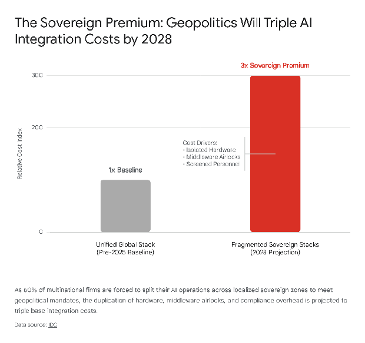
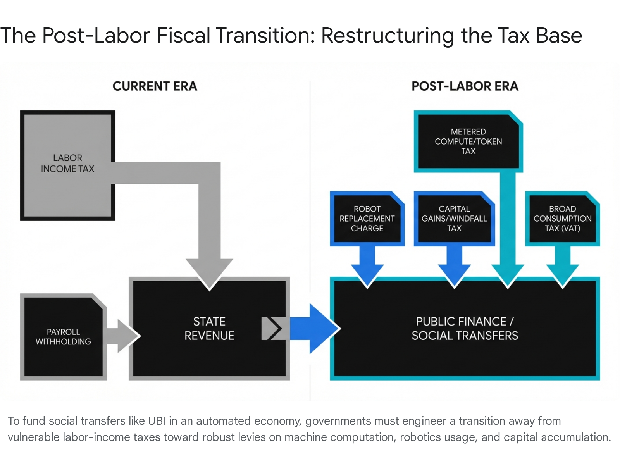

# **The Great Transition: Regulatory, Geopolitical, and Financial Constraints on the Path to a Post-Labor AI Economy (2026–2031)**

## **Introduction: The Threshold of Transformative Artificial Intelligence**

The global economy has entered an unprecedented epoch characterized by the imminent realization of Transformative Artificial Intelligence (TAI). Defined as machine intelligence capable of performing virtually all economically valuable human work, TAI is rapidly shifting from a theoretical construct to an operational reality. Extrapolating current trajectories in reasoning models, agentic workflows, and physical robotics, the consensus among leading developers and macroeconomic analysts indicates that artificial intelligence will achieve parity with, and subsequently surpass, human mental and physical capacity across most labor sectors within the next five years.1 In this scenario, the primary economic imperative becomes the exponential scaling of AI production to facilitate a complete structural overhaul of the global labor market by 2031\.

Assuming that the physical infrastructural prerequisites—such as semiconductor fabrication, grid-level power generation, and data center construction—are successfully managed, the velocity of this rollout will not be constrained by technological capability, but rather by an interconnected triad of systemic friction points: regulation, geopolitics, and capital financing.

This comprehensive report provides an exhaustive analysis of these three constraints. It models how regulatory frameworks, ranging from the European Union’s Artificial Intelligence Act (AI Act) to United States environmental permitting reforms, dictate the legal and physical boundaries of deployment.3 It evaluates how geopolitical hostilities, specifically the fragile techno-economic truce between the United States and China, alongside the emerging "Sovereign AI" paradigm, are fracturing global economies of scale and multiplying deployment costs.5 Furthermore, it investigates the capital financing supercycle required to fund this transition, analyzing hyperscaler debt loads, the unit economics of humanoid robotics, and the impending crisis of return on investment (ROI).7 Finally, anticipating the 2031 horizon, this analysis establishes the macroeconomic frameworks required to restructure public finance in a post-labor economy, detailing the necessary pivot from labor-income taxation to capital and compute-based revenue models to sustainably finance societal adaptation.10

## **Part I: The Regulatory Web and the Legal Velocity of AI Rollout**

The deployment of autonomous AI agents and embodied humanoid robotics into the real economy is currently gated by highly complex, overlapping regulatory regimes. These frameworks dictate not only what constitutes a legally permissible AI system but also the speed at which the physical infrastructure required to support these systems can be constructed. The regulatory landscape through 2030 is characterized by a profound tension between preemptive risk mitigation and the macroeconomic imperative to automate human labor.

### **The Gravity of the European Union AI Act**

The European Union’s Artificial Intelligence Act stands as the most consequential legislative framework governing global AI deployment. Functioning as a regulatory gravity well, the AI Act forces multinational corporations to adapt their global systems to European standards to maintain access to one of the world's largest consumer markets.3 The legislation, which formally entered into force on August 1, 2024, employs a phased, risk-based implementation timeline that creates cascading compliance bottlenecks for AI developers.3 The timeline for the lifting of these regulatory ambiguities, and the transition into a state of structural compliance, is strictly defined by the Act's enforcement schedule.

The table below outlines the critical milestones of the EU AI Act, mapping the escalation of regulatory constraints that developers must navigate to deploy labor-replacing AI systems between 2025 and 2030\.3

| Implementation Date | Regulatory Milestone and Compliance Obligation | Impact on AI Rollout |
| :---- | :---- | :---- |
| **February 2, 2025** | **Prohibited Practices:** Enforcement of bans on unacceptable risk systems (e.g., social scoring) and basic AI literacy mandates. | Eliminates specific deployment vectors but serves primarily as a baseline constraint for system architectures. |
| **August 2, 2025** | **GPAI Governance:** Rules for General-Purpose AI models become applicable. | Requires developers of foundational models to establish robust transparency, data governance, and training dataset documentation. |
| **August 2, 2026** | **High-Risk Systems (Annex III):** The majority of the Act becomes fully applicable and enforceable. | **Major Bottleneck:** Systems used in critical infrastructure, employment, and essential services must undergo conformity assessments and implement strict human oversight. |
| **August 2, 2027** | **Embedded High-Risk Systems:** Rules apply to AI systems embedded as safety components in regulated physical products (e.g., machinery, medical devices). | **Hardware Constraint:** Dictates the timeline for deploying embodied AI and autonomous robotics in commercial and industrial settings. |
| **December 31, 2030** | **Legacy IT Systems Compliance:** Final deadline for large-scale IT systems placed on the market prior to August 2027 to achieve full compliance. | Marks the absolute conclusion of the regulatory transition period, mandating total market compliance. |

As demonstrated by the compliance schedule, the most severe constraints on the global AI rollout will materialize in August 2026 and August 2027\. High-risk systems, which inherently encompass the AI agents designed to replace cognitive labor in corporate environments (e.g., human resources, legal analysis, and financial processing), will require extensive technical documentation and robust risk management systems.15 For the physical automation of labor, the August 2027 deadline is the paramount constraint. This date enforces compliance for high-risk AI systems that are embedded as safety components into regulated products.3 Multinational deployers are currently absorbing vast compliance costs to restructure their models, as failing to meet these obligations results in severe administrative fines.16 The ultimate lifting of this regulatory constraint does not imply a deregulation, but rather the establishment of a normalized, predictable operating environment post-2027, allowing capital to flow into compliant architectures without the current specter of legal uncertainty.

### **Navigating the Medical and Healthcare Bottleneck**

The intersection of AI and healthcare represents one of the most critical avenues for labor replacement, yet it is also the most heavily regulated. The deployment of Software as a Medical Device (SaMD) and AI-enabled robotic caregivers must navigate dual compliance between the incoming EU AI Act and pre-existing medical regulations, such as the EU Medical Device Regulation (MDR) and the United States Food and Drug Administration (FDA) frameworks.18

Analysts forecast a severe compliance bottleneck converging in 2026 and 2027\. Within the European Union, transition periods for legacy devices operating under older directives expire between 2027 and 2028, coinciding precisely with the enforcement of the AI Act's embedded product rules.19 Notified Bodies—the organizations responsible for assessing conformity—are expected to become overwhelmed with recertification demands, resulting in delayed certifications and disrupted supply chains.19

In the United States, the FDA is grappling with how to regulate continuously updating, adaptive AI models within a framework historically designed for static medical devices.20 While the FDA has issued draft guidance to support the development of AI-enabled devices throughout their Total Product Life Cycle, the reliance on predicate devices in the traditional 510(k) pathway creates significant friction for novel, generative AI diagnostic tools.20 Furthermore, absent comprehensive federal legislation, individual US states are enacting a patchwork of AI laws, complicating compliance for healthcare organizations operating across jurisdictions.22 This regulatory fragmentation indicates that while AI possesses the capability to replace vast segments of clinical and administrative healthcare labor, widespread deployment will be delayed until harmonization between medical safety standards and AI governance is achieved, likely extending into the late 2020s.

### **Certifying the Embodied AI Workforce: ISO and Physical Safety Standards**

For AI to replace human physical labor, software must be instantiated in robotic hardware. Historically, the scaling of industrial and commercial humanoid robotics has been constrained by the "safety versus speed" compromise. To prevent workplace injuries, high-speed industrial robots required costly physical fencing, which disrupted factory floor layouts, consumed valuable real estate, and wholly prevented fluid human-robot collaboration.23

This constraint experienced a paradigm shift in 2025 with the International Organization for Standardization's publication of ISO 10218-1:2025 and ISO 10218-2:2025.24 Replacing the outdated 2011 frameworks, these updated standards explicitly integrate requirements for collaborative robot systems and establish strict test methodologies for functional safety and cybersecurity.26 The operational unlocking of these standards was proven in early 2026 when Mantis Robotics achieved the world’s first fenceless, high-speed industrial arm certification to ISO 10218 and ISO 13849-1, achieving Performance Level d (PL=d).23

By utilizing proprietary "Physical AI" and embedded range-based object detection, autonomous robotic systems can now continuously monitor dynamic objects and automatically adjust their speed and behavior, operating safely at speeds up to 10 m/s within the exact footprint of a human worker.23 This certification marks a watershed moment in the timeline of AI labor replacement. Safety—identified by industry leaders as the primary bottleneck to scaling embodied AI—has been technically and legally solved.23 The lifting of this constraint clears the regulatory path for humanoid robots to saturate commercial, industrial, and eventually domestic environments without the capital burden of physical retrofitting.

### **Unleashing Domestic Supply Chains: US Permitting Reform**

While European regulation primarily focuses on the safety and governance of the algorithmic models, United States regulatory constraints heavily impact the physical supply chains required to build the hardware. The exponential scaling of AI requires a massive expansion of grid-level power generation, high-voltage transmission lines, and the domestic extraction of critical minerals (e.g., copper, gallium, germanium) essential for semiconductor fabrication.29 The primary regulatory bottlenecks choking this physical expansion are the National Environmental Policy Act (NEPA) and the Clean Water Act.29

Historically, mining and infrastructure projects face a weighted average duration of eight to nine years to navigate federal permitting.29 The most involved level of NEPA review, the Environmental Impact Statement (EIS), requires a minimum of two to three years, heavily exposing project developers to judicial unpredictability and multi-year litigation.29 Recognizing that AI dominance requires vastly accelerated infrastructure deployment, bipartisan momentum in the US Congress culminated in the passage of the Standardizing Permitting and Expediting Economic Development (SPEED) Act in the House of Representatives in December 2025\.4

The SPEED Act, alongside complementary legislation such as the PERMIT Act (focused on streamlining Clean Water Act Section 404 permits) and the Energy Permitting Reform Act of 2024, seeks to structurally overhaul the environmental review process.32 Key provisions of these reforms include strictly limiting the scope and scale of NEPA reviews, establishing firm review deadlines, utilizing categorical exclusions for projects deemed to have minimal environmental impact, and preventing the federal government from rescinding permits once they have been granted.4

The passage of such comprehensive reform through the Senate is viewed as an existential prerequisite for scaling the domestic AI hardware supply chain. Without truncating NEPA and Section 404 constraints, the capital velocity required to build out the autonomous economy will remain suppressed by bureaucratic attrition.34 Forecasts suggest that if these reforms are fully enacted in 2026, it will take approximately two years for the new legal standards to survive inevitable judicial challenges and stabilize. Consequently, the practical lifting of domestic infrastructure constraints is projected to materialize between 2028 and 2029, aligning with the anticipated surge in next-generation data center construction.

## **Part II: Geopolitical Friction and the Sovereign AI Paradigm**

As artificial intelligence solidifies its position as the apex strategic technology of the 21st century, it has become the primary theater of geopolitical conflict. The hyper-globalized, borderless cloud computing infrastructure that defined the 2010s is being systematically dismantled. In its place, a fractured, mercantilist digital economy is emerging, driven by state-level mandates for technological sovereignty and enforced through retaliatory trade barriers.

### **The Fragile US-China Techno-Economic Truce**

The bilateral relationship between the United States and China dictates the flow of foundational AI inputs: Western advanced semiconductors and Chinese critical minerals. The period extending through 2025 was characterized by acute escalation, demonstrating how geopolitical leverage can bottleneck the global AI supply chain, followed by a pragmatic, albeit highly fragile, de-escalation.

In October 2025, China implemented aggressive export controls on a wide swath of critical minerals through Ministry of Commerce (MOFCOM) Announcements 55 through 62\.36 Most significantly, Beijing applied a mechanism conceptually similar to the US Foreign Direct Product Rule (FDPR) to rare earth elements and permanent magnets.38 This mandated that foreign firms obtain Chinese government approval to export magnets containing even trace amounts of Chinese-origin rare earths, or products manufactured using Chinese processing technology.38 Because China controls over 90% of the refining stages for essential magnet materials (such as neodymium and dysprosium) and holds near-monopolies in battery precursor materials, these restrictions triggered immediate shockwaves through Western automotive, defense, and robotics supply chains.39 Concurrently, earlier restrictions on gallium, germanium, antimony, and graphite heavily constrained semiconductor and AI hardware manufacturing.36

However, the economic mutually assured destruction of these policies forced a recalibration. During the November 2025 APEC summit, President Donald Trump and President Xi Jinping negotiated a one-year techno-economic truce.40 The United States agreed to suspend the implementation of the 50% ownership rule for entity list affiliates and reduced certain tariffs, while concurrently loosening export controls to permit the sale of advanced AI chips (such as the Nvidia H200) to approved Chinese entities.41 In direct exchange, China's MOFCOM issued Announcements No. 70 and No. 72, officially suspending the implementation of the October rare-earth restrictions and pausing the enhanced licensing requirements for dual-use items (gallium, germanium, antimony) until November 2026\.36

Geopolitical analysts classify this truce as a tactical pause rather than a permanent strategic alignment. The underlying structural competition remains unresolved. By loosening chip controls, the US risks accelerating China's domestic AI capabilities, allowing Chinese labs to build massive AI data centers and narrow the compute advantage held by American foundation models.41 Conversely, the one-year pause provides Western nations a critical, but desperately short, window to capitalize on the aforementioned domestic mining initiatives and diversify supply chains away from Chinese reliance.39

Current projections indicate that the timeline to lift these geopolitical constraints organically is highly unfavorable for rapid AI scaling. Breaking China's dominance in rare earth refining and establishing alternative supply chains will take well over five years.46 Therefore, the constant threat of renewed export restrictions will act as a persistent limiting factor on the hardware scale-up of AI robotics through the end of the decade, forcing Western capital to subsidize inefficient, nascent domestic refining capabilities.

### **The Sovereign AI Stack: The Cost of Digital Autarky**

Beyond the acute US-China dynamic, middle powers, multinational blocs, and emerging economies are erecting their own geopolitical barriers under the doctrine of "Sovereign AI." Driven by fears of supply concentration, foreign espionage, and cultural homogenization via imported foundation models, governments are increasingly mandating that AI data, compute infrastructure, and model weights remain strictly within national borders.47

This geopolitical shift is fundamentally destroying the economic efficiency of global cloud computing. According to forecasts by the International Data Corporation (IDC), by 2028, 60% of multinational firms will be forced to split their AI architectures across disparate sovereign zones.5 To comply with localization mandates, multinationals must now procure hardware, secure data center partners, and provision server capacity strictly within regional boundaries, creating isolated operational spheres characterized by an emerging "East versus West" divide.5

The capital impact of this fragmentation is staggering. Operating parallel, localized infrastructures—dubbed the "Sovereign Premium"—carries substantially higher overhead due to isolated hardware deployment, stringent data privacy compliance, and the strict requirement for security-cleared, localized personnel.5 Furthermore, orchestrating AI agents across these sovereign boundaries requires highly complex, federated AI architectures and expensive middleware "airlocks" to prevent cross-border data leakage.5

Consequently, IDC projects that this geopolitical infrastructure multiplication will effectively triple integration costs for global enterprises by 2028, significantly slowing the strategic scaling of AI deployment and diminishing the macroeconomic returns of the technology.5 While complete autarky—building an entirely independent technological stack from silicon to software—is economically prohibitive for most nations, the move toward "managed interdependence" guarantees that the frictionless, global scaling of AI envisioned by technologists will be severely constrained by the territorial realities of statecraft. The timeline for lifting this constraint is indefinite; as AI capabilities grow closer to replacing human labor, the geopolitical imperative to control those capabilities will only intensify, making the Sovereign Premium a permanent fixture of the AI economy.

## **Part III: Capital Financing, CapEx Supercycles, and the ROI Horizon**

The transition to a post-labor economy is not merely a software engineering challenge; it is arguably the most capital-intensive industrial build-out in human history. To adequately replace the cognitive and physical capacity of the global workforce, the computing substrate must expand by orders of magnitude. The financing of this expansion is currently facing profound structural stress, caught between staggering capital expenditure requirements, shifting corporate debt profiles, and mounting investor anxiety over the timeline for revenue realization.

### **The Hyperscaler CapEx Supercycle and the Shift to Leverage**

The financial velocity of the AI rollout is almost entirely dependent on the capital expenditures (CapEx) of the primary hyperscalers: Microsoft, Amazon, Alphabet, Meta, and Oracle. In 2025, these entities invested aggressively in data center construction, high-performance graphics processing units (GPUs), and long-term power contracts.49 Analyst projections indicate that hyperscaler capital spending will surge to an estimated $527 billion to over $600 billion in 2026, representing a massive year-over-year increase.7 Looking toward the end of the decade, comprehensive macroeconomic models suggest that global AI infrastructure will require up to $7 trillion in total capital outlay by 2030 to satisfy the anticipated demand for compute power.52

Historically, large technology companies have funded their expansions organically through robust internal free cash flow. However, the sheer scale of the AI supercycle has fractured this paradigm. By late 2025, aggregate CapEx for the leading tech firms began to outpace their internal free cash flow generation, necessitating a systemic shift toward external funding mechanisms.9 Consequently, hyperscalers are increasingly reliant on global credit markets and investment-grade (IG) borrowing, fundamentally transforming their business models from cash-funded operations to entities utilizing significant leverage.7 For example, Meta priced a $30 billion USD IG financing package in late 2025, marking a seismic shift in how AI infrastructure is capitalized.9 This reliance on debt introduces a critical systemic vulnerability: the sustained expansion of AI infrastructure is now highly sensitive to interest rate regimes, bond market liquidity, and the ongoing appetite of institutional debt investors.

### **The Revenue Realization Gap and Market Dispersion**

As capital expenditures eclipse the half-trillion-dollar mark annually, equity and debt markets are intensely scrutinizing the return on investment (ROI). In the initial phases of the AI boom, capital flowed indiscriminately toward any entity associated with AI infrastructure. Entering 2026, investor sentiment has sharply bifurcated.

Financial analysis notes a significant divergence in the performance of AI-related equities. The average stock price correlation among large public AI hyperscalers dropped precipitously from 80% to merely 20% in late 2025\.7 Investors are aggressively rotating away from infrastructure companies where capital expenditures are debt-funded and where operating earnings growth remains under pressure.7 The market is now strictly rewarding entities that can demonstrate a clear, empirical link between their massive infrastructure investments and tangible, near-term revenue generation—specifically, major cloud platform operators and established software providers.7

This scrutiny exposes a glaring "revenue realization gap." Many companies categorized as "AI Productivity Beneficiaries" have underwhelmed in the equity markets because investors are struggling with the uncertainty surrounding the timing and magnitude of future earnings benefits.7 Furthermore, there is growing concern regarding the circular nature of AI investments—often termed "vendor financing"—where providers of compute infrastructure invest heavily in native AI startups that, in turn, use that capital to rent compute from the hyperscalers.53 If the enterprise adoption of AI agents fails to yield immediate, quantifiable productivity gains, the willingness of markets to finance the underlying infrastructure debt will evaporate.

The timeline for lifting this capital constraint hinges on achieving recursive self-improvement in AI models. Financial frameworks, such as those modeled by Barclays, suggest that if AI labs hit recursive self-improvement by 2028, it would drastically increase the efficiency of spending and reduce training costs, allowing CapEx to plateau while revenues catch up.54 Until that inflection point is reached, the AI rollout remains highly vulnerable to market corrections and tightening credit conditions.

### **The Humanoid Robotics Bubble and the Path to Commodity Pricing**

While digital AI agents are designed to replace cognitive labor, embodied humanoid robots are required to replace the vast spectrum of physical labor. The capital financing landscape for humanoid robotics entering 2026 exhibits symptoms of an investment bubble undergoing a harsh, ROI-driven correction.

In 2024 and 2025, venture capital poured billions into humanoid startups based on impressive, highly controlled technological demonstrations.55 Valuations skyrocketed, with market leaders achieving multi-billion dollar capitalizations before demonstrating mass manufacturing capabilities.58 However, the economic reality of hardware production is asserting dominance. The transition from building bespoke, multi-million-dollar prototypes to achieving scaled, profitable manufacturing is destroying undercapitalized market entrants. Startups lacking the capital runway to establish robust supply chains or achieve true commercial validation are facing cash flow exhaustion, as evidenced by the high-profile failure of firms like K-Scale Labs.57 Market analysts predict that 2026 and 2027 will see accelerated industry consolidation, culling entities that cannot transition from "demo-hype" to verifiable, shift-equivalent uptime and measurable productivity metrics.57

The survival of the humanoid robotics sector, and its ability to meaningfully replace human labor, relies entirely on unit economics. The table below outlines the projected cost milestones required for humanoid robots to reach commodity scale.8

| Year | Target Price Range (USD) | Market Phase and Production Scale | Primary Cost Drivers and Bottlenecks |
| :---- | :---- | :---- | :---- |
| **2026** | $13,500 – $150,000 | **Early Commercialization:** Entry-level models available alongside highly expensive, bespoke industrial units. | Low production volumes. Actuators and motion systems account for 40–50% of the total manufacturing cost. |
| **2028** | $15,000 – $50,000 | **Mass Production Onset:** Industrial humanoids drop below $50k; consumer/service models begin to emerge. | Economies of scale begin to reduce actuator costs by 50–70%. Software differentiation becomes key. |
| **2030** | $10,000 – $20,000 | **Commodity Scale Adoption:** Full-featured humanoids achieve price parity with a fraction of human annual wages. | Supply chain maturity and advanced manufacturing techniques allow for millions of units to be deployed globally. |
| **2032+** | $10,000 – $15,000 | **Ubiquity:** Complete saturation of logistics, manufacturing, and domestic care markets. | Component commoditization and highly efficient inference compute. |

To fulfill the macroeconomic thesis of replacing mass human labor, the industry must drive unit costs down from the $150,000 range to the $10,000 target. Actuators and motion systems remain the critical cost bottleneck.8 As component costs decline and production scales, financial models project that achieving the $10,000 to $20,000 price point by 2030 will unlock commodity-scale adoption, enabling the total displacement of millions of physical labor roles and permanently lifting the capital constraint on physical AI deployment.8

## **Part IV: The 2031 Paradigm: Restructuring Finance for the Post-Labor Economy**

If regulatory friction is mitigated through legislative reform, geopolitical supply lines are stabilized via strategic alliances, and capital constraints are overcome through massive hyperscaler investment and achieving economies of scale in robotics, the five-year trajectory culminates in an economic singularity. By 2031, the global economy will enter an environment where AI and robotic systems are capable of executing the vast majority of economically valuable cognitive and physical tasks. In this scenario, the traditional macroeconomic models that have governed industrial societies for over a century will face systemic failure, demanding a total restructuring of public finance and capital distribution.

### **The Erosion of the Labor-Income Tax Base**

Modern sovereign states operate almost entirely on the taxation of human labor. In the United States, for example, approximately 75% of all federal tax revenue is derived directly from labor income, payroll withholdings, and the consumer spending that is strictly enabled by wages.10

When Transformative AI reaches the capability threshold to substitute human labor across broad occupational spectrums, the foundational pillars of this taxation system will erode. Advanced economic modeling—such as the Solow-Zeira task-automation model (employing a Constant Elasticity of Substitution aggregator )—demonstrates that as automation deepens and tasks are transferred to machines, the labor share of national income plummets while the capital share skyrockets.12 Without large-scale human payrolls, income tax receipts and social security contributions will experience a devastating shortfall.61 This fiscal collapse will occur precisely at the moment when structural, permanent unemployment requires massive state intervention to maintain civil order and economic stability.

This impending fiscal crisis dictates that the primary constraint of the early 2030s will not be technological capacity, but regulatory and legislative adaptation. Governments must aggressively pivot their revenue engines to capture value from the elements of the economy that still scale with output: capital accumulation, machine computation, and broad consumption.10

### **New Fiscal Instruments: From Wages to Compute**

To finance the societal transition and prevent a total collapse in aggregate consumer demand, policymakers must enact a suite of novel taxation mechanisms tailored to an autonomous economy.11 The transition period necessitates a delicate balance: aggressively capturing the productivity gains of AI to fund social safety nets, without taxing the infrastructure so punitively that it strangles the innovation required to generate that wealth.10

Research frameworks identify several primary instruments for this structural shift. First, governments must implement metered AI usage and compute taxes. This involves shifting taxation from human hours worked to machine computation by levying excises on AI activity, such as taxing inference calls, token generation, or raw compute-hours consumed by hyperscale data centers.10 Second, policymakers are exploring robot and automation taxes, often conceptualized as a "Labor-Equivalent Replacement Charge." This mechanism is intended to mimic the traditional labor tax wedge by taxing corporations based on the estimated number of human workers displaced by embodied robotics or autonomous software agents, ensuring businesses continue contributing to public finances post-automation.11

Third, a transition toward broad consumption taxation is required. Because the production cost of goods and services will plummet due to the hyper-efficiency of AI, taxing the end consumption via modernized Value-Added Tax (VAT) systems on digital and AI retail services becomes a highly reliable revenue stream.10 Finally, capital income and windfall taxes must be escalated. This requires significantly increasing the effective taxation on corporate dividends, capital gains, and the monopolistic economic rents generated by the few entities controlling the foundational AI models and critical infrastructure choke points.11

### **The Calculus of Universal Basic Income (UBI)**

The ultimate objective of restructuring these financial mechanisms is to sustainably fund mass social transfers, predominantly conceptualized as Universal Basic Income (UBI) or Universal Basic Capital, to support the displaced human population.11

The viability of UBI is entirely contingent on AI achieving massive leaps in productivity. Current economic modeling utilizing U.S. parameters indicates a specific "AI capability threshold" required to achieve this equilibrium. Even in a highly conservative scenario where no new human-centric job categories are created to replace the ones lost to automation, AI systems must reach a productivity multiplier of 5 to 7 times that of current pre-AI automation to organically fund a UBI equivalent to 11% of GDP.12

Crucially, the regulatory structure of the market heavily influences this threshold. If governments successfully raise the public revenue share extracted from AI capital profits from current levels of approximately 15% up to 33%, the required AI capability threshold is halved. In this scenario, the technology would only need to be 3 times more productive than existing automation to sustain universal transfers.12 Conversely, if the AI market becomes hyper-competitive rather than concentrated among a few monopolistic hyperscalers, economic rents are reduced, ironically making it mathematically harder for governments to capture the surplus wealth required to fund UBI.12

Therefore, the realization of a stable post-labor economy by the early 2030s relies on an intricate, highly managed synergy: regulators must allow hyperscalers to scale infrastructure rapidly and efficiently to achieve massive productivity gains, while simultaneously executing a total paradigm shift in global taxation to capture and redistribute the resulting capital.

## **Conclusion**

The proposition that artificial intelligence will automate the majority of human mental and physical labor within a five-year horizon relies on a critical, often unquestioned assumption: that global production capacity can scale unhindered to meet infinite demand. However, this analysis demonstrates that the trajectory of AI is firmly bound by the terrestrial realities of legislation, sovereign borders, and corporate balance sheets.

Over the period spanning 2026 to 2031, the global AI rollout will not follow a seamless exponential curve, but rather navigate a grueling progression through three distinct constraints. First, the regulatory bottleneck will dictate the legal velocity of deployment. The aggressive compliance deadlines of the EU AI Act—peaking in 2026 for high-risk systems and 2027 for embedded robotics—will force a painful, costly restructuring of global AI governance.3 Simultaneously, the physical expansion of the AI supply chain in the United States depends entirely on whether legislative efforts like the SPEED Act can successfully truncate the multi-year delays inherent in NEPA and environmental permitting.4 Second, geopolitical friction will act as a persistent drag on scaling efficiency. The temporary US-China trade truce regarding critical minerals belies a deeper systemic fragmentation. The rise of the "Sovereign AI" mandate is destroying global cloud efficiencies, threatening to triple integration costs by 2028 and price out all but the most heavily capitalized entities.5 Third, the capital financing crisis will test the patience of the global credit markets. As hyperscalers transition from cash-rich expansion to debt-funded leverage to afford $600 billion in annual expenditures, financial markets are enforcing strict ROI discipline.7 Concurrently, the humanoid robotics sector must survive a brutal mid-decade consolidation, needing to drive unit costs down from $150,000 prototypes to $10,000 commodities by 2030 to make physical labor replacement economically viable.8

Should these constraints be resolved—if regulations are streamlined, supply chains secured, and capital returns validated—the ultimate challenge of 2031 will materialize. The realization of Transformative AI will eradicate the labor-income tax base upon which modern nations rely.10 To survive the post-labor transition, governments must successfully engineer the most profound macroeconomic shift in modern history, replacing the taxation of human effort with the taxation of machine compute and capital.11 Only through this rapid fiscal adaptation can the unprecedented productivity of the AI era be harnessed to sustainably finance the society it displaces.

#### **Works cited**

1. Will we have AGI by 2030? | 80,000 Hours, accessed March 13, 2026, [https://80000hours.org/ai/guide/when-will-agi-arrive/](https://80000hours.org/ai/guide/when-will-agi-arrive/)  
2. Public Finance in the Age of AI: A Primer Anton Korinek and Lee M. Lockwood Transformative artificial intelligence (TAI) \- NBER, accessed March 13, 2026, [https://www.nber.org/system/files/chapters/c15323/revisions/c15323.rev0.pdf](https://www.nber.org/system/files/chapters/c15323/revisions/c15323.rev0.pdf)  
3. Implementation Timeline | EU Artificial Intelligence Act, accessed March 13, 2026, [https://artificialintelligenceact.eu/implementation-timeline/](https://artificialintelligenceact.eu/implementation-timeline/)  
4. Westerman warns of short timeline on permitting reform | National Association of Counties, accessed March 13, 2026, [https://www.naco.org/news/westerman-warns-short-timeline-permitting-reform](https://www.naco.org/news/westerman-warns-short-timeline-permitting-reform)  
5. The high cost of sovereignty in the age of AI \- IDC, accessed March 13, 2026, [https://www.idc.com/resource-center/blog/the-high-cost-of-sovereignty-in-the-age-of-ai/](https://www.idc.com/resource-center/blog/the-high-cost-of-sovereignty-in-the-age-of-ai/)  
6. United States and China Reach Trade Agreement: Takeaways for Export and Supply Chain Controls | Morrison Foerster, accessed March 13, 2026, [https://www.mofo.com/resources/insights/251113-united-states-and-china-reach-trade-agreement](https://www.mofo.com/resources/insights/251113-united-states-and-china-reach-trade-agreement)  
7. Why AI Companies May Invest More than $500 Billion in 2026 | Goldman Sachs, accessed March 13, 2026, [https://www.goldmansachs.com/insights/articles/why-ai-companies-may-invest-more-than-500-billion-in-2026](https://www.goldmansachs.com/insights/articles/why-ai-companies-may-invest-more-than-500-billion-in-2026)  
8. The Economics of Humanoid Robot Production: Costs, Trends & 2026 Analysis \- Robozaps, accessed March 13, 2026, [https://blog.robozaps.com/b/economics-of-humanoid-robot-production](https://blog.robozaps.com/b/economics-of-humanoid-robot-production)  
9. Hyperscalers' Capex Above $600 Bn in 2026 \- MUFG Americas, accessed March 13, 2026, [https://www.mufgamericas.com/sites/default/files/document/2025-12/AI\_Chart\_Weekly\_12\_19\_Financing\_the\_AI\_Supercycle.pdf](https://www.mufgamericas.com/sites/default/files/document/2025-12/AI_Chart_Weekly_12_19_Financing_the_AI_Supercycle.pdf)  
10. The future of tax policy: A public finance framework for the age of AI | Brookings, accessed March 13, 2026, [https://www.brookings.edu/articles/future-tax-policy-a-public-finance-framework-for-the-age-of-ai/](https://www.brookings.edu/articles/future-tax-policy-a-public-finance-framework-for-the-age-of-ai/)  
11. Paying for the AI Transition \- Tax Project Institute, accessed March 13, 2026, [https://taxproject.org/paying-for-the-ai-transition/](https://taxproject.org/paying-for-the-ai-transition/)  
12. An AI Capability Threshold for Rent-Funded Universal Basic Income in an AI-Automated Economy \- arXiv.org, accessed March 13, 2026, [https://arxiv.org/html/2505.18687v3](https://arxiv.org/html/2505.18687v3)  
13. Decoding the EU AI Act, accessed March 13, 2026, [https://assets.kpmg.com/content/dam/kpmg/xx/pdf/2024/02/decoding-the-eu-artificial-intelligence-act.pdf](https://assets.kpmg.com/content/dam/kpmg/xx/pdf/2024/02/decoding-the-eu-artificial-intelligence-act.pdf)  
14. Timeline for the Implementation of the EU AI Act, accessed March 13, 2026, [https://ai-act-service-desk.ec.europa.eu/en/ai-act/timeline/timeline-implementation-eu-ai-act](https://ai-act-service-desk.ec.europa.eu/en/ai-act/timeline/timeline-implementation-eu-ai-act)  
15. EU AI Act Compliance Timeline: Key Dates for 2025-2027 by Risk Tier \- Trilateral Research, accessed March 13, 2026, [https://trilateralresearch.com/responsible-ai/eu-ai-act-implementation-timeline-mapping-your-models-to-the-new-risk-tiers](https://trilateralresearch.com/responsible-ai/eu-ai-act-implementation-timeline-mapping-your-models-to-the-new-risk-tiers)  
16. AI Act Implementation: Timelines & Next steps | EU Artificial Intelligence Act, accessed March 13, 2026, [https://artificialintelligenceact.eu/ai-act-implementation-next-steps/](https://artificialintelligenceact.eu/ai-act-implementation-next-steps/)  
17. EU AI Act High-Risk Requirements: What Companies Need to Know \- Dataiku, accessed March 13, 2026, [https://www.dataiku.com/stories/blog/eu-ai-act-high-risk-requirements](https://www.dataiku.com/stories/blog/eu-ai-act-high-risk-requirements)  
18. 25 February 2026 – MDR, IVDR, and the AI Act: What They Mean for Software as a Medical Device \- EUCROF, accessed March 13, 2026, [https://eucrof.eu/25-february-2026-mdr-ivdr-and-the-ai-act-what-they-mean-for-software-as-a-medical-device/](https://eucrof.eu/25-february-2026-mdr-ivdr-and-the-ai-act-what-they-mean-for-software-as-a-medical-device/)  
19. EU MDR Bottleneck Ahead: Why 2026 Matters for Manufacturers \- QbD Group, accessed March 13, 2026, [https://www.qbdgroup.com/en/blog/eu-mdr-bottleneck-2026-medical-device-manufacturers](https://www.qbdgroup.com/en/blog/eu-mdr-bottleneck-2026-medical-device-manufacturers)  
20. Navigating regulatory and policy challenges for AI enabled combination devices \- PMC, accessed March 13, 2026, [https://pmc.ncbi.nlm.nih.gov/articles/PMC11634576/](https://pmc.ncbi.nlm.nih.gov/articles/PMC11634576/)  
21. FDA Issues Comprehensive Draft Guidance for Developers of Artificial Intelligence-Enabled Medical Devices, accessed March 13, 2026, [https://www.fda.gov/news-events/press-announcements/fda-issues-comprehensive-draft-guidance-developers-artificial-intelligence-enabled-medical-devices](https://www.fda.gov/news-events/press-announcements/fda-issues-comprehensive-draft-guidance-developers-artificial-intelligence-enabled-medical-devices)  
22. Top Healthcare AI Trends in 2026 | News \- Holland & Knight, accessed March 13, 2026, [https://www.hklaw.com/en/news/intheheadlines/2026/01/top-healthcare-ai-trends-in-2026](https://www.hklaw.com/en/news/intheheadlines/2026/01/top-healthcare-ai-trends-in-2026)  
23. Mantis Robotics Achieves Safety Certification of World's First Fenceless, High-Speed Industrial Robot; Lays Foundation for Safe Humanoids and AI Robots Everywhere \- PR Newswire, accessed March 13, 2026, [https://www.prnewswire.com/news-releases/mantis-robotics-achieves-safety-certification-of-worlds-first-fenceless-high-speed-industrial-robot-lays-foundation-for-safe-humanoids-and-ai-robots-everywhere-302695904.html](https://www.prnewswire.com/news-releases/mantis-robotics-achieves-safety-certification-of-worlds-first-fenceless-high-speed-industrial-robot-lays-foundation-for-safe-humanoids-and-ai-robots-everywhere-302695904.html)  
24. New standards for industrial robots EN ISO 10218-1 and \-2 \- IBF Solutions, accessed March 13, 2026, [https://www.ibf-solutions.com/en/seminars-and-news/news/new-standards-for-industrial-robots-en-iso-10218-1-and-2](https://www.ibf-solutions.com/en/seminars-and-news/news/new-standards-for-industrial-robots-en-iso-10218-1-and-2)  
25. Updated ISO 10218 | Answers to Frequently Asked Questions (FAQs) | A3, accessed March 13, 2026, [https://www.automate.org/robotics/blogs/updated-iso-10218-faq](https://www.automate.org/robotics/blogs/updated-iso-10218-faq)  
26. Behind the ISO 10218 series safety standards updates in 2025: understanding the real-world shifts in industrial robot technology that drove the revisions (article 1 of 2\) | IDEC USA, accessed March 13, 2026, [https://www.idec.com/en-us/blog/iso-10218-updates-revisions-background-part-1](https://www.idec.com/en-us/blog/iso-10218-updates-revisions-background-part-1)  
27. ISO 10218-1:2025—Robots And Robotic Devices Safety \- The ANSI Blog, accessed March 13, 2026, [https://blog.ansi.org/ansi/iso-10218-1-2025-robots-and-robotic-devices-safety/](https://blog.ansi.org/ansi/iso-10218-1-2025-robots-and-robotic-devices-safety/)  
28. Fence-free, high-speed robot is 'first' to achieve safety certification \- Drives & Controls, accessed March 13, 2026, [https://drivesncontrols.com/fence-free-high-speed-robot-is-first-to-achieve-safety-certification/](https://drivesncontrols.com/fence-free-high-speed-robot-is-first-to-achieve-safety-certification/)  
29. Unlocking US federal permitting: A sustainable growth imperative \- McKinsey, accessed March 13, 2026, [https://www.mckinsey.com/industries/public-sector/our-insights/unlocking-us-federal-permitting-a-sustainable-growth-imperative](https://www.mckinsey.com/industries/public-sector/our-insights/unlocking-us-federal-permitting-a-sustainable-growth-imperative)  
30. The Impact of the National Environmental Policy Act (NEPA) | Womble Bond Dickinson, accessed March 13, 2026, [https://www.womblebonddickinson.com/us/insights/articles-and-briefings/impact-national-environmental-policy-act-nepa](https://www.womblebonddickinson.com/us/insights/articles-and-briefings/impact-national-environmental-policy-act-nepa)  
31. NEPA: Are New Developments Actually Speeding Federal Permit Reviews? | Carlton Fields, accessed March 13, 2026, [https://www.carltonfields.com/insights/publications/2025/nepa-are-new-developments-actually-speeding-federal-permit-reviews](https://www.carltonfields.com/insights/publications/2025/nepa-are-new-developments-actually-speeding-federal-permit-reviews)  
32. What They Are Saying: Growing Support for PERMIT Act's Permitting Reforms, accessed March 13, 2026, [https://transportation.house.gov/news/documentsingle.aspx?DocumentID=409155](https://transportation.house.gov/news/documentsingle.aspx?DocumentID=409155)  
33. Pass the Energy Permitting Reform Act \- ACP, accessed March 13, 2026, [https://cleanpower.org/resources/pass-the-energy-permitting-reform-act/](https://cleanpower.org/resources/pass-the-energy-permitting-reform-act/)  
34. Secure America's Energy Future: The Time Is Now for Durable Permitting Reform, accessed March 13, 2026, [https://axpc.org/education-resource/secure-americas-energy-future-the-time-is-now-for-durable-permitting-reform/](https://axpc.org/education-resource/secure-americas-energy-future-the-time-is-now-for-durable-permitting-reform/)  
35. The Importance of Domestic Mining for U.S. National Security | ClearPath, accessed March 13, 2026, [https://clearpath.org/our-take/the-importance-of-domestic-mining-for-u-s-national-security/](https://clearpath.org/our-take/the-importance-of-domestic-mining-for-u-s-national-security/)  
36. China Suspends Export Controls on Certain Critical Minerals and Related Items, accessed March 13, 2026, [https://www.pillsburylaw.com/en/news-and-insights/china-suspends-export-controls-certain-critical-minerals-related-items.html](https://www.pillsburylaw.com/en/news-and-insights/china-suspends-export-controls-certain-critical-minerals-related-items.html)  
37. China Hits “Pause” on Rare-Earth Export Controls and What it Means for Supply Chains | News & Events \- Clark Hill, accessed March 13, 2026, [https://www.clarkhill.com/news-events/news/china-hits-pause-on-rare-earth-export-controls-and-what-it-means-for-supply-chains/](https://www.clarkhill.com/news-events/news/china-hits-pause-on-rare-earth-export-controls-and-what-it-means-for-supply-chains/)  
38. China's New Rare Earth and Magnet Restrictions Threaten U.S. Defense Supply Chains \- CSIS, accessed March 13, 2026, [https://www.csis.org/analysis/chinas-new-rare-earth-and-magnet-restrictions-threaten-us-defense-supply-chains](https://www.csis.org/analysis/chinas-new-rare-earth-and-magnet-restrictions-threaten-us-defense-supply-chains)  
39. With new export controls on critical minerals, supply concentration risks become reality \- IEA, accessed March 13, 2026, [https://www.iea.org/commentaries/with-new-export-controls-on-critical-minerals-supply-concentration-risks-become-reality](https://www.iea.org/commentaries/with-new-export-controls-on-critical-minerals-supply-concentration-risks-become-reality)  
40. The U.S.–China Tariff Truce: What It Means for Importers \- Krieg DeVault LLP, accessed March 13, 2026, [https://www.kriegdevault.com/insights/the-us-china-tariff-truce-what-it-means-for-importers](https://www.kriegdevault.com/insights/the-us-china-tariff-truce-what-it-means-for-importers)  
41. If superintelligence isn't imminent, the Trump administration may be right to loosen advanced chip export controls | Brookings, accessed March 13, 2026, [https://www.brookings.edu/articles/if-superintelligence-isnt-imminent-the-trump-administration-may-be-right-to-loosen-advanced-chip-export-controls/](https://www.brookings.edu/articles/if-superintelligence-isnt-imminent-the-trump-administration-may-be-right-to-loosen-advanced-chip-export-controls/)  
42. Trump-Xi Meeting: US and China Agree to Tariff, Rare Earth Concessions \- China Briefing, accessed March 13, 2026, [https://www.china-briefing.com/news/trump-xi-meeting-outcomes-and-implications/](https://www.china-briefing.com/news/trump-xi-meeting-outcomes-and-implications/)  
43. 2026 Global Semiconductor Industry Outlook \- Deloitte, accessed March 13, 2026, [https://www.deloitte.com/us/en/insights/industry/technology/technology-media-telecom-outlooks/semiconductor-industry-outlook.html](https://www.deloitte.com/us/en/insights/industry/technology/technology-media-telecom-outlooks/semiconductor-industry-outlook.html)  
44. China's AI Chip Deficit: Why Huawei Can't Catch Nvidia and U.S. Export Controls Should Remain | Council on Foreign Relations \- CFR.org, accessed March 13, 2026, [https://www.cfr.org/articles/chinas-ai-chip-deficit-why-huawei-cant-catch-nvidia-and-us-export-controls-should-remain](https://www.cfr.org/articles/chinas-ai-chip-deficit-why-huawei-cant-catch-nvidia-and-us-export-controls-should-remain)  
45. The Burn and the Choke: Why Semiconductor Controls Will Outlast China's Rare Earth Weapon \- War on the Rocks, accessed March 13, 2026, [https://warontherocks.com/2026/01/the-burn-and-the-choke-why-semiconductor-controls-will-outlast-chinas-rare-earth-weapon/](https://warontherocks.com/2026/01/the-burn-and-the-choke-why-semiconductor-controls-will-outlast-chinas-rare-earth-weapon/)  
46. Surveying the Experts: The State of U.S.-China Relations Entering 2026, accessed March 13, 2026, [https://chinapower.csis.org/survey-experts-us-china-relations-2026/](https://chinapower.csis.org/survey-experts-us-china-relations-2026/)  
47. The Geopolitics of Tech Is Hitting All Companies. How Boards Can Respond, accessed March 13, 2026, [https://www.bcg.com/publications/2025/geopolitics-of-tech-is-hitting-all-companies](https://www.bcg.com/publications/2025/geopolitics-of-tech-is-hitting-all-companies)  
48. The sovereign AI agenda: Moving from ambition to reality \- McKinsey, accessed March 13, 2026, [https://www.mckinsey.com/capabilities/tech-and-ai/our-insights/tech-forward/the-sovereign-ai-agenda-moving-from-ambition-to-reality](https://www.mckinsey.com/capabilities/tech-and-ai/our-insights/tech-forward/the-sovereign-ai-agenda-moving-from-ambition-to-reality)  
49. Future forward: Following the money in AI \- KPMG International, accessed March 13, 2026, [https://kpmg.com/xx/en/our-insights/value-creation/future-forward.html](https://kpmg.com/xx/en/our-insights/value-creation/future-forward.html)  
50. The cost of compute: A $7 trillion race to scale data centers \- McKinsey, accessed March 13, 2026, [https://www.mckinsey.com/industries/technology-media-and-telecommunications/our-insights/the-cost-of-compute-a-7-trillion-dollar-race-to-scale-data-centers](https://www.mckinsey.com/industries/technology-media-and-telecommunications/our-insights/the-cost-of-compute-a-7-trillion-dollar-race-to-scale-data-centers)  
51. Hyperscaler capex \> $600 bn in 2026 a 36% increase over 2025 while global spending on cloud infrastructure services skyrockets \- IEEE ComSoc Technology Blog, accessed March 13, 2026, [https://techblog.comsoc.org/2025/12/22/hyperscaler-capex-600-bn-in-2026-a-36-increase-over-2025-while-global-spending-on-cloud-infrastructure-services-skyrockets/](https://techblog.comsoc.org/2025/12/22/hyperscaler-capex-600-bn-in-2026-a-36-increase-over-2025-while-global-spending-on-cloud-infrastructure-services-skyrockets/)  
52. AI Infrastructure to Require $7tn by 2030, says McKinsey | Data Centre Magazine, accessed March 13, 2026, [https://datacentremagazine.com/articles/ai-infrastructure-to-require-7tn-by-2030-says-mckinsey](https://datacentremagazine.com/articles/ai-infrastructure-to-require-7tn-by-2030-says-mckinsey)  
53. HYPErscalers: Is the AI boom dot-com redux? | T. Rowe Price, accessed March 13, 2026, [https://www.troweprice.com/en/uk/investment-institute/insights/hyperscalers-is-the-ai-boom-dot-com-redux](https://www.troweprice.com/en/uk/investment-institute/insights/hyperscalers-is-the-ai-boom-dot-com-redux)  
54. AI capex forecasts may be $225 billion too low for 2027, 2028: Barclays \- Investing.com, accessed March 13, 2026, [https://www.investing.com/news/stock-market-news/ai-capex-forecasts-may-be-225-billion-too-low-for-2027-2028-barclays-4553943](https://www.investing.com/news/stock-market-news/ai-capex-forecasts-may-be-225-billion-too-low-for-2027-2028-barclays-4553943)  
55. Speech by Governor Barr on artificial intelligence and the labor market \- Federal Reserve, accessed March 13, 2026, [https://www.federalreserve.gov/newsevents/speech/barr20260217a.htm](https://www.federalreserve.gov/newsevents/speech/barr20260217a.htm)  
56. AI Startups That Failed (2023-2026) | IdeaProof, accessed March 13, 2026, [https://ideaproof.io/failures/ai-startups](https://ideaproof.io/failures/ai-startups)  
57. The first wave of shutdowns of humanoid robot companies has arrived. \- 36氪, accessed March 13, 2026, [https://eu.36kr.com/en/p/3657117189890433](https://eu.36kr.com/en/p/3657117189890433)  
58. Figure AI Stock: Private Investment Guide \- TSG Invest, accessed March 13, 2026, [https://tsginvest.com/figure-ai/](https://tsginvest.com/figure-ai/)  
59. 12 Fastest Growing Robotics Companies and Startups \- Landbase, accessed March 13, 2026, [https://www.landbase.com/blog/fastest-growing-robotics-companies](https://www.landbase.com/blog/fastest-growing-robotics-companies)  
60. 5 Reasons Humanoid Robot ROI Drives the 2026 Cost-Saving Shift | by CreedTec \- Medium, accessed March 13, 2026, [https://medium.com/@creed\_1732/5-reasons-humanoid-robot-roi-drives-the-2026-cost-saving-shift-a7b096af07b9](https://medium.com/@creed_1732/5-reasons-humanoid-robot-roi-drives-the-2026-cost-saving-shift-a7b096af07b9)  
61. How AI Will Reshape Employment Taxes And Public Revenues \- Forbes, accessed March 13, 2026, [https://www.forbes.com/sites/deloitte/2025/11/11/how-ai-will-reshape-employment-taxes-and-public-revenues/](https://www.forbes.com/sites/deloitte/2025/11/11/how-ai-will-reshape-employment-taxes-and-public-revenues/)  
62. Future Taxation of Robots: An EU Perspective \- IBFD, accessed March 13, 2026, [https://www.ibfd.org/sites/default/files/2025-02/future-taxation-of-robots\_0.pdf](https://www.ibfd.org/sites/default/files/2025-02/future-taxation-of-robots_0.pdf)  
63. Public finance in the age of AI: A primer \- Brookings Institution, accessed March 13, 2026, [https://www.brookings.edu/wp-content/uploads/2026/01/Korinek-Lockwood-FINAL-for-website.pdf](https://www.brookings.edu/wp-content/uploads/2026/01/Korinek-Lockwood-FINAL-for-website.pdf)  
64. Public Finance in the Age of AI: A Primer \- NBER, accessed March 13, 2026, [https://www.nber.org/system/files/chapters/c15323/c15323.pdf](https://www.nber.org/system/files/chapters/c15323/c15323.pdf)  
65. Labor 2030: The Collision of Demographics, Automation and Inequality | Bain & Company, accessed March 13, 2026, [https://www.bain.com/insights/labor-2030-the-collision-of-demographics-automation-and-inequality/](https://www.bain.com/insights/labor-2030-the-collision-of-demographics-automation-and-inequality/)
