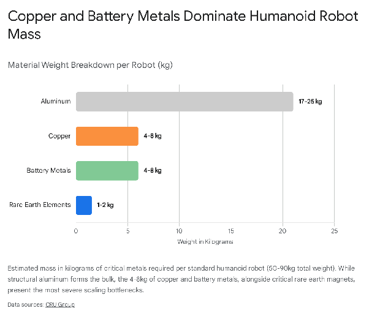
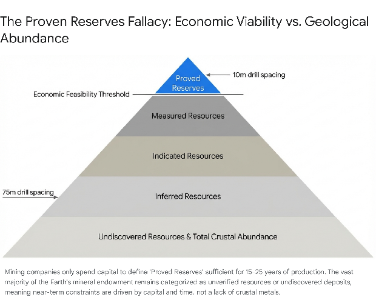
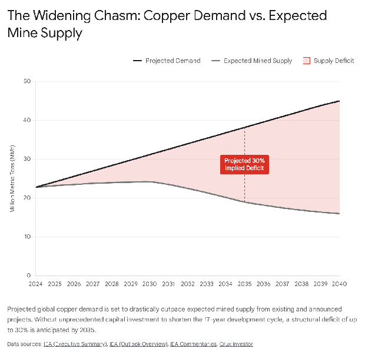

# **The Material Foundations of the AI and Robotics Revolution: Analyzing Structural Constraints in Critical Mineral Supply Chains**

## **1\. Introduction: The Intersection of Digital Expansion and Physical Reality**

The global economy is currently undergoing a macroeconomic and technological paradigm shift driven by the rapid commercialization and deployment of artificial intelligence (AI), hyperscale data centers, and advanced humanoid robotics. While the outputs of these technologies are distinctly digital and cognitive, their foundational infrastructure is inherently physical, relying on an exponentially growing foundation of critical metals and minerals.1 The narrative surrounding the aggressive buildout of this infrastructure has recently been punctuated by severe concerns regarding resource constraints, prompting critical questions regarding the fundamental nature of these impending shortages. Specifically, it is necessary to determine whether the looming global deficits in commodities such as copper, rare earth elements, silver, lithium, and specialized semiconductor trace metals are the result of absolute geological scarcity, or whether they are artifacts of sudden, unprecedented demand shocks layered upon chronic, structural bottlenecks within the global mining and refining sectors.

The prevailing hypothesis within certain investment and technology circles suggests that humanity is rapidly exhausting the Earth's mineral endowment. This perspective frequently cites the relatively short lifespan of "proven reserves" reported by global mining conglomerates, which often indicate only a few decades of remaining supply for critical metals. However, this interpretation fundamentally misunderstands the techno-economic mechanisms of mineral exploration, capital allocation, and regulatory reporting.2 The constraints facing the AI and robotics revolution over the near to medium term—specifically defined here as the next 20 years—are not dictated by the absolute crustal abundance of elements on Earth. Rather, the transition is threatened by severe temporal, capital, and geopolitical bottlenecks that govern how quickly those abundant elements can be extracted, refined, and deployed.

The modern mining industry is characterized by extended development timelines, currently averaging 17 years from geological discovery to commercial production, alongside declining ore grades, increasing capital intensity, and a highly concentrated refining supply chain that is increasingly subject to geopolitical weaponization.4 This report provides an exhaustive analysis of the critical mineral supply chains underpinning the AI and robotics revolution. It delineates the specific material requirements of data centers and robotic actuators, dissects the "proven reserves" fallacy, and investigates the underlying structural issues plaguing the extraction and processing sectors. Furthermore, it evaluates the near-to-medium-term constraints on key commodities and explores the technological, circular, and frontier terrestrial mitigation strategies that will dictate the pace at which humanity can roll out the next generation of digital infrastructure.

## **2\. The Taxonomy of Demand: AI, Hyperscale Data Centers, and Grid Infrastructure**

The sudden acceleration in demand for critical minerals cannot be viewed in isolation. It is a compounding vector, layering on top of traditional core economic demand—historically tied to housing, commercial construction, and consumer appliances—and the massive, ongoing requirements of the broader clean energy transition, which includes electric vehicles (EVs), solar photovoltaics, and grid modernization.4 Artificial intelligence and data center expansion represent a distinct, highly accelerated third demand vector that is testing the limits of global material supply elasticity.

### **2.1 The Hyperscale Data Center Ecosystem and Power Delivery**

Artificial intelligence model training and subsequent inference require hyperscale data centers with unprecedented power, networking, and cooling requirements. Global power demand from data centers is forecast to rise by 165% by 2030, increasing from approximately 415 terawatt-hours (TWh) per year in 2023 to 945 TWh by the end of the decade.8 In the United States alone, the Lawrence Berkeley National Laboratory predicts that data center electricity demand will grow from 176 TWh to between 325 and 580 TWh by 2028, pushing data centers' share of total national electricity consumption from 5% to potentially 14%.4 The strain on local grids is already palpable; in some regions, AI-driven energy demand is outpacing available utility capacity, leading to project delays, the installation of inefficient natural gas reciprocating generators, and severe grid reliability issues, such as a July 2024 voltage fluctuation in northern Virginia that triggered the simultaneous disconnection of 60 data centers.10 In highly concentrated international hubs like Ireland, data centers are forecasted to consume up to 23% of total national power by 2030\.4

This staggering electrical demand translates directly into metallurgical demand. Copper acts as the fundamental connective artery of this digital infrastructure due to its unparalleled combination of high electrical and thermal conductivity, durability, and cost-effectiveness.11 In conventional and AI-optimized data centers, copper is utilized extensively in power distribution equipment, including heavy-duty power cables, electrical busbars, and specialized connectors.11 While there is an ongoing industry shift toward fiber optic cables for certain data transmission and rack interconnect applications, the sheer scale of power delivery required for high-density AI server racks—which draw significantly more kilowatts per rack than conventional cloud servers—negates these marginal copper savings.4

Standard, non-cryptocurrency data centers typically exhibit a copper intensity ranging from 30 to 40 metric tons per megawatt of installed capacity.4 With global installed data center capacity forecasted to grow from 100 gigawatts in 2022 to roughly 550 gigawatts by 2040, the material implications are vast.4 Estimates indicate that direct copper demand tied to data centers could reach up to 2.5 million metric tons (MMt) annually by 2040, with AI training facilities alone accounting for 58% of this specific sector's demand by 2030\.4 Furthermore, the power generation and transmission infrastructure required to feed these hyperscale facilities—including local renewable energy deployments facilitated by hyperscaler Power Purchase Agreements (PPAs) and high-voltage underground transmission lines—will demand an additional 1.0 MMt of copper annually by 2040\.4 Cumulatively, over 4.3 million tonnes of copper could be associated with data centers and adjacent power infrastructure by 2035\.12

### **2.2 Trace Elements, Semiconductors, and Precious Metals in AI Hardware**

Beyond the massive volumes of base metals required for power delivery, AI hardware relies on a highly specialized, vulnerable suite of trace elements and precious metals. The high-performance graphics processing units (GPUs), neural processing units, and sophisticated server boards that process AI workloads require a complex metallurgical stack that cannot easily be substituted.1

Silver and gold are experiencing demand shocks directly correlated with AI hardware deployment. Silver, possessing the highest electrical conductivity of any metal, is critical for advanced interconnects and high-efficiency power electronics required to manage the massive energy loads of AI clusters.13 Data center environments operate at extreme thermal limits, demanding the highest reliability connectors and solders. Consequently, gold remains the corrosion-proof standard for bonding wires and high-reliability electronics that must perform continuously under extreme thermal stress inside AI servers.14 In recent years, technology sector demand for gold has risen sharply, driven largely by electronics and AI hardware scaling.14 Industrial users cannot easily substitute silver or gold in these mission-critical applications; manufacturers are frequently forced to either absorb higher commodity prices or slow their infrastructure deployment when these precious metals face supply constraints.14

Furthermore, the advanced semiconductors and fiber optic networks foundational to AI rely on supply chains characterized by extreme geographic concentration and import reliance. Training a single large language model requires thousands of interconnected GPUs containing gallium arsenide semiconductors, while the high-speed data transfer between these processing nodes is facilitated by germanium-based fiber optics.1

To illustrate the vulnerability of the AI hardware supply chain, the following table details the primary critical minerals utilized in data center components and the corresponding United States import reliance, highlighting the exposure of Western tech infrastructure to foreign supply shocks.

| Data Center Component | Critical Mineral | Primary Application | U.S. Import Reliance (%) |
| :---- | :---- | :---- | :---- |
| **Server Boards & Circuitry** | Silver | Conductive traces, high-efficiency power electronics | 64% |
|  | Copper | Base power distribution, heat exchangers | 45% |
|  | Tin | Soldering | 73% |
|  | Tantalum | High-capacitance, heat-resistant capacitors | 100% |
|  | Palladium | Multi-layer ceramic capacitors, plating | 36% |
|  | Platinum | Specialized contacts and sensors | 85% |
| **Semiconductors & Microchips** | Gallium | Gallium arsenide wafers for high-frequency chips | 100% |
|  | Germanium | Fiber optic network infrastructure | 100% |
|  | Indium | Thermal interface materials, displays | 100% |
|  | Arsenic | Semiconductor doping | 100% |
| **Data Storage** | Rare Earth Elements | Hard disk drive actuators, specialized sensors | 80% |

Data synthesized from USGS and Visual Capitalist critical mineral import reliance tracking.1

## **3\. The Robotics Frontier: Material Intensity of Humanoid Actuation**

If hyperscale data centers function as the cognitive engines of the AI revolution, humanoid and autonomous robotics represent its physical manifestation. As AI software capabilities rapidly mature, the commercialization of humanoid robots is projected to be the next massive vector for mineral consumption, emerging strongly as a "fifth vector" of copper demand in the late 2020s and early 2030s, alongside core economic, energy transition, AI data center, and defense demand.4

Robotic material intensity is uniquely demanding and distinctly different from traditional industrial machinery. While legacy industrial robots are typically large, stationary units deployed in limited, highly controlled manufacturing environments, humanoid robots are designed for mass deployment across diverse applications, ranging from autonomous logistics to healthcare.17 Current prototype and early-commercial units typically weigh between 50 and 90 kilograms and contain substantial metal content optimized for mobility, thermal management, and precision.17

The material breakdown per unit reveals a heavy reliance on base and battery metals. A standard humanoid robot requires 17 to 25 kilograms of aluminum to construct a lightweight structural framework.17 Copper is heavily utilized, accounting for 4 to 8 kilograms per unit.17 This copper is not merely for passive wiring; it is actively required for motor windings to create the magnetic fields necessary for movement, as well as in primary batteries, sensors, and semiconductors.4 To power this mobility untethered, humanoids rely on high-energy-density battery packs, utilizing Lithium Nickel Cobalt Aluminium Oxide (NCA) or Nickel Manganese Cobalt (NMC) chemistries.18 These specialized battery packs contribute an additional 4 to 8 kilograms of highly refined lithium, nickel, and cobalt per robot.17

Most critically, humanoid robots are fundamentally dependent on rare earth elements (REEs) to actuate their joints. To achieve human-like dexterity and freedom of motion, an advanced humanoid may utilize up to 40 individual servo motors and joint actuators.16 To ensure these motors remain small enough to fit within a humanoid chassis while delivering high torque, they rely heavily on neodymium-iron-boron (NdFeB) permanent magnets.18 These high-performance magnets contain the critical light rare earths neodymium and praseodymium (NdPr), and are frequently stabilized against demagnetization at high operating temperatures using scarce heavy rare earths like dysprosium and terbium.20 Over 95% of the motors currently utilized in humanoid robots contain rare earth permanent magnets.16

The aggregate demand forecasts for robotics present a staggering, perhaps insurmountable, challenge to current global mineral production capacities if deployment scales to the levels anticipated by major technology firms. To achieve a deployed base of 63 million robots by 2050—a relatively conservative estimate compared to the long-term vision of a robot in every home—the industry would require approximately 83,000 tonnes of nickel, 12,000 tonnes of cobalt, and 130,000 tonnes of graphite, equivalent to the battery materials required for millions of electric vehicles.22 If the industry eventually scales toward a population of billions of units by the mid-to-late 21st century, it would require multiples of the total current annual global production of NdFeB magnets.22 Consequently, specialized market intelligence firms like IDTechEx forecast that rare earth magnet weight demand specifically within the robotics sector will increase sevenfold by 2036, creating an unprecedented supply squeeze on the rare earth refining industry.16

## **4\. The Geological Reality: Deconstructing the "Proven Reserves" Fallacy**

A persistent and highly misleading narrative surrounding the global energy and technological transition is that the Earth possesses only a few decades of remaining critical minerals. This perception is driven by a fundamental misunderstanding of how the mining industry defines, categorizes, and legally reports mineral endowments to regulators and shareholders. The concept that humanity is facing absolute geological exhaustion is a fallacy born from misinterpreting financial terminology as geological truth.

### **4.1 The Taxonomy of Mineral Endowments: Resources versus Reserves**

The total mineral endowment of the Earth's crust is vast. However, the terminology used to describe this endowment is governed by strict, standardized regulatory frameworks—such as the JORC Code in Australia, NI 43-101 in Canada, or SAMREC in South Africa—designed to protect investors from fraudulent claims.24 These frameworks strictly separate mineral deposits into two primary categories: "Resources" and "Reserves".2

A **Mineral Resource** is defined as a concentration of naturally occurring solid material in or on the Earth's crust in such form, grade, and quantity that there are "reasonable prospects for eventual economic extraction".2 Resources are subdivided by their level of geological confidence, which is primarily determined by drill hole spacing and sampling density.24

* **Inferred Resources** represent the lowest level of confidence, where geological evidence is sufficient to imply but not verify grade continuity (e.g., drill holes spaced widely apart, such as 75 meters).3  
* **Indicated Resources** represent moderate confidence, where grade and quantity can be estimated with enough certainty to allow the application of modifying factors for mine planning (e.g., drill holes spaced 50 meters apart).3  
* **Measured Resources** represent the highest level of geological confidence, established through dense, highly detailed physical sampling (e.g., drill holes spaced 25 meters apart).3

Crucially, a Mineral Resource only describes what is physically in the ground. To be considered economically viable, a portion of that resource must be converted into a **Mineral Reserve**.

A Mineral Reserve is the economically mineable part of a Measured or Indicated Resource.3 Reserves are subdivided into *Probable* and *Proved* (or Proven) categories. Converting a Resource into a Proved Reserve is not merely a geological exercise; it requires extensive engineering, environmental, and financial feasibility studies.26 These studies must rigorously incorporate "modifying factors," which include prevailing commodity prices, anticipated mining and milling costs, precise metallurgical recovery rates, infrastructure requirements, environmental compliance, and legal permitting constraints.26 Therefore, a Proved Reserve represents the highest level of confidence, verifying not just that the metal exists, but that it is currently legally and economically profitable to extract.24

### **4.2 Economic Disincentives and the Illusion of Scarcity**

The regular reporting of global "Proven Reserves" equating to only 20 or 30 years of global supply is a dynamic economic artifact, not a static geological limit. Mining companies operate as rational, capital-allocating entities. The process of proving out a reserve is extraordinarily expensive, requiring millions of dollars in dense core drilling, rigorous laboratory assaying, and exhaustive multi-year engineering studies.24

Once a mining company has established a reserve life of 15 to 25 years—which is generally sufficient to secure long-term project financing from banks, amortize the heavy capital expenditure of building a concentrator plant, and satisfy shareholder demands for visibility—there is zero economic incentive to spend additional millions of dollars drilling to convert further resources into proven reserves.24 Doing so would tie up vital working capital to delineate ore that will not be mined or monetized for decades. As a mine operates and depletes its proven reserves year over year, the company continually undertakes localized "step-out" drilling to convert adjacent inferred resources into proven reserves, effectively rolling the 20-year horizon forward over time. Therefore, comparing current annual consumption strictly against currently declared "Proven Reserves" consistently generates a false countdown to depletion.

### **4.3 Terrestrial Crustal Abundance**

Geologically, the Earth is not running out of the base metals required for the AI transition. Analyzing copper provides the clearest refutation of the scarcity fallacy. Humanity has extracted roughly 700 million metric tons of copper throughout all of recorded history, an aggregate volume that would fit into a cube measuring merely 430 meters on a side.27 Identified deposits currently contain an estimated 2.1 billion metric tons of additional copper.27 Furthermore, the United States Geological Survey (USGS) estimates that undiscovered resources contain roughly 3.5 billion metric tons.27

Therefore, the total terrestrial copper endowment is estimated at 6.3 billion metric tons—equivalent to a solid cube measuring 890 meters on a side.27 This vast crustal abundance far outstrips the 45 million metric tons of annual demand projected for 2040\.4

Similarly, elements deemed "critical," such as lithium and rare earths, are not inherently geologically rare. Lithium is relatively abundant in the Earth's crust, and government agencies are actively identifying immense new sedimentary basins and unconventional feedstocks (such as clays and shales) across North America that have never previously been quantified as resources.28 Rare earth elements, particularly the light lanthanides like cerium and neodymium, are actually more abundant in the Earth's crust than many familiar industrial metals like lead or tin.30 They are termed "rare" not because of absolute scarcity, but because they rarely form dense, highly concentrated, exploitable ore deposits, instead occurring in diffuse concentrations that are metallurgically complex to separate.31

The constraints threatening the deployment of AI and robotics over the next 20 years are therefore not defined by absolute geological limits. Instead, they are defined by the immense techno-economic friction of transforming an "undiscovered resource" into an economically viable, environmentally permitted, and operational "proven reserve," and subsequently refining it into a high-purity technological input.

## **5\. Underlying Structural Bottlenecks in the Mining Sector**

While the Earth possesses adequate minerals, the global mining industry is structurally ill-equipped to meet the sudden, exponential demand shocks generated by AI data centers and electrification. The constraints are driven by uncompromising physics, shifting capital dynamics, and severe regulatory inertia. Even if commodity prices surge to incentivize new production, the industry cannot pivot rapidly.

### **5.1 Declining Ore Grades and Physical Productivity Limits**

The fundamental physical challenge facing the terrestrial extraction industry is the steady deterioration of ore quality. Mining follows a predictable trajectory: humans have historically located and mined the highest-grade, most easily accessible deposits first. As these legacy assets deplete, miners are forced to target increasingly lower-grade, deeper, and more geologically complex ore bodies.4

This trend is most starkly visible in the copper sector, where the average global grade of mined copper has decreased by 40% since 1991\.5 Consequently, to produce the exact same metric ton of refined copper today as twenty years ago, a mining operation must blast, excavate, haul, and crush significantly more rock, consuming vastly more diesel energy, electricity, and water in the process.32 This thermodynamic reality creates a rigid ceiling on physical productivity. Despite high commodity prices over the past decade, the raw efficiency of extraction has struggled to improve; gross production across the industry has dropped by roughly 28% in recent years relative to the required input costs.32 The traditional "bigger is better" engineering approach—relying on scaling up conventional equipment, such as deploying massive autonomous haul trucks and ever-larger grinding mills—is reaching a point of diminishing marginal returns.32

### **5.2 Extended Development Timelines: The 17-Year Gap**

The most severe constraint on expanding supply to meet the AI demand shock is the immense "cost of time." The mining industry is highly inelastic in the near term because new primary supply cannot be brought online quickly. Analyzing data from 214 global mines reveals that the average development timeline—from initial geological discovery to the first commercial production of metal—is now 17 years.4

Alarmingly, this development cycle is actively lengthening. Projects that commenced production in the late 2000s averaged 13 years from discovery to operation, whereas those starting in the early 2020s average 18 years.4 More than two-thirds of this cycle—frequently exceeding 12 years—is consumed not by physical construction or equipment procurement, but by early exploration, feasibility studies, environmental impact assessments, and complex legal challenges.4 Navigating the modern permitting process requires maneuvering through an overlapping web of local, sub-national, and national regulations.4 Mining projects face extensive, often multi-year community consultations regarding water scarcity, waste management, highway safety, and impacts on local ecosystems and indigenous lands.4 Opponents can frequently intervene legally at almost any stage of this protracted process, creating significant uncertainty.4 Because of this inherent lag, the supply response to the sudden AI demand shock of 2024–2026 will not physically materialize in the form of new greenfield mine output until the late 2030s or early 2040s.

### **5.3 Capital Intensity and the "Back-Ended Risk Premium"**

Compounding the issues of grade decline and timeline extension is a severe surge in capital intensity across the sector. The average capital cost required to expand existing, operational mines (brownfield projects) has increased by 65% since 2020, approaching levels traditionally associated with entirely new, much riskier greenfield developments.5

Furthermore, investments in specific critical minerals essential for energy storage and robotics—such as lithium, cobalt, and rare earths—are subject to what economic theorists term a "back-ended risk premium".34 Because these projects face immense technical uncertainties (such as scaling up novel, unproven metallurgical processing technologies) and non-technical barriers (such as shifting environmental regulations, geopolitical instability in resource-rich nations, and unpredictable permitting outcomes over a 17-year horizon), institutional investors and financiers demand a significantly higher cost of capital to justify the risk.34

This risk premium acts as a severe drag on early-stage investment. For example, the International Energy Agency (IEA) estimates that realizing global energy transition targets by 2050 requires up to $450 billion in critical mineral investments by 2030, yet the anticipated supply based on current capital allocation falls severely short of this requirement.34 This chronic underinvestment during the exploration and feasibility phases directly translates into acute, unavoidable supply shortfalls a decade later, creating a bottleneck that threatens to slow the broader deployment of AI infrastructure.

## **6\. The Midstream Chokepoint: Refining Concentration and Geopolitics**

If primary extraction is constrained by geology, capital, and time, the midstream supply chain—the complex refining and processing required to turn raw ore into battery-grade chemicals or semiconductor-grade metals—is constrained by aggressive geographic concentration and the increasing weaponization of global trade. The "criticality" of a mineral is often defined less by its scarcity in the ground and more by the vulnerability of its processing supply chain to systemic disruption.35

### **6.1 Dual Concentration Risk and Chinese Dominance**

The critical mineral supply chain exhibits severe geographic concentration at both the upstream extraction and downstream refining nodes.4 While terrestrial extraction is often concentrated in jurisdictions like Indonesia (which held 54% of global nickel production in 2023), the Democratic Republic of Congo (which held 74% of global cobalt production), and Chile/Peru (copper), the highly technical processing and refining node is overwhelmingly dominated by a single geopolitical entity: the People's Republic of China.4

Despite recent, highly publicized global efforts by Western nations to diversify supply chains, the concentration in refining has paradoxically increased in recent years. Between 2020 and 2024, the average market share of the top three refining nations for key energy minerals rose from 82% to 86%.37 China currently controls more than half of the world's lithium refining, over two-thirds of its cobalt refining, and essentially exercises a near-total monopoly over the complex separation and metallization of rare earth elements, processing 100% of the refined supply of natural graphite and the heavy rare earth dysprosium.7 In the copper sector, China's share of global copper concentrate imports rose massively from 43% in 2015 to 66% in 2024, supported by massive state-backed investments in modern smelting capacity, access to low-cost finance, and economies of scale.4

This extreme concentration shapes market dynamics profoundly. It grants dominant processors immense pricing power, allowing them to drive treatment and refining charges (TCRCs) to multi-year lows, thereby squeezing the margins of global upstream miners and capturing the majority of the value chain's profit.4 Furthermore, this concentration creates compound supply risks, as the flow of critical materials for AI and clean energy becomes highly sensitive to regulatory and political shifts within a single dominant jurisdiction.1

To illustrate this concentration, the following table details the dominance of leading nations in the refining of key AI and energy transition minerals:

| Critical Mineral | Leading Refining Nation | Estimated Global Refining Share | Primary Application |
| :---- | :---- | :---- | :---- |
| **Gallium** | China | 98% | High-performance semiconductors |
| **Natural Graphite** | China | 100% | Battery anodes, thermal management |
| **Dysprosium (HREE)** | China | 100% | High-temp permanent magnets |
| **Cobalt** | China | \~70% | High-energy density batteries |
| **Germanium** | China | 60% | Fiber optics, infrared optics |
| **Lithium** | China | \~60% | Energy storage systems, EV packs |
| **Nickel** | Indonesia / China | \~50%+ (Combined) | EV batteries, stainless steel |

Data synthesized from IEA Global Critical Minerals Outlook 2025, FP Analytics, and IRENA reports.1

### **6.2 Export Controls and Weaponized Supply Chains**

The danger of this midstream concentration has materialized rapidly over the past few years as critical minerals have been thrust into the center of geopolitical competition for technological and military supremacy.1 As nations recognize the strategic necessity of securing the material inputs for AI, defense infrastructure, and green energy, resource nationalism has surged globally.

In recent years, export control measures have proliferated, fundamentally reshaping and fracturing global mineral markets.6 The first major wave of Chinese mineral export controls in 2023 and 2024 was primarily a response to United States technology restrictions on advanced semiconductors and computing.6 Restrictions were placed on gallium and germanium—elements absolutely essential for high-performance AI semiconductors and fiber optics—resulting in near-zero export volumes to certain jurisdictions and triggering price spikes of up to 400% in European markets.1

This was followed by a second wave in 2025, which included sweeping controls on rare earth elements, antimony, and graphite.6 Antimony, critical for specialized defense and electronics applications, experienced a 437% price spike following restrictions.6 These controls serve multiple strategic objectives: reinforcing dominance in global supply chains, promoting domestic value-added manufacturing by maintaining lower input prices internally, and explicitly constraining Western technological capabilities by limiting access to foundational materials.6

While diplomatic negotiations led to temporary pauses in some of these export controls in late 2025, the overarching structural trend is clear: the free, uninterrupted flow of critical technological materials across borders is no longer guaranteed.1 Western governments have responded by elevating critical minerals to a national security imperative. Initiatives like the European Union's Critical Raw Materials Act, the U.S. Defense Production Act's mandate to stockpile antimony, tantalum, and scandium, and massive direct investments in domestic processing facilities (such as the DoD's investment in the Mountain Pass rare earth facility) demonstrate a shift toward prioritizing supply resilience over pure cost optimization.7 However, building parallel, independent refining infrastructures in Western jurisdictions requires billions in capital, faces stringent environmental opposition, and will take years—if not decades—to achieve commercial parity with the massive, integrated hubs currently operating in Asia.42

## **7\. Commodity-Specific Vulnerability Assessments (Near to Medium Term)**

The impact of these structural, temporal, and geopolitical constraints varies significantly across different commodity classes over the next 20 years. Analyzing the specific supply-demand trajectories of base metals, rare earths, precious metals, and battery components reveals distinct timelines for anticipated bottlenecks.

### **7.1 Copper: The Connective Artery Under Severe Strain**

Copper is facing a structural deficit of unprecedented proportions, representing perhaps the most severe macroeconomic threat to the rapid deployment of global electrification and AI infrastructure. Mined production from currently operating assets is forecast to peak around the late 2020s at approximately 24 MMt before declining noticeably to less than 19 MMt by 2035 due to the natural depletion of reserves and asset retirements.33 Simultaneously, the layering of data center buildouts, massive grid modernization efforts, and global EV adoption is pushing demand drastically higher.4

Under its current trajectory, global copper supply is expected to fall significantly short of demand.4 The IEA and private consultancies like Wood Mackenzie project an implied copper supply deficit of roughly 30% by 2035 based on the current pipeline of announced projects.5 The discovery drought is particularly acute in this sector; of all the economically viable copper deposits discovered over the last 35 years, a mere 5% were found in the last decade.5 Even under highly optimistic assumptions in the IEA's high production case, which assumes faster project development and higher exploration success rates, a 20% supply deficit persists by 2035 under the Stated Policies Scenario (STEPS).33 Because copper is utilized in massive volumes, this deficit represents a physical bottleneck that could cap the speed of electrification and AI data center deployment, fundamentally altering the economics of energy transition projects.4

### **7.2 Rare Earth Elements: The Magnetic Bottleneck in Robotics**

While rare earths are abundant in the crust, the supply of the specific magnetic rare earths—Neodymium, Praseodymium (NdPr), Dysprosium, and Terbium—faces extreme techno-economic bottlenecks. These specific elements are critical for the NdFeB permanent magnets used in humanoid robotic actuators, EV motors, and advanced wind turbines.20

The constraint here is multifaceted. First, separating the 15 chemically similar lanthanide elements involves extreme environmental toxicity and complex metallurgy.28 Second, China holds a near-total monopoly on the midstream metallization and complex magnet manufacturing processes, leaving downstream manufacturers highly exposed to export quotas and geopolitical tension.16 Third, there is a specific scarcity of heavy rare earths (Dysprosium, Terbium), which are vital to prevent high-performance magnets from demagnetizing at high operational temperatures.20 As humanoid robotics scale, taking global rare earth magnet demand to an expected $19 billion industry by 2025 and driving a forecasted sevenfold increase in magnet weight demand within the robotics sector by 2036, Western OEMs will face severe vulnerabilities if alternative, secure supply chains are not rapidly established.16

### **7.3 Precious Metals: Silver and Gold in High-Performance Compute**

Silver and gold are experiencing distinct demand shocks directly correlated with the scaling of AI hardware. AI servers and data center power infrastructure run at extremely high thermal limits, requiring the highest reliability connectors and solders.14

The structural issue for silver is that its supply is highly inelastic. Much of global silver production occurs as a by-product of base metal mining, such as lead, zinc, and copper extraction.14 Therefore, mining companies cannot easily ramp up "silver mining" purely in response to higher silver prices.14 Consequently, the global silver market has been operating in a structural supply deficit for five consecutive years, drawing down above-ground inventories to multi-decade lows.14 As AI data centers compound the massive existing demand from the solar photovoltaic sector—which saw its share of silver industrial demand rise from 11% in 2014 to 29% in 2024—silver availability will increasingly act as a silent but rigid constraint on hardware manufacturing.13

### **7.4 Lithium and Battery Metals: The Rollercoaster of Supply**

Unlike copper, the constraints on lithium are primarily tied to refining capacity and volatile capital investment cycles rather than geological scarcity or long-term structural grade declines.11 Under aggressive energy transition scenarios, lithium demand will grow exponentially; the IEA's Stated Policies Scenario (STEPS) projects a fivefold increase from 2024 to 2040\.44

While the market experienced a significant supply glut and subsequent price collapse of over 80% in 2024 and 2025—driven by rapid capacity scale-ups in China, Indonesia, and Africa—forecasting models uniformly predict that this surplus is temporary.37 The sheer volume of electric vehicle and grid-storage battery demand, eventually compounded by untethered robotics, is expected to force the lithium market back into severe structural deficits by the late 2020s and early 2030s.11

Wood Mackenzie models indicate that under a "Net Zero" transition scenario, deficits are expected to begin in 2028 and persist through mid-century, requiring an immense additional supply of approximately 8.5 Mt LCE (Lithium Carbonate Equivalent) by 2050 to meet a total demand of 13.2 Mt LCE.47 Even in a "Delayed Transition" scenario, the market enters a deficit by 2037\.47 Meeting this demand will require staggering capital investments, estimated between $100 billion and $275 billion depending on the transition speed, testing the financial resilience of the mining sector.48

## **8\. Mitigation Pathways: Technological and Systemic Interventions**

Recognizing that terrestrial mining faces severe developmental, capital, and thermodynamic bottlenecks, the industry and global governments are pursuing several vectors of mitigation. These efforts aim to expand the bottleneck and prevent absolute supply exhaustion from halting the digital and robotic revolution.

### **8.1 AI-Driven Exploration and Extraction Optimization**

Ironically, the technology driving the mineral demand shock is actively being deployed to resolve it. Artificial intelligence and machine learning are rapidly transforming mineral exploration, shifting the industry away from traditional, heuristic-based geological surveys toward predictive data science.49

Startups and established miners are utilizing sophisticated AI models to process vast datasets—including hyperspectral imaging, gravimetric data, electromagnetic surveys, and historical drill logs—to identify subtle geological anomalies that human geologists might overlook.51 Companies like KoBold Metals (backed by major technology entrepreneurs) and Earth AI have demonstrated that AI can drastically reduce exploration timelines and lower costs.49 AI platforms optimize drill targeting, reducing the number of costly, time-consuming drill holes required to prove out a deposit. Earth AI, for instance, has achieved highly successful verification rates, discovering large verified deposits of metals like palladium by analyzing data and drilling highly precise targets.50 Similarly, KoBold Metals utilized its proprietary platform to advance the Mingomba copper project in Zambia, identifying what is expected to be one of the highest-grade copper discoveries in recent decades, effectively circumventing the standard industry discovery drought.52

Furthermore, AI is being deployed at the operational level to increase physical productivity. Autonomous drilling and hauling systems, coupled with AI-enabled predictive maintenance algorithms, are reducing mechanical wear and operational downtime by up to 35% across massive mine sites.53 At the processing stage, AI-enabled concentrators are optimizing complex metallurgical flows, improving metal recovery rates from increasingly low-grade ores by several percentage points while increasing throughput.53 This technological injection serves to directly counteract the declining physical productivity of legacy mining assets.

### **8.2 Material Substitution and AI-Driven Materials Science**

Where supply cannot keep pace with demand, powerful market forces inevitably drive material substitution. The high price and impending scarcity of copper are forcing a transition toward aluminum in power grids and EV architectures.55 Aluminum is vastly cheaper and lighter, and despite protective tariffs in regions like the U.S., it is currently being utilized in approximately 10% of high-voltage cables in EVs and 40% of global HVAC units.55

However, physics places a hard limit on this substitution. Because aluminum is less conductive, an aluminum conductor must be approximately 1.6 times thicker than a copper conductor to achieve parity in performance.55 This added volume and weight complicate installation and severely limit its use in applications where space is at an absolute premium, such as inside dense AI data center server racks, highly integrated circuit boards, or the compact chassis of humanoid robots.4

In the robotics and EV sectors, the extreme vulnerability of the rare earth supply chain is driving intense research into rare-earth-free permanent magnets.19 Automakers and robotics firms are exploring magnet-free motor designs or reduced-magnet architectures, though these often involve performance trade-offs regarding power and torque density.19 Here again, AI is accelerating breakthroughs. In 2026, researchers at the University of New Hampshire utilized AI models to screen millions of theoretical compounds, building a database of over 67,000 magnetic compounds and identifying dozens of new high-temperature magnetic materials that do not rely on rare earth elements.56 While these alternatives currently face the long road to commercialization, continuous AI-driven innovation in materials science acts as a vital, long-term deflationary pressure on critical mineral demand.46

### **8.3 The Circular Economy: Urban Mining and E-Waste Recycling**

Secondary supply—the recycling of end-of-life electronics, EV batteries, and industrial scrap—is universally recognized as indispensable for the long-term sustainability and security of the material transition.57 Transitioning to a circular economy effectively creates a domestic reserve of critical minerals for importing nations, buffering them against geopolitical supply shocks and export controls.58

By 2050, advanced recycling infrastructure could theoretically reduce the need for new primary mine development by up to 40% for copper and cobalt, and 25% for lithium and nickel.7 Advanced sorting technologies utilizing AI and hyperspectral imaging, alongside sophisticated hydrometallurgical and electrochemical processing, are steadily improving the recovery efficiency of precious metals like silver and gold from complex electronic waste.11 In the permanent magnet sector, IDTechEx predicts that $1.2 billion of critical rare earth elements could be recovered from secondary sources such as end-of-life electric motors by 2045\.20

However, recycling is governed by rigid thermodynamic and temporal realities. In an environment of exponential demand growth, the volume of material currently reaching its end-of-life is vastly smaller than the volume required to build new, rapidly expanding infrastructure. Because a data center server or an EV battery has a functional lifespan of 7 to 15 years, the massive volumes of metal being deployed in the 2025–2030 buildout will not be available for secondary recovery until the late 2030s or 2040s.47 Therefore, while urban mining is a critical, long-term structural necessity, it mathematically cannot solve the acute primary supply deficits projected for the coming decade.

### **8.4 Frontier Terrestrial Extraction: Deep-Sea and Phytomining**

To circumvent the declining grades and extended, 17-year permitting timelines of traditional terrestrial hard-rock mining, the industry is exploring unconventional extraction domains, strictly remaining within the Earth's biosphere.

The most significant, and controversial, of these is deep-sea mining. The abyssal plains of the ocean floor, particularly areas like the Clarion-Clipperton Zone, are littered with polymetallic nodules—small geological formations containing extraordinarily high grades of nickel, cobalt, copper, and manganese.60 Proponents argue that harvesting these nodules presents a necessary solution to the terrestrial supply crunch, offering resources devoid of the complex social conflicts, community displacement, and massive deforestation associated with terrestrial open-pit mining.7

However, despite intense interest and capital deployment, commercial exploitation has not yet commenced. The industry remains mired in complex international regulatory debates at the International Seabed Authority (ISA) regarding the drafting of a comprehensive Mining Code.11 This regulatory uncertainty is compounded by severe pushback from marine biologists and environmental groups warning of potentially irreversible damage to fragile, poorly understood benthic ecosystems, which could cascade to impact global fisheries and ocean carbon cycles.7 Until scientific consensus and regulatory frameworks are firmly established, deep-sea mining remains a highly speculative, high-risk venture.

A much more localized, ecologically harmonious alternative gaining traction is phytomining (or agromining). This process involves cultivating specific hyperaccumulator plant species on metal-rich, marginal soils that are entirely unfit for traditional agriculture due to poor fertility or natural contamination.63 Species like the Milkwort Jewelflower, native to the U.S., naturally absorb high concentrations of metals, such as nickel, into their cellular tissues.63 The biomass is subsequently harvested, dried, and processed to extract a high-purity bio-ore.63 Supported by government grants, such as the U.S. Department of Energy's ARPA-E program, and strategic investments from major automakers, researchers are utilizing classical plant biology and genetic engineering to scale the metal uptake of these plants for commercial deployment.63 While currently limited in its commercial scale, phytomining offers a low-CAPEX, modular approach to securing critical elements like nickel, promoting soil rehabilitation without the environmental devastation of traditional mining.64

## **9\. Conclusion**

The widespread assertion that the artificial intelligence and robotics revolution will be derailed by an absolute geological exhaustion of Earth's critical minerals is fundamentally incorrect. The planet's crustal endowment of copper, lithium, rare earths, and precious metals—when properly categorized beyond the narrow financial definition of "proven reserves"—is vast and more than sufficient to sustain centuries of technological advancement.

However, this theoretical geological abundance offers little comfort in the face of the acute, near-to-medium-term constraints currently gripping the global supply chain. We have entered a critical period defined not by absolute planetary scarcity, but by severe temporal, economic, and geopolitical friction. The sudden, exponential demand vectors created by hyperscale data centers and the impending commercialization of humanoid robotics are colliding violently with a mining industry characterized by rigid 17-year development cycles, rapidly declining physical ore grades, and skyrocketing capital intensity. Concurrently, the complex processing of these raw ores into high-purity technological inputs relies on a highly concentrated midstream infrastructure that is increasingly being weaponized via export controls and tariffs by dominant geopolitical players.

Over the next twenty years, the rollout of advanced digital and robotic infrastructure will be subjected to unavoidable, highly disruptive bottlenecks. Anticipated structural deficits in essential commodities like copper, silver, and specific magnetic rare earths will likely force hardware manufacturers to accept higher input costs, redesign system architectures to accommodate inferior substitute materials, and endure significant deployment delays.

While mitigation technologies—such as AI-accelerated geological discovery, novel materials science, advanced circular recycling, and frontier extraction methods like phytomining—are being deployed rapidly, they require time and immense capital to reach true macroeconomic scale. Ultimately, the pace at which humanity can deploy the AI and robotics revolution will not be dictated by the theoretical limits of human software engineering, but by the physical, capital, and regulatory realities of moving millions of tonnes of earth, processing it cleanly, and securing its safe transit through an increasingly fractured and volatile global geopolitical landscape.

#### **Works cited**

1. Artificial Intelligence and the Critical Minerals Crunch \- FP Analytics \- Foreign Policy, accessed March 13, 2026, [https://fpanalytics.foreignpolicy.com/2025/07/18/artificial-intelligence-critical-minerals-supply-chains/](https://fpanalytics.foreignpolicy.com/2025/07/18/artificial-intelligence-critical-minerals-supply-chains/)  
2. MINERAL RESERVES, RESOURCES, RESOURCE POTENTIAL, AND CERTAINTY, accessed March 13, 2026, [https://pubs.usgs.gov/unnumbered/7000088/sta13.pdf](https://pubs.usgs.gov/unnumbered/7000088/sta13.pdf)  
3. Mineral Resources vs. Mineral Reserves: Key Mining Terms for Investors to Know \- Nasdaq, accessed March 13, 2026, [https://www.nasdaq.com/articles/mineral-resources-vs-mineral-reserves-key-mining-terms-investors-know](https://www.nasdaq.com/articles/mineral-resources-vs-mineral-reserves-key-mining-terms-investors-know)  
4. Copper in the Age of AI: Challenges of Electrification | S\&P Global, accessed March 13, 2026, [https://www.spglobal.com/en/research-insights/special-reports/copper-in-the-age-of-ai](https://www.spglobal.com/en/research-insights/special-reports/copper-in-the-age-of-ai)  
5. Copper prices have hit record highs, but smelters face mounting strategic pressures \- IEA, accessed March 13, 2026, [https://www.iea.org/commentaries/copper-prices-have-hit-record-highs-but-smelters-face-mounting-strategic-pressures](https://www.iea.org/commentaries/copper-prices-have-hit-record-highs-but-smelters-face-mounting-strategic-pressures)  
6. China's mineral export restrictions: Market impacts and implications, accessed March 13, 2026, [https://www.ui.se/globalassets/ui.se-eng/publications/other-publications/chinas-mineral-export-restrictions\_market-impacts-and-implications\_nkk\_2025.pdf](https://www.ui.se/globalassets/ui.se-eng/publications/other-publications/chinas-mineral-export-restrictions_market-impacts-and-implications_nkk_2025.pdf)  
7. Critical Minerals, Explained | World Resources Institute, accessed March 13, 2026, [https://www.wri.org/insights/critical-minerals-explained](https://www.wri.org/insights/critical-minerals-explained)  
8. accessed March 13, 2026, [https://metalsedge.com/how-ai-energy-demand-and-grid-strain-could-reshape-precious-metal-markets/\#:\~:text=Data%20centers%20now%20use%20about,power%20infrastructure%20and%20cooling%20equipment.](https://metalsedge.com/how-ai-energy-demand-and-grid-strain-could-reshape-precious-metal-markets/#:~:text=Data%20centers%20now%20use%20about,power%20infrastructure%20and%20cooling%20equipment.)  
9. How AI Is Transforming Data Centers and Ramping Up Power Demand \- Goldman Sachs, accessed March 13, 2026, [https://www.goldmansachs.com/insights/articles/how-ai-is-transforming-data-centers-and-ramping-up-power-demand](https://www.goldmansachs.com/insights/articles/how-ai-is-transforming-data-centers-and-ramping-up-power-demand)  
10. AI, Data Centers, and the U.S. Electric Grid: A Watershed Moment \- Belfer Center, accessed March 13, 2026, [https://www.belfercenter.org/research-analysis/ai-data-centers-us-electric-grid](https://www.belfercenter.org/research-analysis/ai-data-centers-us-electric-grid)  
11. Global Critical Minerals Outlook 2025, accessed March 13, 2026, [https://iea.blob.core.windows.net/assets/ef5e9b70-3374-4caa-ba9d-19c72253bfc4/GlobalCriticalMineralsOutlook2025.pdf](https://iea.blob.core.windows.net/assets/ef5e9b70-3374-4caa-ba9d-19c72253bfc4/GlobalCriticalMineralsOutlook2025.pdf)  
12. Scaling metals to secure the data centre materials backbone \- The World Economic Forum, accessed March 13, 2026, [https://www.weforum.org/stories/2025/12/securing-data-centre-materials/](https://www.weforum.org/stories/2025/12/securing-data-centre-materials/)  
13. Silver Demand Forecast to Expand Across Key Technology Sectors, accessed March 13, 2026, [https://silverinstitute.org/silver-demand-forecast-to-expand-across-key-technology-sectors/](https://silverinstitute.org/silver-demand-forecast-to-expand-across-key-technology-sectors/)  
14. The world is running out of silver — and AI is accelerating the ..., accessed March 13, 2026, [https://www.mining.com/sponsored-content/the-world-is-running-out-of-silver-and-ai-is-accelerating-the-squeeze/](https://www.mining.com/sponsored-content/the-world-is-running-out-of-silver-and-ai-is-accelerating-the-squeeze/)  
15. Visualizing the Critical Minerals Powering the AI Boom \- Visual Capitalist, accessed March 13, 2026, [https://www.visualcapitalist.com/the-critical-minerals-powering-the-ai-boom/](https://www.visualcapitalist.com/the-critical-minerals-powering-the-ai-boom/)  
16. 2025 to be a Defining Year for the Rare Earth Magnet Market ..., accessed March 13, 2026, [https://www.idtechex.com/en/research-article/2025-to-be-a-defining-year-for-the-rare-earth-magnet-market/33601](https://www.idtechex.com/en/research-article/2025-to-be-a-defining-year-for-the-rare-earth-magnet-market/33601)  
17. The next commodity battleground: Humanoid robots \- CRU Group, accessed March 13, 2026, [https://www.crugroup.com/en/communities/thought-leadership/2025/the-next-commodity-battleground-humanoid-robots/](https://www.crugroup.com/en/communities/thought-leadership/2025/the-next-commodity-battleground-humanoid-robots/)  
18. Humanoid robots could drive new demand for critical minerals \- WisdomTree, accessed March 13, 2026, [https://www.wisdomtree.eu/api/sitecore/pdf/getblogpdf?id=14b1d6d0-5e89-497c-b7c0-8a87133a6fbf](https://www.wisdomtree.eu/api/sitecore/pdf/getblogpdf?id=14b1d6d0-5e89-497c-b7c0-8a87133a6fbf)  
19. We Know Magnets \- The State of the Magnetics Industry as of October 2025 \- Radial Magnets, accessed March 13, 2026, [https://radialmagnet.com/the-state-of-the-magnetics-industry-as-of-october-2025/](https://radialmagnet.com/the-state-of-the-magnetics-industry-as-of-october-2025/)  
20. How Magnets Are Reshaping Rare Earth Supply, Demand, and Recovery \- IDTechEx, accessed March 13, 2026, [https://www.idtechex.com/en/research-article/how-magnets-are-reshaping-rare-earth-supply-demand-and-recovery/31923](https://www.idtechex.com/en/research-article/how-magnets-are-reshaping-rare-earth-supply-demand-and-recovery/31923)  
21. The Energy Transition Will Need More Rare Earth Elements. Can We Secure Them Sustainably?, accessed March 13, 2026, [https://news.climate.columbia.edu/2023/04/05/the-energy-transition-will-need-more-rare-earth-elements-can-we-secure-them-sustainably/](https://news.climate.columbia.edu/2023/04/05/the-energy-transition-will-need-more-rare-earth-elements-can-we-secure-them-sustainably/)  
22. Where will the metals for the robot revolution come from? \- The Oregon Group \- Critical Minerals and Energy Intelligence, accessed March 13, 2026, [https://theoregongroup.com/uncategorized/where-will-the-metals-for-the-robot-revolution-come-from/](https://theoregongroup.com/uncategorized/where-will-the-metals-for-the-robot-revolution-come-from/)  
23. The mountains of metals needed for 10 billion humanoid robots \- Adamas Intelligence, accessed March 13, 2026, [https://www.adamasintel.com/the-mountains-of-metals-needed-for-10-billion-humanoid-robots/](https://www.adamasintel.com/the-mountains-of-metals-needed-for-10-billion-humanoid-robots/)  
24. What is the difference between the following reserve and resource classifications (proven, probable, measured, indicated, inferred)? : r/mining \- Reddit, accessed March 13, 2026, [https://www.reddit.com/r/mining/comments/kzn3jh/what\_is\_the\_difference\_between\_the\_following/](https://www.reddit.com/r/mining/comments/kzn3jh/what_is_the_difference_between_the_following/)  
25. CIM Definition Standards for Mineral Resources & Mineral Reserves, accessed March 13, 2026, [https://mrmr.cim.org/media/1128/cim-definition-standards\_2014.pdf](https://mrmr.cim.org/media/1128/cim-definition-standards_2014.pdf)  
26. Mineral Resources vs. Mineral Reserves \- Resource Capital Funds, accessed March 13, 2026, [https://resourcecapitalfunds.com/insights/rcf-partners-blog/mineral-resources-reserves/](https://resourcecapitalfunds.com/insights/rcf-partners-blog/mineral-resources-reserves/)  
27. How much copper has been found in the world? | U.S. Geological Survey \- USGS.gov, accessed March 13, 2026, [https://www.usgs.gov/faqs/how-much-copper-has-been-found-world](https://www.usgs.gov/faqs/how-much-copper-has-been-found-world)  
28. Rare-earth elements | U.S. Geological Survey \- USGS.gov, accessed March 13, 2026, [https://www.usgs.gov/publications/rare-earth-elements](https://www.usgs.gov/publications/rare-earth-elements)  
29. AI Tool Speeds Up Critical Mineral Hunt, Boosting U.S. Supply | Department of Energy, accessed March 13, 2026, [https://www.energy.gov/technologycommercialization/articles/ai-tool-speeds-critical-mineral-hunt-boosting-us-supply](https://www.energy.gov/technologycommercialization/articles/ai-tool-speeds-critical-mineral-hunt-boosting-us-supply)  
30. Rare-earth element \- Abundance, Occurrence, Reserves | Britannica, accessed March 13, 2026, [https://www.britannica.com/science/rare-earth-element/Abundance-occurrence-and-reserves](https://www.britannica.com/science/rare-earth-element/Abundance-occurrence-and-reserves)  
31. Rare Earth Elements—Critical Resources for High Technology | USGS Fact Sheet 087-02, accessed March 13, 2026, [https://pubs.usgs.gov/fs/2002/fs087-02/](https://pubs.usgs.gov/fs/2002/fs087-02/)  
32. Why Mining Productivity is Stalling Despite Rising Demand \- AZoMining, accessed March 13, 2026, [https://www.azomining.com/Article.aspx?ArticleID=1916](https://www.azomining.com/Article.aspx?ArticleID=1916)  
33. How Copper Supply Deficits Are Reshaping the Critical Minerals Landscape \- Crux Investor, accessed March 13, 2026, [https://www.cruxinvestor.com/posts/how-copper-supply-deficits-are-reshaping-the-critical-minerals-landscape](https://www.cruxinvestor.com/posts/how-copper-supply-deficits-are-reshaping-the-critical-minerals-landscape)  
34. Artificial intelligence investments reduce risks to critical mineral supply \- PMC, accessed March 13, 2026, [https://pmc.ncbi.nlm.nih.gov/articles/PMC11344786/](https://pmc.ncbi.nlm.nih.gov/articles/PMC11344786/)  
35. A Critical Minerals Enabled Energy Future, accessed March 13, 2026, [https://www.ief.org/\_resources/files/reports/a-critical-minerals-enabled-energy-future.pdf](https://www.ief.org/_resources/files/reports/a-critical-minerals-enabled-energy-future.pdf)  
36. About the 2025 List of Critical Minerals | U.S. Geological Survey \- USGS.gov, accessed March 13, 2026, [https://www.usgs.gov/programs/mineral-resources-program/science/about-2025-list-critical-minerals](https://www.usgs.gov/programs/mineral-resources-program/science/about-2025-list-critical-minerals)  
37. Executive summary – Global Critical Minerals Outlook 2025 ... \- IEA, accessed March 13, 2026, [https://www.iea.org/reports/global-critical-minerals-outlook-2025/executive-summary](https://www.iea.org/reports/global-critical-minerals-outlook-2025/executive-summary)  
38. Geopolitics of the Energy Transition: Critical Materials \- IRENA, accessed March 13, 2026, [https://www.irena.org/Digital-Report/Geopolitics-of-the-Energy-Transition-Critical-Materials](https://www.irena.org/Digital-Report/Geopolitics-of-the-Energy-Transition-Critical-Materials)  
39. Trade in critical minerals shapes energy transition, digital transformation and industrial development worldwide \- SDG Pulse, accessed March 13, 2026, [https://sdgpulse.unctad.org/critical-minerals/](https://sdgpulse.unctad.org/critical-minerals/)  
40. China Hits “Pause” on Rare-Earth Export Controls and What it Means for Supply Chains | News & Events \- Clark Hill, accessed March 13, 2026, [https://www.clarkhill.com/news-events/news/china-hits-pause-on-rare-earth-export-controls-and-what-it-means-for-supply-chains/](https://www.clarkhill.com/news-events/news/china-hits-pause-on-rare-earth-export-controls-and-what-it-means-for-supply-chains/)  
41. The Growing Demand for Critical Minerals \- J.P. Morgan, accessed March 13, 2026, [https://www.jpmorgan.com/insights/global-research/commodities/critical-minerals](https://www.jpmorgan.com/insights/global-research/commodities/critical-minerals)  
42. China Export Restrictions on Tungsten and Antimony \- Discovery Alert, accessed March 13, 2026, [https://discoveryalert.com.au/china-export-restrictions-tungsten-antimony-2025/](https://discoveryalert.com.au/china-export-restrictions-tungsten-antimony-2025/)  
43. The impact of China's new critical mineral export controls \- Wood Mackenzie, accessed March 13, 2026, [https://www.woodmac.com/blogs/energy-pulse/impact-of-chinas-new-critical-mineral-export-controls/](https://www.woodmac.com/blogs/energy-pulse/impact-of-chinas-new-critical-mineral-export-controls/)  
44. Overview of outlook for key minerals – Global Critical Minerals Outlook 2025 – Analysis \- IEA, accessed March 13, 2026, [https://www.iea.org/reports/global-critical-minerals-outlook-2025/overview-of-outlook-for-key-minerals](https://www.iea.org/reports/global-critical-minerals-outlook-2025/overview-of-outlook-for-key-minerals)  
45. Copper Demand Energy Transition Economics & Supply Crisis \- Discovery Alert, accessed March 13, 2026, [https://discoveryalert.com.au/accelerating-economics-industrial-transformation-2026/](https://discoveryalert.com.au/accelerating-economics-industrial-transformation-2026/)  
46. The Global Rare Earth Magnets Research Report 2026-2036: Strategic Positioning, Technology Capabilities, Production Capacity, and Development Initiatives \- Supply Chain, accessed March 13, 2026, [https://supplychaindigital.com/globenewswire/3178459](https://supplychaindigital.com/globenewswire/3178459)  
47. Lithium ETO 2026 | Wood Mackenzie, accessed March 13, 2026, [https://www.woodmac.com/press-releases/lithium-eto-2026/](https://www.woodmac.com/press-releases/lithium-eto-2026/)  
48. Lithium demand to top 13M tonnes by 2050: WoodMac \- MINING.COM, accessed March 13, 2026, [https://www.mining.com/lithium-demand-to-top-13m-tonnes-by-2050-woodmac/](https://www.mining.com/lithium-demand-to-top-13m-tonnes-by-2050-woodmac/)  
49. How Kobold Metals Found 300000 Tonnes of Copper Using AI (That Traditional Geologists Missed), accessed March 13, 2026, [https://chiefaiofficer.com/kobold-metals-ai-copper-discovery-537m-gates-bezos-investment/](https://chiefaiofficer.com/kobold-metals-ai-copper-discovery-537m-gates-bezos-investment/)  
50. Critical Minerals: AI's 2025 Bottleneck Revealed \- EnkiAI, accessed March 13, 2026, [https://enkiai.com/ai-market-intelligence/critical-minerals-ais-2025-bottleneck-revealed](https://enkiai.com/ai-market-intelligence/critical-minerals-ais-2025-bottleneck-revealed)  
51. AI in Mining Market: Overview, Trends and Outlook \- AZoMining, accessed March 13, 2026, [https://www.azomining.com/Article.aspx?ArticleID=1923](https://www.azomining.com/Article.aspx?ArticleID=1923)  
52. accessed March 13, 2026, [https://www.azomining.com/Article.aspx?ArticleID=1923\#:\~:text=KoBold%20Metals%20recently%20utilized%20its,significantly%20shortening%20the%20exploration%20timeline.](https://www.azomining.com/Article.aspx?ArticleID=1923#:~:text=KoBold%20Metals%20recently%20utilized%20its,significantly%20shortening%20the%20exploration%20timeline.)  
53. Artificial Intelligence in Mining and Metals \- ConnectOre, accessed March 13, 2026, [https://connectore.org/posts/artificial-intelligence-in-mining-and-metals/](https://connectore.org/posts/artificial-intelligence-in-mining-and-metals/)  
54. Earth AI is using AI to reduce mining time for metals \- YouTube, accessed March 13, 2026, [https://www.youtube.com/watch?v=NzNp1zm6XKQ](https://www.youtube.com/watch?v=NzNp1zm6XKQ)  
55. Copper shortage forcing faster aluminium adoption \- Fastmarkets, accessed March 13, 2026, [https://www.fastmarkets.com/insights/copper-shortage-is-forcing-faster-aluminium-adoption-norsk-hydro-says/](https://www.fastmarkets.com/insights/copper-shortage-is-forcing-faster-aluminium-adoption-norsk-hydro-says/)  
56. AI breakthrough could replace rare earth magnets in electric vehicles \- ScienceDaily, accessed March 13, 2026, [https://www.sciencedaily.com/releases/2026/02/260218031611.htm](https://www.sciencedaily.com/releases/2026/02/260218031611.htm)  
57. Recycling of Critical Minerals – Analysis \- IEA, accessed March 13, 2026, [https://www.iea.org/reports/recycling-of-critical-minerals](https://www.iea.org/reports/recycling-of-critical-minerals)  
58. Executive summary – Recycling of Critical Minerals – Analysis \- IEA, accessed March 13, 2026, [https://www.iea.org/reports/recycling-of-critical-minerals/executive-summary](https://www.iea.org/reports/recycling-of-critical-minerals/executive-summary)  
59. Electronic Waste Recycling Market Size, Share, Forecast, 2034 \- Fortune Business Insights, accessed March 13, 2026, [https://www.fortunebusinessinsights.com/electronic-waste-recycling-market-111840](https://www.fortunebusinessinsights.com/electronic-waste-recycling-market-111840)  
60. Deep Sea Mining: 2025, a Strategic and Institutional Turning Point? \- IRIS, accessed March 13, 2026, [https://www.iris-france.org/en/deep-sea-mining-2025-a-strategic-and-institutional-turning-point/](https://www.iris-france.org/en/deep-sea-mining-2025-a-strategic-and-institutional-turning-point/)  
61. Deep-sea mining: What you need to know \- The World Economic Forum, accessed March 13, 2026, [https://www.weforum.org/stories/2025/09/deep-sea-mining-critical-minerals/](https://www.weforum.org/stories/2025/09/deep-sea-mining-critical-minerals/)  
62. What changed for deep-sea mining in 2025? Everything. \- Grist, accessed March 13, 2026, [https://grist.org/global-indigenous-affairs-desk/what-changed-for-deep-sea-mining-in-2025-everything/](https://grist.org/global-indigenous-affairs-desk/what-changed-for-deep-sea-mining-in-2025-everything/)  
63. Flowers Offer Cleaner Future Through Phytomining for Nickel | Happy Eco News, accessed March 13, 2026, [https://happyeconews.com/phytomining-for-nickel/](https://happyeconews.com/phytomining-for-nickel/)  
64. Phytomining: Growing a U.S. Solution to the Nickel Supply Crisis \- Horticultural Sciences Department \- Blogs, accessed March 13, 2026, [https://blogs.ifas.ufl.edu/hosdept/2025/04/16/phytomining-growing-u-s-solution-to-the-nickel-supply-crisis/](https://blogs.ifas.ufl.edu/hosdept/2025/04/16/phytomining-growing-u-s-solution-to-the-nickel-supply-crisis/)  
65. Phytomining: Growing Nickel In Plants \- The NatureTech Memos, accessed March 13, 2026, [https://www.naturetechmemos.com/p/phytomining-growing-nickel-in-plants](https://www.naturetechmemos.com/p/phytomining-growing-nickel-in-plants)
