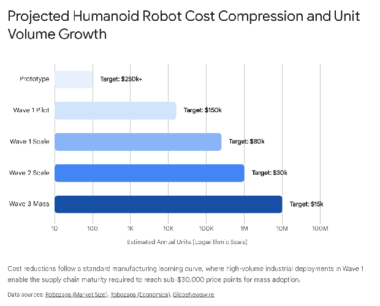
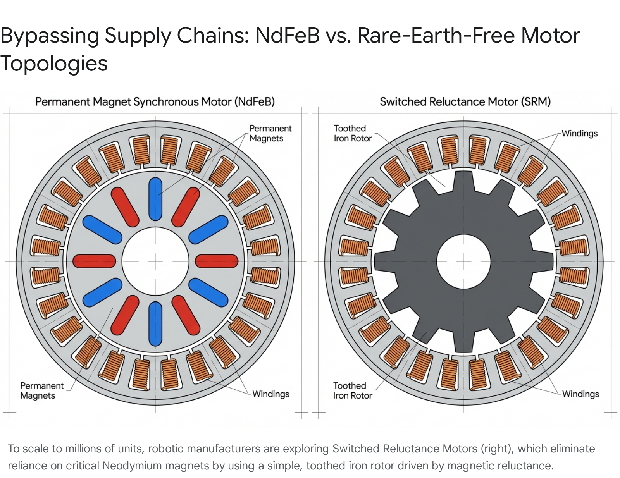

# **The Industrialization of Humanoid Robotics: Scaling Dynamics, Supply Chain Bottlenecks, and Geopolitical Implications (2025–2035)**

The premise of a fully realized humanoid robotic workforce—capable of executing the majority of human physical labor—represents one of the most profound economic and industrial shifts in modern history. The assumption that the foundational challenges of embodied artificial intelligence, reinforcement learning, and basic electromechanical prototyping have been resolved shifts the friction point immediately from laboratory research and software development to the brutal realities of mass manufacturing.1 Scaling humanoid robotics from localized pilot programs to a ubiquitous global workforce of millions, and eventually billions, of units requires an unprecedented mobilization of the global industrial base. This transition is constrained not by software intelligence, but by the immutable laws of the physical world: precision machining limits, raw material availability, battery electrochemistry, the physics of force transmission, and highly rigid geopolitical trade structures.1

This comprehensive report provides an exhaustive analysis of the timelines, scaling dynamics, and critical supply chain bottlenecks that will dictate the deployment velocity of a humanoid workforce over the coming decade.

## **The Scaling Horizon, Market Valuation, and Adoption Timelines**

The commercialization of humanoid robotics is not a singular, disruptive event but a phased, multi-decade structural transition integrated into existing industrial workflows. Over the past two years, industry forecasts have been aggressively revised upward as technological milestones in end-to-end artificial intelligence are achieved much faster than anticipated.1 Goldman Sachs recently increased its 2035 total addressable market projection for humanoid robots by more than sixfold, shifting expectations from a $6 billion niche market to a $38 billion global industry, anticipating annual shipments to reach 1.4 million units within that timeframe.1 More aggressive, long-term macroeconomic models from institutions like Morgan Stanley and ARK Invest suggest the market could ultimately exceed $1 trillion to $5 trillion by 2050, supporting a global stock of over 1 billion operational robots and unlocking a $26 trillion macroeconomic revenue opportunity as unpaid household and informal labor transitions into market-based activities.5

The market is currently structuring itself around a sequential, three-wave adoption model that carefully balances hardware maturity, unit cost, and environmental complexity.3

The first wave of adoption, spanning from 2025 to 2030, targets structured, highly controlled industrial environments. Automotive manufacturing, logistics, and warehousing serve as the primary beachheads for this technology.4 In these sectors, the return on investment (ROI) models are explicitly clear, driven by severe labor shortages and the necessity for repetitive, ergonomically demanding task execution.3 Early commercial deployments, such as Agility Robotics' Digit robots deployed at Amazon and Spanx warehouses (facilitated by GXO Logistics), and Figure AI's pilot programs at BMW manufacturing plants, are currently establishing the baseline for commercial viability and operational uptime.9 During this first wave, annual global installations are projected to grow exponentially from roughly 16,000 units in 2025 to over 250,000 units by 2030, with Chinese domestic markets accounting for up to 80% of initial deployments.1 However, Gartner analysts caution that the hype cycle may outpace reality, predicting that fewer than 20 companies will successfully scale humanoid robots into live, high-throughput production environments for supply chain use cases by 2028 due to lingering technological limitations in unstructured environments.14

The second wave, projected between 2027 and 2033, anticipates that massive production volumes will drive down unit economics sufficiently to allow deployment into semi-structured commercial environments, such as retail operations, hospitality, education, and generalized developer markets.9 The final wave, extending from 2030 to 2036 and beyond, targets entirely unstructured environments, specifically medical assistance, elderly care, and domestic household deployment.9 This final frontier requires the highest levels of uncompromised safety certification, advanced tactile dexterity, and aggressive cost compression to succeed.9

### **The Economics of Production and the Cost Compression Curve**

Scaling production is fundamentally inextricably linked to the learning rate of manufacturing and the resultant cost compression. In 2023, early humanoid prototypes cost between $150,000 and $500,000 to produce, largely due to overengineered subsystems and an immature, heavily fragmented supply chain.1 By 2025 and 2026, improved supply chain integration, the availability of cheaper standardized components, and refined design optimization drove these manufacturing costs down by 40%, settling in a range of $30,000 to $150,000 per unit.1

To achieve ubiquitous, global adoption across all intended waves, the industry must successfully push the average selling price (ASP) toward the $15,000 to $30,000 threshold.5 This target pricing aligns with the strict economic thresholds required for a sub-two-year payback period when measured against human industrial labor rates, which average approximately $30 per hour in Western markets.11 If a robot operates for an estimated 20 hours a day over a five-year lifespan, the amortized operating cost must fall to between $10 and $12 per hour to achieve dominant market penetration.5

| Adoption Phase | Timeframe | Target Unit Cost | Estimated Annual Unit Volume | Primary Target Markets |
| :---- | :---- | :---- | :---- | :---- |
| **Prototype & R\&D** | 2020–2024 | $250,000 – $1,000,000+ | \< 1,000 | Laboratory research, proof of concept |
| **Wave 1: Pilot Production** | 2024–2026 | $80,000 – $250,000 | 16,000 – 100,000 | Automotive, structured logistics, heavy manufacturing |
| **Wave 1: Early Mass Production** | 2026–2030 | $30,000 – $80,000 | 100,000 – 250,000 | Broad warehousing, simple assembly, inspection |
| **Wave 2: Full Mass Production** | 2030–2033 | $15,000 – $30,000 | 250,000 – 1,000,000+ | Retail, hospitality, education, developer platforms |
| **Wave 3: Commodity Scale** | 2033+ | $8,000 – $15,000 | 10,000,000+ | Domestic household assistance, elder care, medical |

Data indicates that reaching this mass-market pricing floor is severely constrained by the physical bill of materials (BOM), particularly within the complex electromechanical and actuation systems that dictate the physical movement of the unit.5

## **Core Hardware Bottlenecks: The Anatomy of Constraints**

Assuming rapid advancements in vision-language-action (VLA) foundation models effectively solve the cognitive aspects of robotics—allowing machines to interpret visual cues, process natural language commands, and plan multi-step actions without manual step-by-step programming—the physical realization of these commands requires immense electromechanical precision.2 The hardware stack accounts for the vast majority of current value capture within the robotics ecosystem, with actuators, transmission systems, end effectors, and power supplies representing profound, physical scaling constraints.16

An analysis of the standard Bill of Materials (BOM) for a mid-range industrial humanoid robot reveals a highly disproportionate concentration of capital within the systems responsible for motion. Actuation and motion control systems represent the single largest cost block, accounting for approximately 45% of the total manufacturing cost.2 The dexterous hands, despite their small physical volume, represent a staggering 31% of the total cost due to their immense complexity.5 The remaining budget is distributed across computing and perception sensor stacks (15%), the battery and power management systems (5%), and the structural chassis and structural materials (4%).2 Therefore, over three-quarters of a humanoid robot's cost is entirely bound to its ability to move and manipulate its environment, making mechanical transmission the absolute focal point for supply chain optimization.

### **The Actuation and Motion Control Crunch**

Actuators act as the biomechanical equivalent of human muscles, responsible for converting electrical energy into controlled rotational or linear motion. In a standard humanoid robot, there are between 28 and 44 precision actuators distributed across the shoulders, elbows, hips, knees, and ankles.5 Because humanoids must continuously support their own chassis weight, maintain dynamic bipedal balance in real-time, and manipulate external heavy payloads, these actuators must possess extraordinary torque-to-weight ratios.2

At current low production volumes, high-performance actuators—which combine powerful electric motors, precision gearboxes, and integrated micro-controllers into a single housing—can cost between $500 and $2,000 each.5 This pushes the total actuator BOM to a restrictive range of $13,500 to $40,000 per individual robot, crippling mass-market economics.5

The critical technological bottleneck within the actuator assembly is the mechanical reduction gear. Most rotating robotic joints rely on strain wave gears, also known as harmonic drives. Strain wave gears operate on the complex principle of elastic metal deformation, utilizing an elliptical wave generator plug, a flexible metallic flex spline, and a rigid outer circular spline to achieve extremely high gear reduction ratios, essentially zero backlash, and highly compact form factors.20

The global market for these specialized strain wave components is highly concentrated and currently lacks the installed capacity to support millions of humanoid robots. Japanese manufacturers, historically dominant in traditional industrial robotics, control the majority of the market; Nabtesco holds an estimated 24.5% market share, while Harmonic Drive SE commands approximately 18.3%.22 While domestic Chinese manufacturers such as Leaderdrive, Green Harmonic, and Han's Motion Technology are expanding factory capacity rapidly and utilizing aggressive pricing strategies to capture the emerging humanoid market, the overall global capacity to produce these highly specialized gears remains a severe limiting factor.22

### **Precision Transmission: The Planetary Roller Screw Bottleneck**

While strain wave gears handle rotational motion, humanoids require heavy-duty linear motion for joints like the knee and ankle extensions, or the actuation of heavy-duty arm lifts. For these high-force applications, the industry is transitioning away from traditional ball screws toward advanced planetary roller screws.24

Traditional ball screws rely on recirculating metal balls that create point contact with the screw thread. While efficient and low-cost, this point contact severely limits load capacity and makes the mechanism prone to rapid fatigue and catastrophic failure under heavy, repetitive shock loads—such as the continuous impact of a bipedal robot walking or running.24 In contrast, planetary roller screws utilize multiple threaded rollers that orbit a central threaded shaft, mirroring a planetary gear system.26 This architecture creates massive multi-point contact between the threads, theoretically extending the mechanical service life by up to 15 times according to Hertzian contact theory, while providing exceptional axial rigidity capable of handling 3g acceleration without deflection.24

| Performance Metric | Planetary Roller Screws | Traditional Ball Screws |
| :---- | :---- | :---- |
| **Load Capacity & Life** | Up to 15x longer lifespan under high-cycle loads; 3-5x higher dynamic load limit | Limited by point contact fatigue; shorter lifespan under heavy robotic stress |
| **Axial Rigidity** | Exceptional rigidity; minimal mechanical deflection under load | Lower rigidity; prone to flexing in high-torque industrial scenarios |
| **Speed & Acceleration** | Handles 3g acceleration and 5000+ rpm without DN value limits | Restricted by physical ball recirculation systems; lower maximum speeds |
| **Sustained Precision** | Sustains micron-level accuracy over millions of continuous cycles | Loses precision progressively over time as internal balls and races wear |

However, planetary roller screws represent a massive, compounding manufacturing bottleneck. Producing these components requires grinding interlocking threads with micron-level accuracy across multiple orbiting rollers. High-precision C5-grade micro screws—such as those developed by Chinese manufacturer Nuoshi Robotics, featuring diameters as small as 1.5mm to fit inside the fingers of dexterous hands—push the absolute boundaries of current global machining capabilities.27

Scaling the production of planetary roller screws is bottlenecked by constraints within the foundational machine tool industry itself. Producing high-precision gears and roller screws requires highly specialized, multi-axis CNC gear grinding and hobbing machines produced by a small oligopoly of manufacturers, such as Reishauer and Gleason.29 Currently, the lead times to procure these advanced machine tools have stretched to 18 to 24 weeks.30 This delay is exacerbated by lingering pandemic-related semiconductor controller shortages, fluctuating raw tool steel costs, and a permanent, systemic shortage of skilled CNC machinists capable of programming, operating, and maintaining these ultra-precise systems.30 Therefore, any sudden surge in demand for tens of millions of planetary roller screws to support a massive humanoid rollout would immediately collide with a severe, structural capacity deficit in the global machine tool sector, placing hard limits on production velocity.

### **The Dexterity Deficit: Tactile Sensors and Articulated Hands**

While bipedal locomotion and basic payload lifting have largely been solved by companies like Boston Dynamics and Agility Robotics, human-level manipulation remains the most technically daunting challenge facing the industry.2 Dexterous hands represent up to 31% of the total robot bill of materials and are universally recognized by manufacturing experts as the single most difficult electromechanical component to mass-produce reliably.5

A biological human hand possesses over 20 distinct degrees of freedom (DoF).2 Replicating this mechanical bandwidth requires packing 11 to 22 individual micro-actuators, complex tendon-driven pulley systems, or direct-drive mechanisms into a form factor identical to an average human hand.2 Beyond the severe mechanical challenge of miniaturizing high-torque components, the sensory gap is profound. Humanoids currently struggle with reliable, closed-loop manipulation because they lack the dense, multimodal tactile sensing skins necessary to dynamically adjust grip force upon contact.2 Without real-time haptic feedback, a robot cannot differentiate the force required to hold a heavy steel pipe versus a fragile item, suffering from Moravec’s paradox where complex reasoning is solved but basic physical interaction remains highly error-prone.2

Currently, custom sensor arrays capable of high-resolution thermal, shear, and force feedback are effectively bespoke, laboratory-grade products. They are not yet produced at the economies of scale seen in standard automotive LiDAR or optical sensors.5 Furthermore, the mechanical reliability gap for complex, highly articulated hands is severe. Current robotic hands often require extensive maintenance interventions every 200 to 500 operating hours due to Kevlar tendons snapping, micro-gears stripping, or motors suffering thermal burnout.5 This is a stark contrast to traditional, single-purpose industrial robotic arms that routinely operate for over 50,000 hours before suffering a mechanical failure.5 Until tactile sensing architectures are fundamentally standardized and the supply chains for micro-actuators achieve massive economies of scale, the dexterous hand will artificially inflate the total cost of ownership (TCO) and limit humanoids to tasks that do not require fine grip control.5

## **The Power Paradigm: Energy Density and Operational Logistics**

The integration of advanced neural network computing arrays, multiple LiDAR and optical sensor stacks, and 30 to 40 continuously active high-torque motors results in immense, relentless power draw. Currently, battery electrochemistry represents a primary blocker to the widespread scalability of the humanoid workforce.2 State-of-the-art humanoids, utilizing standard high-nickel ternary lithium batteries (NMC/NCA), are restricted to continuous operating times of just 2 to 4 hours under dynamic industrial workloads.2

A standard industrial manufacturing or logistics shift requires 8 to 12 hours of continuous operation.2 The traditional automotive method of increasing runtime—simply adding a heavier, larger capacity battery pack—is fundamentally untenable in a humanoid chassis. Bipedal robots operate under extremely strict weight distribution constraints to maintain dynamic balance while walking; exceeding approximately 2.3 kWh of battery capacity (the size utilized in the Tesla Optimus Gen 2\) generally pushes the overall mass beyond viable limits for current joint actuators to support efficiently.33 Furthermore, higher-energy battery packs generate significant waste heat, raising acute thermal management risks within a closely packed electromechanical system lacking the space for large liquid cooling loops.2

### **The Solid-State Battery Trajectory**

To bridge the critical gap between current 4-hour constraints and the holy grail of full-shift autonomy, the robotics industry is increasingly looking toward the commercialization of solid-state battery (SSB) technology. Solid-state batteries completely replace the heavy, volatile, and flammable liquid electrolytes found in traditional lithium-ion cells with a solid electrolyte.2 This architectural shift significantly increases volumetric energy density, enabling longer runtimes without increasing the physical dimensions or weight of the robotic torso, while simultaneously offering vastly improved thermal safety profiles.2

Market projections indicate that the commercialization of humanoids will serve as a primary catalyst for the acceleration of SSB production. TrendForce forecasts that demand for solid-state batteries driven specifically by humanoid robots will surge exponentially from roughly 0.05 GWh in 2025 to a staggering 74.2 GWh by 2035—an increase of more than 1,000 times over the decade.33 Early prototypes intended for extended deployments, such as models from Chinese firms EngineAI, GAC GoMate, and Xpeng IRON, have already begun integrating early solid-state technology to successfully push runtimes past the four-hour operational limit.33

### **Operational Infrastructure: Swapping vs. Autonomous Docking**

Until battery densities double through solid-state adoption, the operational logistics of managing a 24/7 humanoid workforce require robust, expensive charging infrastructure. Facility and supply chain managers must choose between two primary operational architectures, each with significant logistical tradeoffs 35:

1. **Autonomous Docking:** In this model, the robot uses its internal navigation to return to an inductive or direct-contact charging pad when its battery is depleted. While this minimizes the need for human intervention, it introduces severe operational friction: docking effectively pauses productivity, entirely removing the robot from the active workflow for 1 to 2 hours while it physically recharges.35 To maintain uninterrupted 24/7 throughput in an e-commerce fulfillment center relying on docking, management must purchase oversized fleets to ensure a continuous rotation of active robots, drastically inflating upfront capital expenditure.36  
2. **Automated Battery Swapping:** A secondary robotic system or a dedicated automated station physically extracts the depleted battery pack from the humanoid's chassis and instantly inserts a fully charged one. Companies like UBTECH are deploying humanoids like the Walker S2 capable of autonomously navigating to swap stations to minimize downtime to mere seconds.37 While swapping keeps the humanoid in continuous active operation, solving the productivity problem, it requires purchasing massive redundant battery inventories, building complex localized swapping infrastructure, and constantly managing the degradation curves of heavily cycled spare packs.35

## **The Material Choke Point: Rare Earth Elements and Motor Topologies**

The transition from biological human labor to a mechanized robotic workforce places extreme, unprecedented stress on critical mineral supply chains, specifically regarding the extraction and refinement of rare earth elements (REEs). Humanoid robots demand approximately 150 to 200 watts of power per kilogram of actuator weight to successfully mimic explosive human biomechanics, such as jumping, catching, or lifting heavy loads from a squatting position.39 To achieve this incredible power density within the highly constrained volume of a robotic joint, manufacturers overwhelmingly rely on Neodymium-Iron-Boron (NdFeB) permanent magnets.

NdFeB magnets completely dominate high-performance robotics due to their unparalleled magnetic properties, delivering energy product values of 48 to 52 MGOe (mega-gauss-oersteds).39 By comparison, cheaper, more abundant ferrite magnets deliver an energy product of only 3 to 5 MGOe, which is grossly insufficient to generate the instantaneous torque required in robotic knees or shoulders.39

| Magnet Type | Energy Product (MGOe) | Operating Temp Limit (°C) | Cost Relative to NdFeB | Application Suitability |
| :---- | :---- | :---- | :---- | :---- |
| **Neodymium-Iron-Boron (NdFeB)** | 48 – 52 | 80 – 200 | 1.0x (Baseline) | Essential for high-torque humanoid joints and compact micro-actuators. |
| **Samarium Cobalt (SmCo)** | 26 – 32 | 250 – 350 | 8.0x | Used only in extreme high-heat environments; cost prohibitive for mass robotics. |
| **Alnico (Aluminum-Nickel-Cobalt)** | 5 – 9 | 525 | 2.5x | High stability but weak magnetic force; unsuitable for compact robotic design. |
| **Ferrite** | 3 – 5 | 250 | 0.1x | Highly abundant and cheap, but lacks the power density required for humanoids. |

A single humanoid robot incorporates approximately 1.3 kilograms of Neodymium-Praseodymium (NdPr) elements distributed across its 30 to 40 motors.39 If the industry aims to deploy even a fraction of the 1 billion robots forecasted by Morgan Stanley for 2050, the macroeconomic math breaks down entirely. Producing 10 billion robots would require over 186 times the current global annual output of NdFeB magnets; building just 63 million units would consume 120% of today's total production capacity, completely starving other industries like wind turbines and electric vehicles.6 This material requirement creates not only an environmental and mining bottleneck but an acute geopolitical vulnerability, given that China currently controls over 91% of the world's refined rare earth production.7

### **Rare-Earth-Free Alternatives: Rewiring the Supply Chain**

To circumvent this impending, existential supply chain crisis, Western and Asian tier-1 automotive and robotics suppliers are rushing to adapt rare-earth-free motor topologies specifically for robotic actuation:

* **Externally Excited Synchronous Motors (EESM):** Instead of using permanent magnets in the rotor to create a magnetic field, EESMs utilize traditional copper wire windings. When a DC current flows through these windings, the rotor becomes an electromagnet.39 Because the magnetic field can be dynamically controlled (or turned off entirely to eliminate drag losses when coasting), EESMs offer high efficiency.42 However, they are traditionally physically larger and heavier to achieve the same torque output as an NdFeB motor, posing severe spatial integration challenges for compact humanoid limbs.  
* **Switched Reluctance Motors (SRM):** SRMs represent the simplest motor architecture: the rotor is essentially a solid piece of toothed iron, completely devoid of magnets or delicate copper windings.40 Torque is generated by magnetic reluctance as the stator's surrounding electromagnets sequentially pull the rotor's teeth into alignment.40 Historically, SRMs were plagued by excessive acoustic noise and jerky torque ripple, making them entirely unsuitable for smooth robotic manipulation. However, recent advancements utilizing high-frequency Silicon Carbide (SiC) inverters and Model Predictive Control (MPC) algorithms—which adjust the current in microseconds based on rotor position—have smoothed SRM operation significantly.43 SRMs offer a highly durable, cheap, and entirely magnet-free alternative perfectly suited for mass robotic assembly.

## **Global Manufacturing, Geopolitics, and the China Factor**

The race to industrialize humanoid robotics is not merely a corporate technological competition; it has rapidly escalated into a strategic macroeconomic and geopolitical imperative. The physical supply chain required for scaling this technology is highly regionalized, and the dynamics of state intervention heavily influence global production timelines.

### **China's "AI Plus" Mandate and the Risk of Systemic Oversupply**

The Chinese government has explicitly designated embodied AI and humanoid robotics as a central, foundational pillar of its 15th Five-Year Plan (2026–2030).44 The strategy is grouped under the ideological umbrella of creating "New Quality Productive Forces," aiming to weave artificial intelligence and advanced robotic automation into the very fabric of the traditional real economy, specifically prioritizing manufacturing, mining, and logistics.44 This is operationalized through the "AI Plus" action plan, which sets aggressive integration targets of 70% AI penetration across industries by 2027, scaling to 90% by 2030, and demanding ubiquitous deployment by 2035\.45

This policy prioritization functions as an undeniable political signal to local government cadres and capital markets. In 2025 alone, China boasted more than 140 registered domestic humanoid robot manufacturers producing over 330 distinct models.46 Investment capital has flooded the sector; in the first nine months of 2025, China's robotics sector recorded 610 financing deals totaling 50 billion yuan ($7 billion).3 To achieve self-reliance and insulate this industry from foreign sanctions, Beijing is injecting massive subsidies through the National Integrated Circuit Industry Investment Fund (the "Big Fund"), coordinating entities like Huawei and SMIC to indigenize the production of the advanced AI semiconductors required to act as the "brains" of these robots.45

This aggressive, top-down mobilization creates a highly volatile market dynamic. Because cash-strapped local municipalities are eager to demonstrate political alignment with Beijing's central mandates, they heavily subsidize land, capital, and R\&D for local robotics firms regardless of immediate commercial viability.45 This structural dynamic exactly mirrors the early developmental phases of China's solar panel and electric vehicle industries.45 Consequently, there is a high probability of massive manufacturing capacity overbuild, resulting in a systemic product oversupply.

While Western analysts worry deeply about component supply constraints, Chinese firms operating with heavily subsidized capital are rapidly driving down hardware costs through extreme vertical integration and agile, localized supply chains.2 The result is that Chinese humanoids are frequently priced at fractions of the cost of their Western counterparts. For instance, while Western pilot models cost upwards of $100,000 to $250,000, Chinese manufacturer Unitree introduced its G1 humanoid at a base price of just $13,500, and its R1 model at $5,600, establishing a brutal price floor that challenges the viability of Western manufacturing economics.5

### **Western Trade Policy, Defensive Tariffs, and the Reshoring Dilemma**

In response to China's aggressive subsidization and growing dominance in the robotics supply chain, Western nations have begun erecting defensive trade architectures. The United States, viewing automation capabilities as a fundamental matter of national security, launched wide-ranging Section 232 investigations into the import of robotics, industrial machinery, and programmable mechanical systems in late 2025\.48 The explicit objective of these proposed tariffs is to disincentivize reliance on Asian hardware and force a rapid reshoring of the mechatronic supply chain to North America.48 Similarly, the UK government launched its Industrial Strategy 2025, committing £2.8 billion in R\&D over five years to spur domestic automation and advanced manufacturing capabilities.49

However, this protectionist policy creates a paradoxical challenge for Western automation. The United States and Europe do not currently possess the expansive domestic supply base required to produce millions of precision actuators, micro-sensors, and NdFeB magnets at competitive market prices.48 Tariffs placed on these critical imported components immediately inflate the Bill of Materials (BOM) for Western robotics startups attempting to scale.

Industry analysts warn that artificially raising the cost of basic robotic hardware through tariffs could destroy the delicate economic ROI models—specifically the requirement for a sub-two-year payback period—that are absolutely necessary for widespread factory adoption.48 Rebuilding a globally competitive domestic mechatronics ecosystem from the ground up—complete with the necessary skilled machinists, specialized gear-grinding machinery, and raw material processing facilities—is a generational process measured in decades, not months.48 If Western robotics firms are forced by policy to source exclusively from expensive, capacity-constrained domestic suppliers, the mass deployment of humanoids in Western factories could be artificially delayed by several years compared to the rapid deployment rates occurring in Asia.48

## **Regulatory Friction and the Hidden Costs of Fleet Operations**

Beyond hardware constraints and geopolitical trade wars, the deployment timeline at scale will be heavily dictated by bureaucratic regulatory compliance and the hidden, recurring costs of field maintenance.

### **The Double-Bind of European Regulation**

In the European Union, the rollout of humanoid robots faces severe regulatory friction due to the unprecedented intersection of traditional physical product safety laws and emerging digital governance frameworks. Deploying an AI-driven humanoid robot on a factory floor requires strict compliance with both the longstanding Machinery Regulation (which ensures mechanical and electrical safety) and the newly enforced EU AI Act.51

The EU AI Act classifies AI systems that are embedded into physical machinery and intended to function as safety components as High-Risk AI (HRAI).52 The compliance deadlines for these Annex III HRAI systems take effect aggressively in August 2026, with further obligations rolling out through 2027\.51 This dual regulatory framework requires robotics manufacturers to undergo expensive double assessments—certifying both the physical kinematics of the robot's arms and the opaque, black-box decision-making processes of its neural networks.52 For small and medium-sized robotics enterprises (SMEs), this dual certification process is estimated to add between €216,000 and €319,000 in initial compliance costs, significantly draining capital and delaying product launches within the European market compared to less regulated jurisdictions.55

### **Operations, Predictive Maintenance, and the Service Infrastructure**

Finally, the macroeconomic assumption that humanoid robots represent a simple, one-time capital expenditure is fundamentally flawed. In dynamic, unstructured industrial settings, humanoids suffer from severe mechanical wear, joint degradation, and sensor recalibration drift.

While the projected overarching mechanical lifespan of a humanoid chassis is 5 to 10 years, high-wear components—specifically the dexterous hands and primary load-bearing knee and hip actuators—may require complete physical replacement every 1 to 3 years.12 Organizations attempting to deploy large fleets must realistically account for 2 to 5 hours of weekly preventative maintenance per robot.12

The ultimate success of humanoid scaling relies entirely on establishing a robust "service infrastructure" alongside the hardware manufacturing.56 If original equipment manufacturers (OEMs) attempt to scale production to hundreds of thousands of units without simultaneously building a massive, nationwide network of field technicians, rapid-response repair centers, and replacement parts logistics, widespread deployments will inevitably stall due to unacceptable periods of downtime and customer frustration.56

To mitigate this, the integration of AI-driven predictive maintenance will be a mandatory capability for enterprise fleet management. By utilizing continuous telemetry, acoustic monitoring, and vibration data to preemptively schedule motor replacements before a catastrophic failure occurs on the factory floor, operators can maintain the required uptime.57 Furthermore, innovations in algorithmic safety, such as Control Barrier Functions (CBFs), are necessary to prevent unnecessary emergency stops and collisions, allowing humanoids to operate closely alongside human workers without triggering safety lockdowns that halt production.58

## **Strategic Synthesis and Conclusion**

The transition toward a ubiquitous global robotic workforce is technically feasible within the next five to ten years, but it is entirely dependent on successfully navigating profound physical, logistical, and geopolitical constraints. The software and VLA foundation models enabling spatial reasoning, imitation learning, and dexterity are progressing on an exponential curve; however, the physical supply chain required to manifest these cognitive models in the real world is relatively rigid and inelastic.

The timeline for scale will proceed in highly distinct waves. Between 2025 and 2030, production will scale into the hundreds of thousands, focusing almost exclusively on structured industrial environments where ROI can be strictly calculated against severe labor shortages and demographic declines. Achieving volumes in the millions by 2035—and the corresponding vital price compression below the $20,000 threshold—requires solving three critical bottlenecks simultaneously:

1. **Machine Tool and Manufacturing Capacity:** The global machine tool industry must overcome severe lead times and skilled labor shortages to exponentially scale the production of precision strain wave gears and planetary roller screws.  
2. **Material Science and Energy Density:** The industry must successfully transition from rare-earth dependent NdFeB motors to alternative, sustainable topologies (such as Switched Reluctance Motors) and rapidly commercialize solid-state battery manufacturing to escape the paralyzing 4-hour operational limit.  
3. **Geopolitical Supply Chain Alignment:** Western robotics firms must carefully navigate the extreme tension between tariff-induced supply chain security mandates and the reality of cheap, vertically integrated hardware flooding out of China's heavily subsidized manufacturing base.

Organizations and policymakers that view humanoids purely as software platforms will fail to scale. The definitive winners in the coming automation revolution will be those that master the brutal, unforgiving realities of high-precision mechatronic supply chains, battery electrochemistry, and the complex logistics of global field maintenance.

#### **Works cited**

1. The global market for humanoid robots could reach $38 billion by 2035 | Goldman Sachs, accessed March 13, 2026, [https://www.goldmansachs.com/insights/articles/the-global-market-for-robots-could-reach-38-billion-by-2035](https://www.goldmansachs.com/insights/articles/the-global-market-for-robots-could-reach-38-billion-by-2035)  
2. Humanoid robots: From concept to reality | McKinsey, accessed March 13, 2026, [https://www.mckinsey.com/industries/industrials/our-insights/humanoid-robots-crossing-the-chasm-from-concept-to-commercial-reality](https://www.mckinsey.com/industries/industrials/our-insights/humanoid-robots-crossing-the-chasm-from-concept-to-commercial-reality)  
3. The Global Humanoid Robots Market 2026-2036 \- Advanced and Emerging Technology Market Research, accessed March 13, 2026, [https://www.futuremarketsinc.com/the-global-humanoid-robots-market-2026-2036-3/](https://www.futuremarketsinc.com/the-global-humanoid-robots-market-2026-2036-3/)  
4. Humanoid Robots 2026-2036: Technologies, Markets, and Opportunities, accessed March 13, 2026, [https://www.idtechex.com/en/research-report/humanoid-robots/1149](https://www.idtechex.com/en/research-report/humanoid-robots/1149)  
5. Humanoid Production Economics \[2026\] | Robozaps, accessed March 13, 2026, [https://blog.robozaps.com/b/economics-of-humanoid-robot-production](https://blog.robozaps.com/b/economics-of-humanoid-robot-production)  
6. Every robot needs 30 magnets. There aren't enough. \- Katusa Research, accessed March 13, 2026, [https://katusaresearch.com/every-robot-needs-30-magnets-there-arent-enough/](https://katusaresearch.com/every-robot-needs-30-magnets-there-arent-enough/)  
7. Robotics and The Rare Earth Bottleneck \- Ocean Wall, accessed March 13, 2026, [https://oceanwall.com/wp-content/uploads/2025/10/Robotics-Market-and-Rare-Earth-Magnet-Supply-Chain\_.pdf](https://oceanwall.com/wp-content/uploads/2025/10/Robotics-Market-and-Rare-Earth-Magnet-Supply-Chain_.pdf)  
8. Humanoid Robotics: The Next $26 Trillion Opportunity \- ARK Invest Europe, accessed March 13, 2026, [https://europe.ark-funds.com/2025/03/humanoid-robotics-and-the-next-frontier-of-automation/](https://europe.ark-funds.com/2025/03/humanoid-robotics-and-the-next-frontier-of-automation/)  
9. Global Humanoid Robots Market Report 2026-2036, Competitive, accessed March 13, 2026, [https://www.globenewswire.com/news-release/2026/03/11/3253552/0/en/Global-Humanoid-Robots-Market-Report-2026-2036-Competitive-Landscape-Mapping-Over-60-Active-Manufacturers-with-Detailed-Profiles-of-More-Than-100-Companies.html](https://www.globenewswire.com/news-release/2026/03/11/3253552/0/en/Global-Humanoid-Robots-Market-Report-2026-2036-Competitive-Landscape-Mapping-Over-60-Active-Manufacturers-with-Detailed-Profiles-of-More-Than-100-Companies.html)  
10. How Humanoid Robots Could Reshape Work \- JLL, accessed March 13, 2026, [https://www.jll.com/en-us/insights/how-humanoid-robots-could-reshape-work](https://www.jll.com/en-us/insights/how-humanoid-robots-could-reshape-work)  
11. Top AI & Humanoid Robots | ANDROIDS.COM Innovators USA, accessed March 13, 2026, [https://androids.com/news-2025](https://androids.com/news-2025)  
12. Humanoid Robots in Business: Real Use Cases, Costs & ROI, accessed March 13, 2026, [https://www.articsledge.com/post/humanoid-robots-business](https://www.articsledge.com/post/humanoid-robots-business)  
13. Humanoid Robot Market Size \[2026\] \- Robozaps, accessed March 13, 2026, [https://blog.robozaps.com/b/market-size-for-humanoid-robots](https://blog.robozaps.com/b/market-size-for-humanoid-robots)  
14. Gartner Predicts Fewer Than 20 Companies Will Scale Humanoid Robots for Manufacturing and Supply Chain to Production Stage by 2028, accessed March 13, 2026, [https://www.gartner.com/en/newsroom/press-releases/2026-01-21-gartner-predicts-fewer-than-20-companies-will-scale-humanoid-robots-for-manufacturing-and-supply-chain-to-production-stage-by-2028](https://www.gartner.com/en/newsroom/press-releases/2026-01-21-gartner-predicts-fewer-than-20-companies-will-scale-humanoid-robots-for-manufacturing-and-supply-chain-to-production-stage-by-2028)  
15. Tesla Optimus vs Agility Robotics Digit: Full 2026 Comparison \- Robozaps, accessed March 13, 2026, [https://blog.robozaps.com/b/tesla-optimus-vs-agility-robotics-digit](https://blog.robozaps.com/b/tesla-optimus-vs-agility-robotics-digit)  
16. Humanoid Robot Market Size, Share, & Growth Report \[2034\], accessed March 13, 2026, [https://www.fortunebusinessinsights.com/humanoid-robots-market-110188](https://www.fortunebusinessinsights.com/humanoid-robots-market-110188)  
17. Humanoid robots could drive new demand for critical minerals \- WisdomTree, accessed March 13, 2026, [https://www.wisdomtree.eu/api/sitecore/pdf/getblogpdf?id=14b1d6d0-5e89-497c-b7c0-8a87133a6fbf](https://www.wisdomtree.eu/api/sitecore/pdf/getblogpdf?id=14b1d6d0-5e89-497c-b7c0-8a87133a6fbf)  
18. Humanoid Robot Rotary Actuator Market Outlook 2025-2032 \- Intel Market Research, accessed March 13, 2026, [https://www.intelmarketresearch.com/humanoid-robot-rotary-actuator-market-7922](https://www.intelmarketresearch.com/humanoid-robot-rotary-actuator-market-7922)  
19. AI & Robotics | Tesla, accessed March 13, 2026, [https://www.tesla.com/AI](https://www.tesla.com/AI)  
20. Strain Wave Gear Market Outlook 2026-2034, accessed March 13, 2026, [https://www.intelmarketresearch.com/strain-wave-gear-market-35868](https://www.intelmarketresearch.com/strain-wave-gear-market-35868)  
21. Strain Wave Gearing Devices Market Size, Share & Trend 2034 \- Business Research Insights, accessed March 13, 2026, [https://www.businessresearchinsights.com/market-reports/strain-wave-gearing-devices-market-105452](https://www.businessresearchinsights.com/market-reports/strain-wave-gearing-devices-market-105452)  
22. Robot Strain Wave Gear Market Size & CAGR 8.1% \- Global Growth Insights, accessed March 13, 2026, [https://www.globalgrowthinsights.com/market-reports/robot-strain-wave-gear-market-117399](https://www.globalgrowthinsights.com/market-reports/robot-strain-wave-gear-market-117399)  
23. Humanoid Robot Speed ??Reducers Market Outlook 2026-2032 \- Intel Market Research, accessed March 13, 2026, [https://www.intelmarketresearch.com/humanoid-robot-speed-reducers-market-23769](https://www.intelmarketresearch.com/humanoid-robot-speed-reducers-market-23769)  
24. Planetary Roller Screws: Elevating Linear Motion Beyond Ball Screw Limits, accessed March 13, 2026, [https://www.yosomotion.com/blog/planetary-roller-screws-elevating-linear-motion-beyond-ball-screw-limits](https://www.yosomotion.com/blog/planetary-roller-screws-elevating-linear-motion-beyond-ball-screw-limits)  
25. Advantages of Roller Screws | Planetary vs Ball Screw Actuator Technology \- YouTube, accessed March 13, 2026, [https://www.youtube.com/watch?v=9kVaWtUgpNA](https://www.youtube.com/watch?v=9kVaWtUgpNA)  
26. News \- What is the difference between roller screws and ball screws? \- KGG Robots, accessed March 13, 2026, [https://www.kggfa.com/news/what-is-the-difference-between-roller-screws-and-ball-screws/](https://www.kggfa.com/news/what-is-the-difference-between-roller-screws-and-ball-screws/)  
27. Nous Robot \- A globally renowned brand of planetary roller screws and miniature linear cylinders, accessed March 13, 2026, [http://nousbot.tech/en/](http://nousbot.tech/en/)  
28. "Nuoshi Robotics" Completes Over 100 Million Yuan Series A ... \- 36氪, accessed March 13, 2026, [https://eu.36kr.com/en/p/3719335512585609](https://eu.36kr.com/en/p/3719335512585609)  
29. News from Reishauer, accessed March 13, 2026, [https://www.reishauer.com/en/news](https://www.reishauer.com/en/news)  
30. Gear Processing Machine Tool Market Outlook 2026-2034 \- Intel Market Research, accessed March 13, 2026, [https://www.intelmarketresearch.com/gear-processing-machine-tool-market-32850](https://www.intelmarketresearch.com/gear-processing-machine-tool-market-32850)  
31. State of the Gear Industry 2026 \- Gear Technology Magazine, accessed March 13, 2026, [https://www.geartechnology.com/state-of-the-gear-industry-2026](https://www.geartechnology.com/state-of-the-gear-industry-2026)  
32. Humanoid Robots to Reach Nearly US$30 Billion by 2036 | IDTechEx Research Article, accessed March 13, 2026, [https://www.idtechex.com/en/research-article/humanoid-robots-to-reach-nearly-us-30-billion-by-2036/34443](https://www.idtechex.com/en/research-article/humanoid-robots-to-reach-nearly-us-30-billion-by-2036/34443)  
33. Humanoid Robots Move Toward Commercialization; Solid-State ..., accessed March 13, 2026, [https://www.trendforce.com/presscenter/news/20260128-12902.html](https://www.trendforce.com/presscenter/news/20260128-12902.html)  
34. Report: humanoid robots set to drive demand for solid-state batteries \- Electrek, accessed March 13, 2026, [https://electrek.co/2026/01/30/report-humanoid-robots-set-to-drive-demand-for-solid-state-batteries/](https://electrek.co/2026/01/30/report-humanoid-robots-set-to-drive-demand-for-solid-state-batteries/)  
35. Swappable Battery vs. Autonomous Docking: What Leading OEMs Are Choosing for Next-Gen Mobile Robots \- Phihong USA, accessed March 13, 2026, [https://www.phihong.com/swappable-battery-vs-autonomous-docking-what-leading-oems-are-choosing-for-next-gen-mobile-robots/](https://www.phihong.com/swappable-battery-vs-autonomous-docking-what-leading-oems-are-choosing-for-next-gen-mobile-robots/)  
36. The Charging Dilemma in Warehouse Automation \- CaPow, accessed March 13, 2026, [https://capow.energy/blog/articles/the-charging-dilemma-in-warehouse-automation/](https://capow.energy/blog/articles/the-charging-dilemma-in-warehouse-automation/)  
37. Maximizing Industrial Robot Uptime Through Intelligent Charging and Swapping Strategies, accessed March 13, 2026, [https://www.large-battery.com/blog/non-stop-production-industrial-robot-charging-swapping/](https://www.large-battery.com/blog/non-stop-production-industrial-robot-charging-swapping/)  
38. Is Robotics the Key to Supply Chain Stability?, accessed March 13, 2026, [https://supplychaindigital.com/news/robotics-key-supply-chain-stability](https://supplychaindigital.com/news/robotics-key-supply-chain-stability)  
39. China Rare Earths Drive Humanoid Robot Supply Chain \- Discovery Alert, accessed March 13, 2026, [https://discoveryalert.com.au/humanoid-robotics-rare-earth-elements-2026/](https://discoveryalert.com.au/humanoid-robotics-rare-earth-elements-2026/)  
40. Electric Vehicle Motors Free of Rare-Earth Elements—An Overview \- MDPI, accessed March 13, 2026, [https://www.mdpi.com/2075-1702/13/8/702](https://www.mdpi.com/2075-1702/13/8/702)  
41. Where will the metals for the robot revolution come from? \- InvestorNews, accessed March 13, 2026, [https://investornews.com/critical-minerals-rare-earths/where-will-the-metals-for-the-robot-revolution-come-from/](https://investornews.com/critical-minerals-rare-earths/where-will-the-metals-for-the-robot-revolution-come-from/)  
42. Rare earth magnet alternatives for electric motors \- Power Progress, accessed March 13, 2026, [https://www.powerprogress.com/news/rare-earth-alternatives-for-electric-motors/8113484.article](https://www.powerprogress.com/news/rare-earth-alternatives-for-electric-motors/8113484.article)  
43. How Rare-Earth-Free Motors Are Redefining the EV Supply Chain, accessed March 13, 2026, [https://emag.directindustry.com/2026/02/04/rare-earth-free-motors-ev-supply-chain-oem/](https://emag.directindustry.com/2026/02/04/rare-earth-free-motors-ev-supply-chain-oem/)  
44. China's Five-Year Plan bets on a risky new direction | Chatham House, accessed March 13, 2026, [https://www.chathamhouse.org/publications/the-world-today/2025-12/chinas-five-year-plan-bets-risky-new-direction](https://www.chathamhouse.org/publications/the-world-today/2025-12/chinas-five-year-plan-bets-risky-new-direction)  
45. China's next five-year bet on AI: Self-reliance, diffusion, and a lot of ..., accessed March 13, 2026, [https://merics.org/en/comment/chinas-next-five-year-bet-ai-self-reliance-diffusion-and-lot-hype](https://merics.org/en/comment/chinas-next-five-year-bet-ai-self-reliance-diffusion-and-lot-hype)  
46. Top 10 Chinese Humanoid Robots of 2026, accessed March 13, 2026, [https://humanoidroboticstechnology.com/articles/top-10-chinese-humanoid-robots-of-2026/](https://humanoidroboticstechnology.com/articles/top-10-chinese-humanoid-robots-of-2026/)  
47. How Innovative Is China in the Robotics Industry? | Reports & Briefings | Mar 11, 2024 | ITIF, accessed March 13, 2026, [https://itif.org/publications/2024/03/11/how-innovative-is-china-in-the-robotics-industry/](https://itif.org/publications/2024/03/11/how-innovative-is-china-in-the-robotics-industry/)  
48. Industry experts react to U.S. robotics tariff proposal \- The Robot ..., accessed March 13, 2026, [https://www.therobotreport.com/industry-experts-react-u-s-robotics-tariff-proposal/](https://www.therobotreport.com/industry-experts-react-u-s-robotics-tariff-proposal/)  
49. Industrial Strategy 2025: What it means for the Robotics Sector, accessed March 13, 2026, [https://www.techuk.org/resource/industrial-strategy-2025-what-it-means-for-the-robotics-sector.html](https://www.techuk.org/resource/industrial-strategy-2025-what-it-means-for-the-robotics-sector.html)  
50. Industrial Strategy 2025: What it means for the Robotics Sector | techUK \- WiredGov, accessed March 13, 2026, [https://www.wired-gov.net/wg/news.nsf/articles/Industrial+Strategy+2025+What+it+means+for+the+Robotics+Sector+01072025162500?open](https://www.wired-gov.net/wg/news.nsf/articles/Industrial+Strategy+2025+What+it+means+for+the+Robotics+Sector+01072025162500?open)  
51. EU AI Act \- Timeline Update | Tech Law Blog, accessed March 13, 2026, [https://www.techlaw.ie/2026/03/articles/artificial-intelligence/eu-ai-act-timeline-update/](https://www.techlaw.ie/2026/03/articles/artificial-intelligence/eu-ai-act-timeline-update/)  
52. Smart Robots, Dual Regulations Navigating AI Act and Machinery Compliance \- TwoBirds, accessed March 13, 2026, [https://www.twobirds.com/en/insights/2026/smart-robots,-dual-regulations-navigating-ai-act-and-machinery-compliance](https://www.twobirds.com/en/insights/2026/smart-robots,-dual-regulations-navigating-ai-act-and-machinery-compliance)  
53. AI Act Implementation: Timelines & Next steps | EU Artificial Intelligence Act, accessed March 13, 2026, [https://artificialintelligenceact.eu/ai-act-implementation-next-steps/](https://artificialintelligenceact.eu/ai-act-implementation-next-steps/)  
54. AI Act | Shaping Europe's digital future \- European Union, accessed March 13, 2026, [https://digital-strategy.ec.europa.eu/en/policies/regulatory-framework-ai](https://digital-strategy.ec.europa.eu/en/policies/regulatory-framework-ai)  
55. One robot, two laws: Industry warns EU's double regulation in the way of progress, accessed March 13, 2026, [https://euperspectives.eu/2026/03/industry-groups-urge-to-simplify-ai-act-and-delay-obligations/](https://euperspectives.eu/2026/03/industry-groups-urge-to-simplify-ai-act-and-delay-obligations/)  
56. Roboworx Calls for Robust “Service Infrastructure” to Ensure Widescale Success of Humanoid Robots at Humanoids Summit Silicon Valley \- A3 Association for Advancing Automation, accessed March 13, 2026, [https://www.automate.org/news/roboworx-calls-for-robust-service-infrastructure-to-ensure-widescale-success-of-humanoid-robots-at-humanoids-summit-silicon-valley](https://www.automate.org/news/roboworx-calls-for-robust-service-infrastructure-to-ensure-widescale-success-of-humanoid-robots-at-humanoids-summit-silicon-valley)  
57. AI in Robotics: Benefits, Real-World Use Cases & Infrastructure \- Clarifai, accessed March 13, 2026, [https://www.clarifai.com/blog/ai-in-robotics](https://www.clarifai.com/blog/ai-in-robotics)  
58. Humanoids and the Future of Repair and Maintenance \- 3Laws Robotics, accessed March 13, 2026, [https://3laws.io/pages/Humanoids\_and\_the\_Future\_of\_Repair\_and\_Maintenance.html](https://3laws.io/pages/Humanoids_and_the_Future_of_Repair_and_Maintenance.html)
